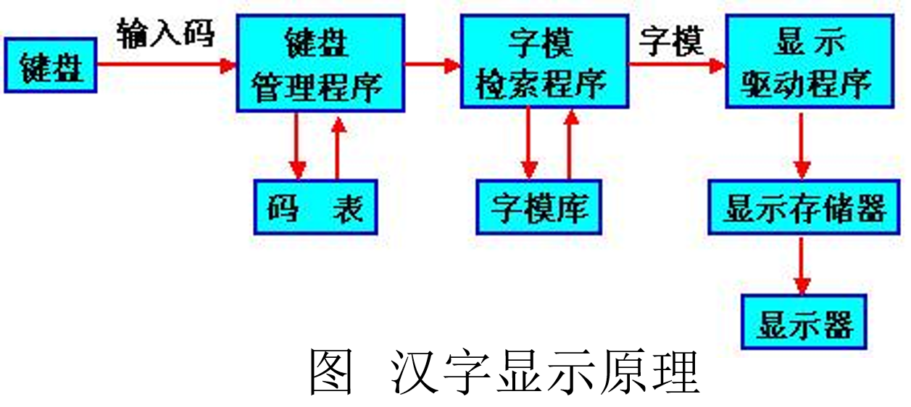
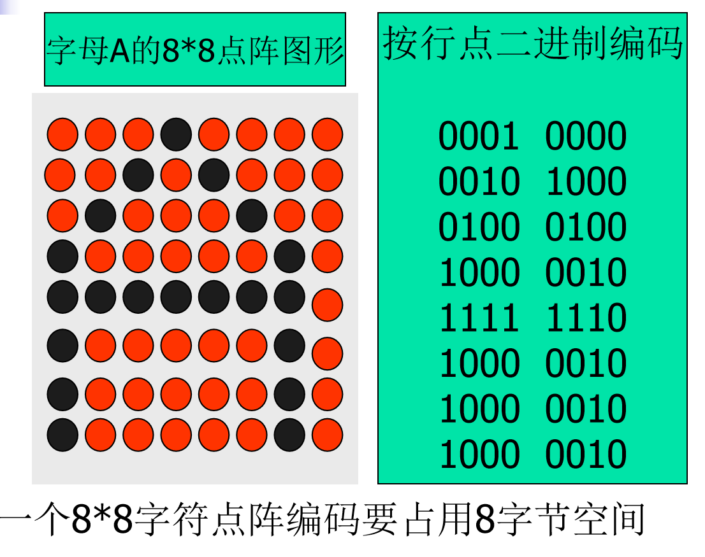
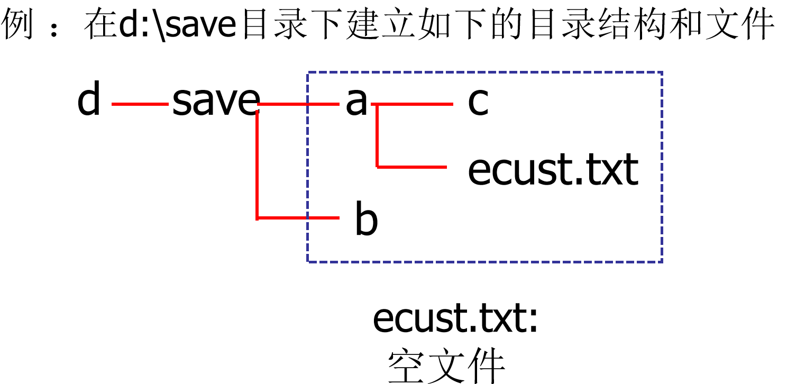

[TOC]
# 流式输入输出及文件处理
## 流式输入输出处理机制
我们来详细讲解一下 Java 中的**流式输入输出处理机制 (Stream I/O Processing Mechanism)**。这是 Java 语言处理数据传输的核心方式，无论是从文件、网络、内存还是其他程序，数据都以“流”的形式进行传输。

---

### Java 中的流式输入输出处理机制详解

在 Java 中，I/O（Input/Output）操作是基于“流 (Stream)”的概念。流可以被想象成连接数据源（Source）和数据目的地（Sink）的一条单向管道，数据在这条管道中顺序地流动。

Java 的 `java.io` 包提供了丰富的类来支持各种 I/O 操作。

#### 1. 流的本质与分类

**本质：**
* **抽象化：** Java I/O 流是对各种数据源和目的地的抽象。无论是读取文件、网络通信还是内存操作，都统一为流的概念，使得开发者可以用统一的 API 来处理不同来源/去向的数据。
* **单向性：** 流是单向的。如果需要同时进行输入和输出，你需要分别创建输入流和输出流。

**分类：**
Java 的流根据处理的数据类型和功能分为两大类：

**根据数据单位：**

1.  **字节流 (Byte Streams)：**
    * 以字节（8位）为单位进行读写操作。
    * 适用于处理所有类型的数据，包括文本、图像、音频、视频等二进制数据。
    * **基类：** `InputStream` (抽象类，用于读取字节) 和 `OutputStream` (抽象类，用于写入字节)。
    * **常用子类：**
        * `FileInputStream` / `FileOutputStream`：用于读写文件中的字节。
        * `BufferedInputStream` / `BufferedOutputStream`：提供带缓冲的字节输入/输出，提高性能。
        * `DataInputStream` / `DataOutputStream`：用于读写 Java 基本数据类型（如 `int`, `double`, `boolean`）的二进制表示。
        * `ObjectInputStream` / `ObjectOutputStream`：用于对象的序列化和反序列化（将对象转换为字节序列存储，或将字节序列恢复为对象）。
        * `ByteArrayInputStream` / `ByteArrayOutputStream`：从/向内存中的字节数组读写数据。

2.  **字符流 (Character Streams)：**
    * 以字符（16位 Unicode 字符）为单位进行读写操作。
    * 适用于处理文本数据，能够正确处理各种字符编码（如 UTF-8, GBK 等），避免乱码问题。
    * **基类：** `Reader` (抽象类，用于读取字符) 和 `Writer` (抽象类，用于写入字符)。
    * **常用子类：**
        * `FileReader` / `FileWriter`：用于读写文件中的字符。它们使用平台默认的字符编码。
        * `BufferedReader` / `BufferedWriter`：提供带缓冲的字符输入/输出，提高性能，`BufferedReader` 提供了 `readLine()` 方法方便按行读取。
        * `InputStreamReader` / `OutputStreamWriter`：**字节流和字符流之间的桥梁**。它们将字节流转换为字符流，并在转换过程中处理字符编码（可以指定编码）。
        * `PrintWriter` / `PrintStream`：提供了方便的 `print()` 和 `println()` 方法，常用于输出文本到控制台或文件。`System.out` 就是一个 `PrintStream` 的实例。

#### 2. 常用流的层次结构 (简化版)

**字节输入流：**
* `InputStream` (抽象基类)
    * `FileInputStream` (文件)
    * `ByteArrayInputStream` (字节数组)
    * `PipedInputStream` (管道)
    * `FilterInputStream` (抽象过滤流)
        * `BufferedInputStream` (缓冲)
        * `DataInputStream` (基本类型)
        * `ObjectInputStream` (对象)

**字节输出流：**
* `OutputStream` (抽象基类)
    * `FileOutputStream` (文件)
    * `ByteArrayOutputStream` (字节数组)
    * `PipedOutputStream` (管道)
    * `FilterOutputStream` (抽象过滤流)
        * `BufferedOutputStream` (缓冲)
        * `DataOutputStream` (基本类型)
        * `ObjectOutputStream` (对象)
        * `PrintStream` (打印流，如 `System.out`)

**字符输入流：**
* `Reader` (抽象基类)
    * `FileReader` (文件)
    * `StringReader` (字符串)
    * `CharArrayReader` (字符数组)
    * `InputStreamReader` (字节到字符的桥梁)
        * `FileReader` (实际上是 `InputStreamReader` 的子类，使用了默认编码)
    * `FilterReader` (抽象过滤流)
        * `BufferedReader` (缓冲)

**字符输出流：**
* `Writer` (抽象基类)
    * `FileWriter` (文件)
    * `StringWriter` (字符串)
    * `CharArrayWriter` (字符数组)
    * `OutputStreamWriter` (字符到字节的桥梁)
        * `FileWriter` (实际上是 `OutputStreamWriter` 的子类，使用了默认编码)
    * `FilterWriter` (抽象过滤流)
        * `BufferedWriter` (缓冲)
        * `PrintWriter` (打印流)

#### 3. 流操作的基本步骤

无论是哪种类型的流，其操作流程通常遵循以下三个基本步骤：

1.  **创建流对象 (Open the Stream)：**
    * 根据需要读写的数据源/目的地以及数据类型（字节/字符）选择合适的流类并创建其实例。
    * 例如：`FileInputStream fis = new FileInputStream("data.txt");`
    * 例如：`BufferedReader br = new BufferedReader(new FileReader("text.txt"));`

2.  **读写数据 (Read/Write Data)：**
    * 使用流对象提供的 `read()` (输入流) 或 `write()` (输出流) 方法进行数据传输。
    * `read()` 方法通常返回读取到的字节（0-255）或字符（0-65535），如果到达流的末尾则返回 -1。
    * `write()` 方法通常接收一个字节或字符作为参数。
    * 对于缓冲流，可能需要调用 `flush()` 方法将缓冲区中的数据强制写入目的地。

3.  **关闭流 (Close the Stream)：**
    * 这是**最关键**的一步。在使用完流之后，**必须**关闭它。
    * 关闭流会释放底层的系统资源（如文件句柄、网络端口），避免资源泄露。
    * 关闭操作通常在 `finally` 块中执行，或者更推荐地，使用 Java 7 引入的 **try-with-resources** 语句来自动关闭。
    * 关闭处理流时，它通常也会自动关闭其封装的底层节点流。

## java的输入输出流库
我们来对 Java 的输入输出流库进行一个简洁而全面的总结。

---

### Java 输入输出流库总结 (`java.io` 包)

Java 的 `java.io` 包提供了强大的、基于“流”概念的输入输出处理机制。它的核心思想是将数据传输抽象为从数据源到数据目的地流动的管道。
<table>
  <thead>
    <tr>
      <th>类</th>
      <th>描述</th>
    </tr>
  </thead>
  <tbody>
    <tr>
      <td>File</td>
      <td>支持文件或目录操作的类:<br>顺序读写,不是流</td>
    </tr>
    <tr>
      <td>InputStream</td>
      <td>字节流输入操作的抽象类</td>
    </tr>
    <tr>
      <td>OutputStream</td>
      <td>字节流输出操作的抽象类</td>
    </tr>
    <tr>
      <td>Reader</td>
      <td>字符流输入操作的抽象类</td>
    </tr>
    <tr>
      <td>Writer</td>
      <td>字符流输出操作的抽象类</td>
    </tr>
    <tr>
      <td>RandomAccessFile</td>
      <td>支持随机存取文件操作的类</td>
    </tr>
  </tbody>
</table>

#### 1. 流的两个主要分类维度

 **按数据单位：**
    * **字节流 (Byte Streams):** 处理 8 位字节数据。适用于任何类型的数据（文本、图片、音频、视频等）。
        * 基类：`InputStream` (读) 和 `OutputStream` (写)。
        * 典型代表：`FileInputStream`, `FileOutputStream`, `BufferedInputStream`, `BufferedOutputStream`, `DataInputStream`, `DataOutputStream`, `ObjectInputStream`, `ObjectOutputStream`。
    * **字符流 (Character Streams):** 处理 16 位 Unicode 字符数据。**专门用于处理文本数据**，能够正确处理字符编码，避免乱码。
        * 基类：`Reader` (读) 和 `Writer` (写)。
        * 典型代表：`FileReader`, `FileWriter`, `BufferedReader`, `BufferedWriter`, `InputStreamReader` (字节转字符), `OutputStreamWriter` (字符转字节), `PrintWriter`。

#### 2. 流的核心操作和生命周期

无论哪种流，基本操作和生命周期管理是共通的：

1.  **打开 (Open):** 创建流对象，建立与数据源/目的地的连接。
    * `new FileInputStream("file.txt")`
2.  **读/写 (Read/Write):** 使用流对象的方法进行数据传输。
    * `read()`: 从输入流读取数据，返回一个字节/字符的 int 值或 -1 (流末尾)。
    * `write()`: 向输出流写入字节/字符。
    * `readLine()`: (仅 `BufferedReader`) 按行读取文本。
3.  **刷新 (Flush):** (仅输出缓冲流) 将缓冲区中尚未写入的数据强制写入目的地。
    * `bufferedWriter.flush()`
4.  **关闭 (Close):** 释放与流关联的所有系统资源（文件句柄、网络端口等）。**至关重要，防止资源泄露。**
    * `stream.close()`
    * **最佳实践：**
        * 在 `finally` 块中关闭流。
        * **推荐：** 使用 Java 7 引入的 **try-with-resources** 语句，实现资源的自动关闭，代码更简洁、安全。

#### 3. 字节流与字符流的转换

* 当需要从字节流读取文本数据或向字节流写入文本数据，并希望正确处理字符编码时，需要使用**转换流**：
    * `InputStreamReader`: 将字节输入流转换为字符输入流。可以指定字符集编码。
        * `new InputStreamReader(new FileInputStream("file.txt"), "UTF-8")`
    * `OutputStreamWriter`: 将字符输出流转换为字节输出流。可以指定字符集编码。
        * `new OutputStreamWriter(new FileOutputStream("file.txt"), "UTF-8")`


### Java 中的字节流 (Byte Streams) 详解

在 Java I/O 体系中，字节流是最基础的流类型，它以**字节（byte）**为单位进行数据传输。一个字节是 8 位二进制数据。由于计算机中的所有数据（无论是文本、图片、音频、视频还是程序代码）最终都是以字节的形式存储和传输的，因此字节流可以处理**任何类型**的数据。

#### 1. 字节流的基类

Java 中的所有字节流都继承自两个抽象基类：

1.  **`java.io.InputStream` (字节输入流)：**
    * 用于从数据源**读取**字节数据。
    * 核心方法：
        * `int read()`：从输入流中读取数据的下一个字节，返回一个 0 到 255 之间的整数表示该字节。如果已到达流的末尾，则返回 -1。
        * `int read(byte[] b)`：将最多 `b.length` 个字节从输入流读入一个字节数组中，返回实际读取的字节数。如果已到达流的末尾，则返回 -1。
        * `int read(byte[] b, int off, int len)`：将最多 `len` 个字节从输入流读入字节数组 `b` 中，从偏移量 `off` 处开始存放。
        * `void close()`：关闭输入流并释放与之关联的系统资源。

2.  **`java.io.OutputStream` (字节输出流)：**
    * 用于向数据目的地**写入**字节数据。
    * 核心方法：
        * `void write(int b)`：将指定的字节（由 `int` 值的低 8 位表示）写入输出流。
        * `void write(byte[] b)`：将 `b.length` 个字节从指定的字节数组写入输出流。
        * `void write(byte[] b, int off, int len)`：将 `len` 个字节从指定的字节数组写入输出流，从偏移量 `off` 处开始。
        * `void flush()`：刷新此输出流，强制任何缓冲的输出字节被写入。
        * `void close()`：关闭输出流并释放与之关联的系统资源。

#### 2. 常用字节流及其功能

**输出数据**：

`write(int b)`：将一个整数输出到流中（只输出低位一个字节）。

`write(byte buffer[])`：将字节数组buffer中的数据输出到流中。

`write(byte buffer[], int offset, int length)`：将数组buffer中从offset位置开始的长度为length的数据输出到流中。

`flush( ) ` ：刷新输出流，并将已经写入缓冲区中的内容写入输出流。
      由于某些流支持缓存功能，该方法将把缓存中所有内容强制输出到流中。 　　 

关闭流：  `close( )`;

不可以`skip(long n)`

**字节输入流**成员方法：
`int read() `: 从输入流中读一个字节，低字节是读   取的内容，高字节全是0。 
     返回一个0～ 255之间的整数。-1为文件结束      
     抽象方法。
`int read(byte buffer[])` :读多个字节到数组中。
    从输入流中读取字节序列并将它们存放到字节数组buffer中，直到buffer填满为止。
    返回读取的字节数目

`int read(byte buffer[], int offset, int length)`: 
        从输入流中读取长度为length的数据，写入数组buffer中从索引offset开始的位置，并返回读取得字节数。

`skip(long n )`：跳过流中若干字节数,或者达到流的尾部。可以随机地读
    返回跳过的字节数。

`Close()`:关闭输入流

#### 字节流读取文件

利用FileOutputStream写文件 
         ==以字节为单位写==

构造方法：
   `FileOutputStream(String name);`  从文件头开始输出数据
   `FileOutputStream(String name, boolean append);`     append＝true:从文件的末尾位置开始输出数据
                                                        append＝false:将数据输出到文件头==(覆盖原文件)==
   `FileOutputStream(File file);`
   `FileOutputStream(File file, boolean append);`

**说明：**
1） FileOutputStream: 顺序地写.不能移动文件指针到某一个位置进行写的操作。先写前一个字节的内容，然后写后一个字节的内容。
2）FileInputStream：可以移动指针进行读的操作。可以随机地读。 

FileOutputStream方法：继承OutputStream中所有方法。　

`write(int b)` 、 `write(byte b[])` 、
`write(byte b[]`, `int off`, `int len)`、`flush()`、`close()`  

==无skip()方法==

无汉字
```java
import java.io.*;
public class TestFileOutputStream{
	public static void main(String[] args){  
	  byte[] info={97,98,99,100,101,102}; 
	  char[] c={'x','y','z'}; 	  //字符'a'的ASCII值为97,依此类推;
	  try{
		File file=new File("c:/save/TestOutput.txt");
		file.createNewFile();
		FileOutputStream outputFile=new FileOutputStream(file);
		 for(int i=0;i<info.length;i++){
			outputFile.write(info[i]); 
		  }
		  for(int i=0;i<c.length;i++){
			//outputFile.write( c[i]); //写低字节 正确
			//outputFile.write((byte)c[i]); //   正确
			outputFile.write((int)c[i]); //写低字节  正确
		  }		   
		 outputFile.close();
	     } catch(IOException e){System.out.println(e);		         }	    
		 }
	 }
```
有汉字
```java
import java.io.*;
public class TestSimpleChineseFileOutputStream{
	public static void main(String[] args) throws Exception{  
	  byte[] info={97,98,99,100,101,102};  //字符'a'的ASCII值为97,依此类推;
	  char[] c={'x','y','z'}; 
	  char[]  ecustChar ={'华','东','理','工','大','学'}; //unicode编码
	   
	  try{
		File file=new File("d:/save/TestSimpleChineseFileOutputStream.txt");
		file.createNewFile();
		FileOutputStream outputFile=new FileOutputStream(file);
		
		System.out.println("----------------{97,98,99,100,101,102}--------------" );
		for(int i=0;i<info.length;i++){
		    System.out.print(info[i]);	System.out.print(" ");	
			outputFile.write(info[i]);
		  }
		 System.out.println( );


         System.out.println("------------------{'x','y','z'}---------------" );		
		 for(int i=0;i<c.length;i++){
			 System.out.print(c[i]);	System.out.print(" ");	
			//outputFile.write( c[i]); //写低字节 正确
			//outputFile.write((byte)c[i]); //   正确
			outputFile.write((int)c[i]); //写低字节  正确
		  }
		  System.out.println( );


          System.out.println("-----------------{'华','东','理','工','大','学'}---------------" );		
		  for(int i=0;i<ecustChar.length;i++){
			   	
            System.out.print(ecustChar[i]);	System.out.print(" ");	
			outputFile.write(ecustChar[i]); //写汉字的低字节 乱码
		  }
		  System.out.println( );  
           
		 outputFile.close();
	     } catch(IOException e){System.out.println(e);		         }	    
		 }
	 }
```

### 字符编码
汉字显示输出原理

汉字显示输出工作过程如下：
1、从键盘输入的汉字经过键盘管理模块，变换成机内码。
2、然后经字符检索程序，查到机内码对应的点阵信息在字模库的地址，从字库中检索出该汉字点阵信息。
3、利用显示驱动程序将这些信息送到显示卡的显示缓冲存储器中。
4、显示器的控制器把点阵信息整屏顺序读出，并使每一个二进制位与屏幕的一个点位相对应，就可以将汉字形在屏幕上显示出来。如果显示色彩，则还要附加色彩信息。



#### 编码、字模、字库、编辑软件的关系 
 1 编码：字模在字库中的地址。
 2 通过编码可以在字库中找到字符的字模     （点阵信息）,然后编辑软件（记事本、 editplus等）在屏幕上显示该字模。  
==**ASCII**== ： 1个字节，首位为0，无法表示汉字
==**Unicode**==
编码方式：
一个字符的编码是固定。对应一个固定的整数。
实现方式：utf
出于节省空间的目的，对Unicode编码的实现方式有所不同。
Unicode的实现方式称为Unicode转换格式（Unicode Transformation Format，简称为UTF）UTF-16BE编码、UTF-16LE编码

==**GB2312-80**==：每个字符俩个字节编码

不同操作系统，对**字节顺序**的理解是不一致的。

**windows/linux**：
'汉': 0x6c49 **先读高字节后读低字节**。
**UTF-16BE编码**

**Mac**：
'汉': 0x496c **先读低字节后读高字节**。
==**UTF-16LE编码**==：

**unicode实现方式**

**unicode在字符串(不是字符)**首部会多**2个字节**区分哪种平台：

**FE FF** : windows/linux。
**FE FF +UTF-16BE编码**

**FF FE** : Mac
**FF FE +UTF-16LE编码**

==**GBK**==：是Windows中文平台的默认字符编码。
        一个汉字编码为2个字节，
         一个字符编码为1个字节。

==**UTF-8**== ：一种变长编码
ASCII字符 :     1个字节，首位为0。
其它Unicode字符 : 1-3个字节编码，并利用首 位为0或1进行识别
UTF-16 

==**ANSI编码**==
Windows中文系统中：GBK编码


#### **Unicode** 转换成其它编码（字节形式）
`byte[] String.getBytes(encoding);`

例如：
`String str="华东理工大学";`
`byte[] bytes=str.getBytes("GBK");`
`byte[] bytes=str.getBytes("Unicode");`
`byte[] bytes=str.getBytes();`
默认：操作系统的字符编码 “GBK”；

```java
public class TestEncoding 
{
   public static void prn1() throws Exception{
        System.out.println("------------prn1-------------------------" );
		char c1='汉';
		System.out.println(" \'"+c1+"\'字符");  

        int i1='汉';
		System.out.println("汉(unicode编码格式)(10进制): "+i1);//'汉'字符的编码：一个整数
		System.out.printf("汉(unicode编码格式)(16进制):  %x ",i1);//将'汉'字符以16进制格式显示
		System.out.println( );
		String str=Integer.toHexString(i1); //将'汉'字符的整形编码转换为16进制的字符串
		System.out.println("汉(unicode编码格式)(16进制): "+str); 
		System.out.println( );
        

		//System.out.println("-------------------------------------" );


		char c2='a';
		System.out.println(" \'"+c2+"\'字符");

		int i2='a';
		System.out.println("a(unicode编码格式)(10进制): "+i2);//'a'字符的编码：一个整数
		System.out.printf("a(unicode编码格式)(16进制):  %x",i2);//将'a'字符以16进制格式显示
		System.out.println( ); 
		String str2=Integer.toHexString(i2); //将'a'字符的整形编码转换为16进制的字符串
		System.out.println("a(unicode编码格式)(16进制): "+str2); 
		System.out.println( );

		System.out.println("-------------prn1------------------------" );


   }

   public static void prn2() throws Exception{
	   System.out.println();
	   System.out.println();
	    System.out.println("-------------prn2------------------------" );


      //byte[] bytes='a'.getBytes("unicode");//错误，必须为String
		byte[] bytes1="a".getBytes("unicode");  //将字符串"a"按照unicode编码格式转换
		System.out.print("\"a\"(unicode编码格式):  " );
		for (int i=0; i<bytes1.length ;i++ )
		{
			System.out.printf("第%d个字节: %x ",i+1,bytes1[i]);
		}
		System.out.println( );
		System.out.println("-------------------------------------" );


		byte[] bytes2="汉".getBytes("unicode");  //将字符串"汉"按照unicode编码格式转换
		System.out.print("\"汉\"(unicode编码格式):  " );
		for (int i=0; i<bytes2.length ;i++ )
		{
			System.out.printf("第%d个字节: %x ",i+1,bytes2[i]);
		}
		System.out.println( );
		System.out.println("---------------prn2----------------------" ); 
   }


   public static void prn3() throws Exception{
	   System.out.println();
	   System.out.println();
	   System.out.println("---------------prn3----------------------" ); 
   

        byte[] bytes3="a".getBytes("ascii");  //将字符串"a"按照ascii编码格式转换
		System.out.print("\"a\"(ascii编码格式):  " );
		for (int i=0; i<bytes3.length ;i++ )
		{
			System.out.printf("第%d个字节: %x ",i+1,bytes3[i]);
		}
		System.out.println( );
		//System.out.println("-------------------------------------" );

        /*
		byte[] bytes4="汉".getBytes("ascii");  //汉字没有ascii编码
		System.out.print("汉:  " );
		for (int i=0; i<bytes4.length ;i++ )
		{
			System.out.printf("第%d个字节: %x ",i+1,bytes4[i]);
		}
		System.out.println( );
		
		System.out.println("-------------------------------------" );
        */
        System.out.println("---------------prn3----------------------" ); 
   
   }


  public static void prn4()throws Exception {
	  System.out.println();
	  System.out.println();

      System.out.println("---------------prn4----------------------" ); 
   
      byte[] bytes4="a".getBytes("GBK");  //将字符串"a"按照GBK编码格式转换:unicode编码格式转换成GBK编码格式
		System.out.print("\"a\"(GBK编码格式):  " );
		for (int i=0; i<bytes4.length ;i++ )
		{
			System.out.printf("第%d个字节: %x ",i+1,bytes4[i]);
		}
		System.out.println( );
		//System.out.println("-------------------------------------" );


		byte[] bytes5="汉".getBytes("GBK");  //将字符串"汉"按照GBK编码格式转换:unicode编码格式转换成GBK编码格式
		System.out.print("\"汉\"(GBK编码格式):  " );
		for (int i=0; i<bytes5.length ;i++ )
		{
			System.out.printf("第%d个字节: %x ",i+1,bytes5[i]);
		}
		System.out.println( );
		System.out.println("-----------------prn4--------------------" );

  }


  public static void prn5() throws Exception{
	  System.out.println();
	  System.out.println();
     System.out.println("----------------prn5---------------------" );

     byte[] bytes6="ab".getBytes("unicode");  //将字符串"a"按照GBK编码格式转换:unicode编码格式转换成GBK编码格式
		System.out.print("\"ab\"(unicode编码格式):  " );
		for (int i=0; i<bytes6.length ;i++ )
		{
			System.out.printf("第%d个字节: %x ",i+1,bytes6[i]);
		}
		System.out.println( );
		//System.out.println("-------------------------------------" );


		byte[] bytes7="汉字".getBytes("unicode");  //将字符串"汉"按照GBK编码格式转换:unicode编码格式转换成GBK编码格式
		System.out.print("\"汉字\"(unicode编码格式):  " );
		for (int i=0; i<bytes7.length ;i++ )
		{
			System.out.printf("第%d个字节: %x ",i+1,bytes7[i]);
		}
		System.out.println( );
		System.out.println("---------------prn5----------------------" ); 

  }


  public static void prn6() throws Exception{
	  System.out.println();
	  System.out.println();

    System.out.println("---------------prn6----------------------" );

    byte[] bytes8="ab".getBytes("GBK");  //将字符串"a"按照GBK编码格式转换:unicode编码格式转换成GBK编码格式
		System.out.print("\"ab\"(GBK编码格式):  " );
		for (int i=0; i<bytes8.length ;i++ )
		{
			System.out.printf("第%d个字节: %x ",i+1,bytes8[i]);
		}
		System.out.println( );
		//System.out.println("-------------------------------------" );


		byte[] bytes9="汉字".getBytes("GBK");  //将字符串"汉"按照GBK编码格式转换:unicode编码格式转换成GBK编码格式
		System.out.print("\"汉字\"(GBK编码格式):  " );
		for (int i=0; i<bytes9.length ;i++ )
		{
			System.out.printf("第%d个字节: %x ",i+1,bytes9[i]);
		}
		System.out.println( );
		System.out.println("---------------prn6----------------------" );
  }


  public static void prn7() throws Exception{
	  System.out.println();
	  System.out.println();
     System.out.println("----------------prn7---------------------" );

     byte[] bytes10="汉".getBytes("utf-16le");  //将字符串"汉"按照utf-16le编码格式转换
		System.out.print("\"汉\"(utf-16le编码格式):  " );
		for (int i=0; i<bytes10.length ;i++ )
		{
			System.out.printf("第%d个字节: %x ",i+1,bytes10[i]);
		}
		System.out.println( );
		//System.out.println("-------------------------------------" );

		 byte[] bytes11="汉".getBytes("utf-16be");  //将字符串"汉"按照utf-16be编码格式转换
		System.out.print("\"汉\"(utf-16be编码格式):  " );
		for (int i=0; i<bytes11.length ;i++ )
		{
			System.out.printf("第%d个字节: %x ",i+1,bytes11[i]);
		}
		System.out.println( );
		System.out.println("------------prn7-------------------------" );

  }
	public static void main(String[] args) throws Exception	{
		 
		 
		prn1(); 
		prn2(); 
		prn3();
		prn4();
		prn5();
		prn6();
		prn7();
		 
	}
}
```
```java
import java.io.*;
public class TestChinese{
	public static void main(String[] args) throws Exception{  
	  String ecustString="ecust华东理工大学";
	  byte[] ecustByte =ecustString.getBytes(); // Unicode转换成GBK编码
	  byte[] ecustByte2 =ecustString.getBytes("GBK");// Unicode转换成GBK编码
	  byte[] ecustByte3 =ecustString.getBytes("Unicode"); //Unicode转换成Unicode编码
	   
	  try{
		File file=new File("d:/save/TestChinese1.txt");
		File file2=new File("d:/save/TestChinese2.txt");
		File file3=new File("d:/save/TestChinese3.txt");
		file.createNewFile();
		file2.createNewFile();
		file3.createNewFile();
		FileOutputStream outputFile=new FileOutputStream(file);
		FileOutputStream outputFile2=new FileOutputStream(file2);
		FileOutputStream outputFile3=new FileOutputStream(file3); 
		  
		   
		  System.out.println("------------------ ecust华东理工大学 -getBytes()--------------" );	
           for(int i=0;i<ecustByte.length;i++){
            System.out.print(ecustByte[i]);	System.out.print(" ");	
			outputFile.write(ecustByte[i]); //写汉字的低字节 无乱码
		  }
		  System.out.println( );

		  System.out.println("------------------ ecust华东理工大学 -getBytes(GBK)--------------" );	
           for(int i=0;i<ecustByte2.length;i++){
            System.out.print(ecustByte2[i]);	System.out.print(" ");	
			outputFile2.write(ecustByte2[i]); //写汉字的低字节 无乱码
		  }
		  System.out.println( );

		  System.out.println("------------------ ecust华东理工大学 -getBytes(Unicode)--------------" );	
           for(int i=0;i<ecustByte3.length;i++){
            System.out.print(ecustByte3[i]);	System.out.print(" ");	
			outputFile3.write(ecustByte3[i]);  
		  }
		  System.out.println( );

		   
           
		 outputFile.close();
		 outputFile2.close();
		 outputFile3.close();
		 
	     } catch(IOException e){System.out.println(e);		         }	    
		 }
	 }
```

```java
import java.io.*;
public class TestChineseFileOutputStream{
	public static void main(String[] args) throws Exception{  
	  byte[] info={97,98,99,100,101,102};  //字符'a'的ASCII值为97,依此类推;
	  char[] c={'x','y','z'}; 
	  char[]  ecustChar ={'华','东','理','工','大','学'}; //unicode编码
	  String huaChar="华";
      byte[] huaCharByte =huaChar.getBytes(); // Unicode转换成GBK编码
      String ecustString="ecust华东理工大学";
	  byte[] ecustByte =ecustString.getBytes(); // Unicode转换成GBK编码
	  byte[] ecustByte2 =ecustString.getBytes("GBK");// Unicode转换成GBK编码
	  byte[] ecustByte3 =ecustString.getBytes("Unicode"); //Unicode转换成Unicode编码
	  
	  try{
		File file=new File("d:/save/TestChineseFileOutputStream.txt");
		file.createNewFile();
		FileOutputStream outputFile=new FileOutputStream(file);
		
		System.out.println("----------------{97,98,99,100,101,102}--------------" );
		 for(int i=0;i<info.length;i++){
		    System.out.print(info[i]);	System.out.print(" ");	
			outputFile.write(info[i]);
		  }
		 System.out.println( );


         System.out.println("------------------{'x','y','z'}---------------" );		
		 for(int i=0;i<c.length;i++){
			 System.out.print(c[i]);	System.out.print(" ");	
			//outputFile.write( c[i]); //写低字节 正确
			//outputFile.write((byte)c[i]); //   正确
			outputFile.write((int)c[i]); //写低字节  正确
		  }
		  System.out.println( );


          System.out.println("-----------------{'华','东','理','工','大','学'}---------------" );		
		  for(int i=0;i<ecustChar.length;i++){
			   	
            System.out.print(ecustChar[i]);	System.out.print(" ");	
			outputFile.write(ecustChar[i]); //没有转码，写汉字的低字节 乱码
		  }
		  System.out.println( );


		  System.out.println("----------------- 华 ---getBytes()-----------" );		
		  for(int i=0;i<huaCharByte.length;i++){
			   	
            System.out.print(huaCharByte[i]);	System.out.print(" ");	
			outputFile.write(huaCharByte[i]); // //写汉字的低字节 无乱码
		  }
		  System.out.println( );

          
         
		 // outputFile.write(ecustString);   //编译错误，无write(String)方法
          
		  System.out.println("------------------ ecust华东理工大学 -getBytes()--------------" );	
           for(int i=0;i<ecustByte.length;i++){
            System.out.print(ecustByte[i]);	System.out.print(" ");	
			outputFile.write(ecustByte[i]); //写汉字的低字节 无乱码
		  }
		  System.out.println( );

		  System.out.println("------------------ ecust华东理工大学 -getBytes(GBK)--------------" );	
           for(int i=0;i<ecustByte2.length;i++){
            System.out.print(ecustByte2[i]);	System.out.print(" ");	
			outputFile.write(ecustByte2[i]); //写汉字的低字节 无乱码
		  }
		  System.out.println( );

		  System.out.println("------------------ ecust华东理工大学 -getBytes(Unicode)--------------" );	
           for(int i=0;i<ecustByte3.length;i++){
            System.out.print(ecustByte3[i]);	System.out.print(" ");	
			outputFile.write(ecustByte3[i]);  
		  }
		  System.out.println( );
           
		 outputFile.close();
	     } catch(IOException e){System.out.println(e);		         }	    
		 }
	 }
```
```java
 
import java.io.File;
import java.io.FileInputStream;
import java.io.FileOutputStream;
import java.util.Calendar; 

public class  TestIo4{ 
	//按照16进制方式显示str的encoding编码格式
	public static void Encode(String encoding,String str)throws Exception { 
        byte[] bytes=str.getBytes(encoding);//GBK为Windows系统默认保存文本文件的编码格式
		System.out.print(""+str+" "+encoding+": ");
		for(int i=0;i<bytes.length;i++){
			System.out.printf(" %x",(bytes[i]));
		} 
		System.out.println( );
	} 
   
	public static void main(String[] args)  throws Exception	{ 
		 //以下3条代码可以看出Unicode编码是两个字节表示字符，而GBK编码是一个字节表示字符，两个字节表示汉字
		
		 TestIo.Encode("Unicode","abc");
		 TestIo.Encode("Ascii","abc");
		 TestIo.Encode("GBK","abc"); 
         //以下3条代码可以看出Unicode编码是两个字节表示英文字符和汉字
		 //而GBK编码是一个字节表示英文字符，两个字节表示汉字 
		 TestIo.Encode("Unicode","abc华东理工大学ecust");
		 TestIo.Encode("UTF-16BE","abc华东理工大学ecust"); //可以看出Unicode编码实际是采用UTF-16BE编码格式+BOM头（fe ff)
         TestIo.Encode("UTF-8","abc华东理工大学ecust"); 
		 TestIo.Encode("GBK","abc华东理工大学ecust");
		 
		  
	}
} 
```
3) 利用DataOutputStream写文件 
       以基本数据类型为单位写
构造方法：
　　 DataOutputStream(OutputStream out);
        其中out可以为FileOutputStream 、PipedOutputStream、ByteArrayOutputStream类对象
            writeByte(int  value): 将value的低字节写入流
            writeBoolean(boolean  value): 将value作为一个字节写入流中，如果value为true写入1；否则写入0。
            writeChar(int  value) ：将value的低位两个字节写入流
            writeShort(int  value) ：  将value的低位两个字节写入流
            writeInt(int  value)：   将value的四个字节写入流
            writeLong(long  value)： 将value的八个字节写入流
            writeFloat(float value) ： 将value的四个字节写入流
            writeDouble(double value)：将value的八个字节写入流
            writeChars(String  s)：将String类型的s写入流中

```java
import java.io.*;
public class TestDataOutputStream{
     public static void main(String[] args){  
	  int[] info={97,98,99,100,101,102};
	  String[] str={"aa","bb","cc"};
            try{
		File file=new File("d:/save/TestDataOutput.txt");
		file.createNewFile();
		FileOutputStream outputFile=new    
                            FileOutputStream(file);
		DataOutputStream datastream=new   
                            DataOutputStream(outputFile);
		for(int i=0;i<info.length;i++){
			datastream.writeByte(info[i]); //写int的低位字节
		  }	
		  for(int i=0;i<info.length;i++){
			datastream.writeChar(info[i]); //写int的低两位字节
		  }	
		 for(int i=0;i<info.length;i++){
			datastream.writeInt(info[i]);//写int的4位字节
		  }		  
		  
         for(int i=0;i<str.length;i++){
			datastream.writeChars(str[i]);//写String 的每位字符
		  }
		 datastream.close();
	   } catch(IOException e){
			System.out.println(e);
		}	    
     }
}
```

(4) 利用FileInputStream读文件：**以字节为单位读**

`int read()`、`int read(byte b[])`
`int read(byte b[], int off, int len)`
`skip()`: 跳过流中若干字节字数

读取文件其它的方法:
`available()`: 返回流中未读取的字节数
`mark()`: 在流中标记一个位置
`reset()`: 返回标记过的地方
`markSupport()`: 是否支持标记和复位操作

将字节数组中的数据转换成String
`String str=new String(byte[],encoding);`

例如：
`String str=new String(bytes, "GBK");`
按照“GBK”编码格式转换bytes字节数组中的数据成String。
前提是bytes字节数组是按照GBK编码保存数据的。

```java
public class  TestString
{
	public static void main(String[] args) 
	{
		try{
		String str1="abcdef华东理工大学";
		byte[] b=str1.getBytes("GBK");
		String str2=new String(b,"GBK");
		System.out.println( str2 );
		System.out.println(  str2);
		}catch(Exception e){
               e.printStackTrace();
		}

		try{
		String str3="abcdef华东理工大学";
		byte[] b=str3.getBytes("unicode");
		String str4=new String(b,"GBK");   //乱码
		System.out.println( str3 );
		System.out.println(  str4);
		}catch(Exception e){
               e.printStackTrace();
		}
	}
}
```
```java

import java.io.*;

import java.io.File;
import java.io.FileInputStream;
import java.io.FileOutputStream;
import java.util.Calendar;

public class  TestIo3{ 

	//将d:/save/a/ecust.txt文件中的字符读取到unicodeStr变量中 
	public static void readFile() throws Exception{  
        String file="d:/save/a/ecust.txt";
		String unicodeStr= null;//字符串是以Unicode编码格式存在内存中的。（UTF-16 的 UTF-16BE 格式)
		byte[] unicodeBytes=null;//保存读取文件的字节数据。（GBK为Windows系统默认保存文本文件的编码格式）
		File ecust=new File(file); 
		int filesize=(int)ecust.length();//文件字节大小
        unicodeBytes=new byte[filesize];

		
        FileInputStream inputStream=new FileInputStream(ecust);
		int i=0;
		int content=0;//保存每次读取文件的一个字节数据
		while((content=inputStream.read())!=-1){
  
           unicodeBytes[i]=(byte)content;//将读取到的字节数据保存到数组中
		   i++;

		}

		unicodeStr=new String(unicodeBytes,"GBK");//按照"GBK"编码格式转换unicodeBytes字节数组中的数据至String
		// public String(byte bytes[], Charset charset)
		System.out.println("["+unicodeStr+"]");
		inputStream.close();

	}


    //将d:/save/a/ecust.txt文件复制到d:/save/b/ecust.txt中 
	public static void copyFile() throws Exception {  
        String sourcefile="d:/save/a/ecust.txt"; 
		String destinationfile="d:/save/b/ecust.txt"; 
		 
		File source=new File(sourcefile);
		File destination=new File(destinationfile);
		destination.createNewFile();
        FileInputStream sourceStream=new FileInputStream(source);
		FileOutputStream destinationStream=new FileOutputStream(destination);
		int content=0;
		while((content=sourceStream.read())!=-1){

           destinationStream.write(content);

		}
		sourceStream.close();
		destinationStream.close(); 
	}

 
	public static void main(String[] args)  throws Exception
	{ 
		 
		 TestIo.copyFile(); 
		 TestIo.readFile();
		 
	}
}
```
(5) 利用`DataInputStream`读文件
**以基本数据类型**为单位读

构造方法：
构造方法：
`DataInputStream(InputStream in);`
其中in可以为`FileInputStream`、
`PipedInputStream`、
`ByteArrayInputStream`类对象

readByte():    从输入流中读取一个字节 
readBoolean():从输入流中读取一个字节 
readChar() ：从输入流中读取2个字节 
readShort() ：从输入流中读取2个字节 
readInt()：   从输入流中读取4个字节 
readLong()：从输入流中读取8个字节 
readFloat() ：从输入流中读取4个字节 
readDouble()：从输入流中读取8个字节 
readChars( )：从输入流中读取一个String

import java.io.*;
public class TestDataInputStream{
    public static void main(String[] args){ 
		int[] out={11,22,33,44,55,66};
	  try{	
		File file=new File("d:/save/TestDataOutInputStream.txt"); 

		FileOutputStream outputFile=new        
                        FileOutputStream(file);
		DataOutputStream dataOutputStream=new                                                                       
                        DataOutputStream(outputFile);         
		 for(int i=0;i<out.length;i++){
			 dataOutputStream.writeInt(out[i]); 
			 
		  }
         
        dataOutputStream.close();

        File file2=new File("d:/save/TestDataOutInputStream.txt"); 

		FileInputStream inputFile=new        
                        FileInputStream(file2);
		DataInputStream dataInputStream=new                                                                       
                        DataInputStream(inputFile);  
		   /*
		 for(int i=0;i<in.length;i++){
			in[i]=dataInputStream.readInt(); 
			System.out.println(in[i]);
		  }
		  */
		  
		  
		 int k=0; 
         while((dataInputStream.available())!=0){ //       л   δ        
			 k=dataInputStream.readInt(); 
			 System.out.println(k); 
		 }

         dataInputStream.close();
		  
	   } catch(IOException e){ 
		   
		   e.printStackTrace();
		 }	    
    
	 }  
}

#### 总结

(1) java程序中的字符串是以unicode编码存储在内存中的。

(2) 该unicode编码存储方式与具体操作系统有关系。如果为windows系统，那么：
unicode编码=feff + utf-16be编码

(3) windows中文操作系统默认的编码格式为GBK

(4) 如果要把java程序中的字符串存储到windows操作系统中，并且用任何编辑软件可以打开并且看的懂，需要对程序中的字符串进行转码（byte[] b=str.getBytes("GBK")为GBK字节数组，然后通过FileOutputStream写该字节数组b。

---

**图片二内容：**

(5) 如果要读取windows操作系统中别人写的文本文件中的字符到java字符串中，需要把该文本文件的字节读到一个字节数组b中，然后通过GBK编码来生成unicode字符串：
`String str=new String(b, “GBK”);`

(6) 一般情况下，**以什么编码写字符，就应该以什么编码转换字符**。

(7) 软件开发过程中，常用的编码是utf-8。

```java

import java.io.*;
public class  TestIOGBK
{
	public static void main(String[] args) throws Exception
	{
		FileOutputStream output1=new FileOutputStream("d:\\save\\TestIOGBK1");
		FileOutputStream output2=new FileOutputStream("d:\\save\\TestIOGBK2");
		String str1="ecust华东理工大学";
		String str2="ecust华东理工大学";
		byte[] b1=str1.getBytes("unicode");
		byte[] b2=str2.getBytes("GBK");

		for(int i=0;i<b1.length;i++){
			 output1.write(b1[i]);
		} 
		for(int i=0;i<b2.length;i++){
			 output2.write(b2[i]);
		} 
        
        //--------------------------------------------------------------------------------
		File f1=new File("d:\\save\\TestIOGBK1");
		File f2=new File("d:\\save\\TestIOGBK2");
		int f1size=(int)f1.length();//文件字节大小
		int f2size=(int)f2.length();//文件字节大小
		
		FileInputStream input1=new FileInputStream("d:\\save\\TestIOGBK1");
		FileInputStream input2=new FileInputStream("d:\\save\\TestIOGBK2");
		
		byte[] b11=new byte[f1size];
		byte[] b22=new byte[f2size];

		int c=-1;
		int i=0;
		while( true){

           c= input1.read();
		   if(c==-1) break;  //代表读到文件末尾了。
		   b11[i]=(byte)c; //int -> byte 
		   i++;
		}


        c=-1;
		i=0;
		while( true){ 
           c= input2.read();
		   if(c==-1) break;  //代表读到文件末尾了。 
		   b22[i]=(byte)c;
		   i++;
		}

		String str11=new String(b11,"unicode");
        String str22=new String(b22,"GBK");
		String str33=new String(b11,"GBK"); // unicode写，然后以GBK读,乱码
		String str44=new String(b22,"unicode");// GBK写，然后以unicode读,乱码

		System.out.println(str11);
		System.out.println(str22);
		System.out.println(str33);
		System.out.println(str44);


		 
	}
}
```

---

### Java 中的文件操作详解

在 Java 中，对文件和目录的操作主要通过 `java.io.File` 类以及从 Java 7 开始引入的 `java.nio.file` 包（及其核心类 `Path` 和 `Files`）来完成。

#### 1. `java.io.File` 类

`java.io.File` 类是 Java 早期（传统 I/O）用于表示文件或目录的**抽象路径名**。它本身并不包含读写文件内容的方法，而是提供了一系列用于**文件和目录管理**的方法。

**主要功能：**

* **表示文件/目录路径：** 创建 `File` 对象只是在内存中抽象地表示一个路径，并不意味着文件或目录实际存在于文件系统中。
* **文件/目录属性查询：** 检查文件是否存在、是否是文件/目录、是否可读/写/执行、文件大小、最后修改时间等。
* **文件/目录操作：** 创建、删除、重命名文件或目录，列出目录内容等。

**构造器：**

* `File(String pathname)`: 根据给定的路径名字符串创建 `File` 对象。
``` java
File fileObject=new File(“d:/save/Hello.java”);
File dirObject=new File(“d:/save”);
```
* `File(String parent, String child)`: 根据父路径字符串和子路径字符串创建 `File` 对象。
 ``` java
File fileObject=new File(“d:/save”,”Hello.java”);
```
* `File(File parent, String child)`: 根据父 `File` 对象和子路径字符串创建 `File` 对象。
```java
File dirObject=new File(“d:/save”);
File fileObject=new File(dirObject,”Hello.java”);
```
**常用方法：**

| 方法签名                  | 描述                                                           | 返回类型/示例                                       |
| :------------------------ | :------------------------------------------------------------- | :-------------------------------------------------- |
| `boolean exists()`        | 测试文件或目录是否存在。                                       | `true` 或 `false`                                   |
| `boolean isDirectory()`   | 测试此抽象路径名表示的是否是目录。                             | `true` 或 `false`                                   |
| `boolean isFile()`        | 测试此抽象路径名表示的是否是文件。                             | `true` 或 `false`                                   |
| `String getName()`        | 返回此抽象路径名表示的文件或目录的名称字符串。                 | `"myFile.txt"`, `"myDir"`                           |
| `String getPath()`        | 返回此抽象路径名的路径字符串。                                 | `"path/to/myFile.txt"`                              |
| `String getAbsolutePath()`| 返回此抽象路径名的绝对路径字符串。                             | `"/Users/user/project/myFile.txt"`                |
| `File getParentFile()`    | 返回此抽象路径名父目录的抽象路径名。                           | `File` 对象 (表示父目录)                            |
| `long length()`           | 返回此抽象路径名表示的文件的长度（字节数）。如果路径不存在或为目录，则返回 0。 | `1024` (字节)                                       |
| `long lastModified()`     | 返回此抽象路径名表示的文件或目录的最后修改时间，以毫秒为单位。 | `1678886400000L`                                    |
| `boolean canRead()`       | 测试应用程序是否可以读取此抽象路径名表示的文件。               | `true` 或 `false`                                   |
| `boolean canWrite()`      | 测试应用程序是否可以修改此抽象路径名表示的文件。               | `true` 或 `false`                                   |
| `boolean createNewFile()` | 当且仅当不存在具有此抽象路径名指定名称的文件时，原子地创建该文件。 | `true` (创建成功) 或 `false` (文件已存在)             |
| `boolean delete()`        | 删除此抽象路径名表示的文件或目录。目录必须为空才能被删除。     | `true` (删除成功) 或 `false` (删除失败/文件不存在)    |
| `boolean mkdir()`         | 创建此抽象路径名指定的目录。                                   | `true` (创建成功) 或 `false` (创建失败/已存在)        |
| `boolean mkdirs()`        | 创建此抽象路径名指定的目录，包括所有必需但不存在的父目录。     | `true` (创建成功) 或 `false` (创建失败/已存在)        |
| `boolean renameTo(File dest)` | 重命名此抽象路径名表示的文件或目录。                       | `true` (重命名成功) 或 `false` (重命名失败)           |
| `String[] list()`         | 返回此抽象路径名表示的目录中的文件和目录的名称字符串数组。     | `{"file1.txt", "subdir", "file2.jpg"}`              |
| `File[] listFiles()`      | 返回此抽象路径名表示的目录中的文件和目录的抽象路径名数组。     | `File[]` 数组                                       |

**示例：**

```java
import java.io.File;
import java.io.IOException;

public class FileClassDemo {
    public static void main(String[] args) {
        String dirPath = "my_directory";
        String filePath = dirPath + File.separator + "my_file.txt"; // 使用 File.separator 保证跨平台兼容性

        File directory = new File(dirPath);
        File file = new File(filePath);

        // 1. 创建目录
        if (!directory.exists()) {
            if (directory.mkdirs()) { // mkdirs() 创建所有父目录
                System.out.println("Directory created: " + directory.getAbsolutePath());
            } else {
                System.out.println("Failed to create directory: " + directory.getAbsolutePath());
            }
        } else {
            System.out.println("Directory already exists: " + directory.getAbsolutePath());
        }

        // 2. 创建文件
        if (!file.exists()) {
            try {
                if (file.createNewFile()) { // createNewFile() 原子创建文件
                    System.out.println("File created: " + file.getName());
                } else {
                    System.out.println("Failed to create file: " + file.getName());
                }
            } catch (IOException e) {
                System.err.println("Error creating file: " + e.getMessage());
            }
        } else {
            System.out.println("File already exists: " + file.getName());
        }

        // 3. 获取文件信息
        if (file.exists()) {
            System.out.println("File name: " + file.getName());
            System.out.println("Absolute path: " + file.getAbsolutePath());
            System.out.println("Is file? " + file.isFile());
            System.out.println("Is directory? " + file.isDirectory());
            System.out.println("Can read? " + file.canRead());
            System.out.println("Can write? " + file.canWrite());
            System.out.println("File size (bytes): " + file.length());
            System.out.println("Last modified: " + new java.util.Date(file.lastModified()));
        }

        // 4. 列出目录内容
        if (directory.isDirectory()) {
            System.out.println("\nFiles in directory " + directory.getName() + ":");
            String[] fileNames = directory.list();
            if (fileNames != null) {
                for (String name : fileNames) {
                    System.out.println("- " + name);
                }
            }
        }

        // 5. 重命名文件 (可选：如果需要演示，可以取消注释)
        // File newFile = new File(dirPath + File.separator + "renamed_file.txt");
        // if (file.renameTo(newFile)) {
        //     System.out.println("\nFile renamed to: " + newFile.getName());
        // } else {
        //     System.out.println("\nFailed to rename file.");
        // }

        // 6. 删除文件 (可选：如果需要演示，可以取消注释)
        // if (file.exists()) {
        //     if (file.delete()) {
        //         System.out.println("\nFile deleted: " + file.getName());
        //     } else {
        //         System.out.println("\nFailed to delete file: " + file.getName());
        //     }
        // }

        // 7. 删除目录 (如果目录不为空，则不能直接删除，需要先删除其内部文件)
        // if (directory.exists() && directory.isDirectory()) {
        //     if (directory.delete()) {
        //         System.out.println("Directory deleted: " + directory.getName());
        //     } else {
        //         System.out.println("Failed to delete directory (might not be empty): " + directory.getName());
        //     }
        // }
    }
}
```


```java
import java.io.*; 
import java.io.File;
import java.io.FileInputStream;
import java.io.FileOutputStream;
import java.util.Calendar;

public class  TestIo1{ 
	 
	//在d:/save目录下创建a,b子目录
	//在d:/save/a目录下创建c子目录
	public static void createDirectory() throws Exception{  
		String directory="d:/save";
		String aDirectory="d:/save/a";
		String bDirectory="d:/save/b";
		String cDirectory="d:/save/a/c";
		File a=new File(aDirectory);
		File b=new File(bDirectory);
		File c=new File(cDirectory);
		a.mkdir();
		b.mkdir();
		c.mkdir(); 
	} 
    public static void createFile() throws Exception{  
         String file="d:/save/a/ecust.txt";
		 File ecust=new File(file);
		ecust.createNewFile(); 
	} 
     
  //递归方式显示directory目录下所有的文件和子目录
	public static void dir(int level ,String directory){ 
        //directory:文件的绝对路径+文件名
	    //level:目录的层次

         File file=new File(directory);
		 File file2=null;
		 String[] list=file.list();
		 for(int i=0;i<list.length;i++){ 
		   file2=new File(directory+"/"+list[i]); 
		   if(file2.isFile()){ 
              //以下代码控制"-",以便显示更美观
			 String filename="";
			 for(int t=1;t<=level;t++){
				 filename+="-";
			 }
			 filename+=list[i] ;
			  System.out.println( "文件名:"+filename );  
		   }
		   if(file2.isDirectory()){
                //System.out.println("时间："+cd.getTime()+"目录名:"+list[i]); 
				String directory2="";
			    for(int t=1;t<=level;t++){
				     directory2+="-";
			    }
			    directory2+=list[i] ; 
				System.out.println( "目录名:"+directory2); 

			    dir(level+1,directory +"/"+list[i]);  //递归 
			} 
		 } 
		 return ;

	}
	public static void main(String[] args)  throws Exception
	{ 
		   
		 TestIo1.createDirectory();
		 TestIo1.createFile();
		  
		 TestIo1.dir(1,"d:/save/a"); 
	}
}
```


### Java 中的随机文件访问：`RandomAccessFile` 类详解

在 Java 的 `java.io` 包中，`RandomAccessFile` 类是一个非常独特的类，它既不是 `InputStream` 的子类，也不是 `OutputStream` 的子类，但它同时实现了 `DataInput` 和 `DataOutput` 接口。这使得 `RandomAccessFile` 拥有了强大的功能：它允许你在文件的**任何位置**进行读写操作，而不是像普通流那样只能顺序读写。

#### 1. `RandomAccessFile` 的特性

1.  **随机访问：** 这是它最核心的特点。你可以自由地在文件中跳跃到任意字节位置进行读写。这通过 `seek()` 方法实现。
2.  **同时支持读和写：** 一个 `RandomAccessFile` 对象可以同时进行读和写操作，无需像 `FileInputStream` 和 `FileOutputStream` 那样需要分别创建输入流和输出流。
3.  **基于字节操作：** 尽管它提供了读写基本数据类型的方法（通过实现 `DataInput` 和 `DataOutput` 接口），但其底层仍然是基于字节进行操作的。
4.  **不属于标准流体系：** 它不继承 `InputStream` 或 `OutputStream`，这意味着你不能直接将它作为参数传递给需要 `InputStream` 或 `OutputStream` 的方法（例如 `BufferedInputStream`）。
5.  **文件指针 (File Pointer)：** `RandomAccessFile` 内部维护一个文件指针，指示当前读写操作的位置。每次读写后，文件指针会自动向前移动。

#### 2. `RandomAccessFile` 的构造器

创建 `RandomAccessFile` 对象时，需要指定文件路径和访问模式。

* `RandomAccessFile(File file, String mode)`
* `RandomAccessFile(String name, String mode)`

    ==name:== 文件的路径及文件名
    ==mode:存取方式==。r:只读　rw:可读写
 **例**：new RandomAccessFile(“d:\save\hello.txt”,rw); 

**访问模式 (mode)：**

| 模式 | 描述                                                         |
| :--- | :----------------------------------------------------------- |
| `"r"` | **只读 (read)**。打开文件进行读取。如果文件不存在，则抛出 `FileNotFoundException`。 |
| `"rw"` | **读写 (read/write)**。打开文件进行读写。如果文件不存在，则尝试创建文件。 |
| `"rws"` | **读写并同步文件内容的更新 (read/write with synchronous writes)**。除了 `"rw"` 的功能外，还要求对文件内容或元数据的每个更新都立即写入到底层存储设备。 |
| `"rwd"` | **读写并同步文件内容的更新，不包括元数据 (read/write with synchronous writes to file content)**。除了 `"rw"` 的功能外，要求对文件内容的每个更新都立即写入到底层存储设备。元数据（如文件大小、最后修改时间）的更新可能不会立即写入。 |

通常，我们使用 `"r"` 或 `"rw"` 模式。`"rws"` 和 `"rwd"` 主要用于需要高数据完整性保障（如数据库日志）的特殊场景，性能开销较大。

#### 3. `RandomAccessFile` 的常用方法

| 方法签名                 | 描述                                                                    | 返回类型/示例                                  |
| :----------------------- | :---------------------------------------------------------------------- | :--------------------------------------------- |
| `long getFilePointer()`  | 返回文件指针的当前位置（字节偏移量）。                                  | `long` (当前位置)                              |
| `void seek(long pos)`    | 将文件指针设置到指定位置（从文件开头算起的字节偏移量）。               | `void`                                         |
| `long length()`          | 返回此文件的长度（字节数）。                                            | `long` (文件大小)                              |
| `int skipBytes(int)` | 将文件指针向前移动指定的字节数。 | `int`                                         |
                                     | `void`                                         |

#### 4. `RandomAccessFile` 的应用场景

`RandomAccessFile` 最适合以下场景：

* **大数据文件处理：** 当文件非常大，无法一次性加载到内存中时，可以使用 `RandomAccessFile` 跳转到特定位置进行读写。
* **数据库文件操作：** 某些简单的数据库或索引文件可能使用 `RandomAccessFile` 来实现记录的定位和修改。
* **文件分块下载/上传：** 下载或上传文件时，可以同时进行多线程分块操作，每个线程负责文件的不同部分。
* **更新文件特定部分：** 例如，修改日志文件中的某个标记位，或者更新大型数据文件中的某条记录，而无需读取整个文件。
* **内存映射文件 (Memory-Mapped Files) 的替代：** 在 NIO `MappedByteBuffer` 出现之前，`RandomAccessFile` 是实现类似功能的唯一选择。

#### 5. 示例：使用 `RandomAccessFile` 进行文件读写和定位

```java
import java.io.File;
import java.io.IOException;
import java.io.RandomAccessFile;
import java.nio.charset.StandardCharsets; // 导入标准字符集

public class RandomAccessFileDemo {

    private static final String FILE_NAME = "random_access_demo.txt";

    public static void main(String[] args) {
        // 确保文件不存在，方便演示从头开始
        File file = new File(FILE_NAME);
        if (file.exists()) {
            file.delete();
            System.out.println("Existing file " + FILE_NAME + " deleted.");
        }

        System.out.println("--- 写入文件 ---");
        try (RandomAccessFile raf = new RandomAccessFile(FILE_NAME, "rw")) {
            // 写入一些文本数据
            raf.write("Hello World\n".getBytes(StandardCharsets.UTF_8)); // 写入UTF-8编码字节
            raf.write("Java is awesome\n".getBytes(StandardCharsets.UTF_8));

            // 获取当前文件指针位置
            long currentPos = raf.getFilePointer();
            System.out.println("Current position after writing: " + currentPos + " bytes.");

            // 写入一个整数
            raf.writeInt(12345);
            System.out.println("Current position after writing int: " + raf.getFilePointer() + " bytes.");

            // 写入一个字符串 (使用 writeUTF 确保编码一致性)
            raf.writeUTF("End of File Data.");
            System.out.println("Current position after writing UTF string: " + raf.getFilePointer() + " bytes.");

            System.out.println("Total file length: " + raf.length() + " bytes.");

        } catch (IOException e) {
            System.err.println("Error during writing: " + e.getMessage());
            e.printStackTrace();
        }

        System.out.println("\n--- 读取文件 ---");
        try (RandomAccessFile raf = new RandomAccessFile(FILE_NAME, "r")) {
            // 1. 读取第一行
            String line1 = raf.readLine(); // 注意：readLine() 已过时且不支持UTF-8，这里仅为演示
            System.out.println("Read Line 1 (using readLine): " + line1);
            System.out.println("Position after reading Line 1: " + raf.getFilePointer());

            // 2. 跳过下一行，直接跳到某个特定位置
            // 假设我们知道 "Java is awesome\n" 是 16个字节 (如果按UTF-8计算，中文会是3个字节)
            // 简单演示跳过，实际需要更精确的字节计算
            // raf.skipBytes(16); // 跳过16个字节

            // 3. 将文件指针设置到文件的开头
            raf.seek(0);
            System.out.println("\nSeeked to beginning. Current position: " + raf.getFilePointer());

            // 4. 再次读取第一行 (使用更安全的字节读取，并手动解码)
            byte[] buffer = new byte[20]; // 足够容纳第一行
            int bytesRead = raf.read(buffer); // 读取到缓冲区
            if (bytesRead != -1) {
                System.out.println("Read (bytes): " + new String(buffer, 0, bytesRead, StandardCharsets.UTF_8).trim());
            }
            System.out.println("Position after reading bytes: " + raf.getFilePointer());

            // 5. 再次定位到写入整数的位置 (假设之前写入的整数在某个固定偏移量)
            // 假设 "Hello World\n" 是 12 bytes, "Java is awesome\n" 是 16 bytes
            // 那么整数从 12 + 16 = 28 字节开始
            raf.seek(28); // 定位到整数开始的字节位置
            System.out.println("\nSeeked to integer position. Current position: " + raf.getFilePointer());
            int readInt = raf.readInt(); // 读取整数
            System.out.println("Read Integer: " + readInt);
            System.out.println("Position after reading integer: " + raf.getFilePointer());

            // 6. 读取 UTF 字符串
            String readUTFStr = raf.readUTF();
            System.out.println("Read UTF String: " + readUTFStr);
            System.out.println("Position after reading UTF string: " + raf.getFilePointer());

            // 7. 定位到文件末尾，尝试写入（这会追加内容）
            raf.seek(raf.length());
            raf.write("Appended content.\n".getBytes(StandardCharsets.UTF_8));
            System.out.println("\nAppended content. New file length: " + raf.length());

        } catch (IOException e) {
            System.err.println("Error during reading: " + e.getMessage());
            e.printStackTrace();
        }

        // 清理文件 (可选)
        // if (file.exists()) {
        //     file.delete();
        //     System.out.println("\nCleaned up: " + FILE_NAME);
        // }
    }
}
```
在RandomAccessFile类中定义了与DataInputStream和DataOutputStream相同的操作接口：以基本数据类型为单位读写
  
    writeByte(int)   写入一个字节
    writeBoolean(boolean )   写入一个布尔值
    writeChar(int )  写入一个字符
    writeShort(int)  写入一个短整型
    writeInt(int)   写入一个整数
    writeLong(long)  写入一个长整形
    writeChars(String)  写入一个字符串中所有字符

    readByte():     
    readBoolean(): 
    readChar() ： 
    readShort() ： 
    readInt() 
    readLong()： 
    readFloat()  
    readDouble() 
    readChars( )   从文件中读取一系列字符


```java
import java.io.*;
public class TestRandomAccessFile{
  public  static void main(String[] args){
     int num=0;
     RandomAccessFile raf=null;
     try{
       raf=new RandomAccessFile("d:/save/test.dat","rw");     
       raf.seek(0);
       for(int i=1;i<=10;i++){
         raf.writeInt(i);
        }
       raf.close();
       }catch(IOException e){
       
        System.out.println("err1"+e);
       }
   
     try{
       raf=new RandomAccessFile("d:/save/test.dat","rw");
       raf.seek(0);
       for(int i=1;i<=((int)raf.length()/4);i++){
         num=raf.readInt();
         System.out.println(num);
        }
       raf.close();
       }catch(IOException e){
       System.out.println("err2"+e);         
       }   
  }
}
```
```java
import java.io.File;
import java.io.FileInputStream;
import java.io.FileOutputStream;
import java.io.RandomAccessFile;


public class TestIoStream 
{
	public static void main(String[] args) throws Exception
	{ 
		/*
		File file=new File("d:/aa.txt");
		FileOutputStream input=new FileOutputStream(file);
	 
       // input.skip(file.length());
		for(int i=1;i<=10;i++){
           input.write(97+i);
		}
		*/

        RandomAccessFile random=new RandomAccessFile("d:/aa.txt","rw");
        long k=random.length();
		random.seek(k);//移动到文件末尾
         for(int i=0;i<10;i++){
           random.writeByte(97+i);
		} 
		
		System.out.println("Hello World!");
	}
}
```
### 外部排序
选择排序：
每次都从未排序数据中挑选出最大的数放至有序数据最后。  
```java

import java.io.File;
import java.io.FileInputStream;
import java.io.FileOutputStream;
import java.io.DataInputStream;
import java.io.DataOutputStream;
import java.util.Random;
import java.io.RandomAccessFile;


//外部排序:在外存进行排序.
//数据保存在外存，排序的过程中，只读入需要待排的数据和需要比较的数据，而其它数据不读入到内存。
//每次排序的时候，只读两个int数据
public class  DiskSort
{
	//随机产生10个整数，保存到文件d:/save/data.dat中
	public static void saveData() throws Exception{

        File file=new File("d:/save/data.dat");
		file.createNewFile();
		int randomInt=0;
		int[] data=new int[10];//随机产生10个整数 
		Random random=new Random();
		for(int i=0;i<data.length;i++){ 
          randomInt=random.nextInt()%100;
		  data[i]=randomInt; 
		} 
        FileOutputStream fileoutput=new FileOutputStream(file);
        DataOutputStream output=new DataOutputStream(fileoutput);
		for(int i=0;i<data.length;i++){ 
		   output.writeInt(data[i]);// 将10个整数保存到文件d:/save/data.dat中
		} 
		output.close(); 
	}

    // 打印文件d:/save/data.dat中的数据
	public static void printData() throws Exception{

        File file=new File("d:/save/data.dat"); 
		long fileSize=file.length();
		int[] data=new int[(int)fileSize/4];
		 
        FileInputStream fileInput=new FileInputStream(file);
        DataInputStream input=new DataInputStream(fileInput);
		for(int i=0;i<data.length;i++){ 
		   data[i]=input.readInt();
		}
		for(int i=0;i<data.length;i++){ 
          System.out.print(data[i]);System.out.print(" ");
		}
		System.out.println( );
		input.close();

	}


    // 对文件d:/save/data.dat中的数据进行外部排序
	public static void sortData() throws Exception{

        File file=new File("d:/save/data.dat"); 
		long fileSize=file.length();
		int[] data=new int[(int)fileSize/4];
		 
        //FileInputStream fileInput=new FileInputStream(file);
        //DataInputStream input=new DataInputStream(fileInput);
		RandomAccessFile random=new RandomAccessFile(file,"rw");
		 
		int currentInt=0;
		int nextInt=0;
		int tempInt=0;
		for(int i=0;i<data.length;i++){ 
		   random.seek(i*4);
		   currentInt=random.readInt();
		    
           for(int j=(i+1);j<data.length;j++){
               random.seek(j*4);
			   nextInt=random.readInt(); 

			   if(nextInt>currentInt){
                 tempInt=currentInt;
				 random.seek(i*4);
				 random.writeInt(nextInt);
				 random.seek(j*4);
				 random.writeInt(tempInt);  
                 currentInt=nextInt;
			   } 
		   }
		   
		    currentInt=0;
		    nextInt=0;  
		}
		 
		random.close();

	}
	public static void main(String[] args) throws Exception
	{
         
		 DiskSort.saveData();
		 System.out.println(" 排序前的数据");
		 printData();
		 

		 sortData();//外部排序
		 System.out.println(" 排序后的数据");
		 printData();
	}
}
```
----
## 字符流
我们来详细讲解 Java 中的**字符流 (Character Streams)**。

### Java 中的字符流 (Character Streams) 详解

在 Java I/O 体系中，字符流是专门用于处理**文本数据**的流类型。它以**字符（Character）**为单位进行读写操作，每个字符占用 16 位（一个 Unicode 字符）。相较于字节流，字符流的优势在于它能够正确处理各种字符编码（如 UTF-8, GBK, UTF-16 等），从而有效避免在处理文本时出现的乱码问题。

#### 1. 字符流的基类

Java 中的所有字符流都继承自两个抽象基类：

1.  **`java.io.Reader` (字符输入流)：**
    * 用于从数据源**读取**字符数据。
    * 核心方法：
        * `int read()`：从输入流中读取数据的下一个字符，返回一个 0 到 65535 之间的整数表示该字符。如果已到达流的末尾，则返回 -1。
        * `int read(char[] cbuf)`：将最多 `cbuf.length` 个字符从输入流读入一个字符数组中，返回实际读取的字符数。如果已到达流的末尾，则返回 -1。
        * `int read(char[] cbuf, int off, int len)`：将最多 `len` 个字符从输入流读入字符数组 `cbuf` 中，从偏移量 `off` 处开始存放。
        * `void close()`：关闭输入流并释放与之关联的系统资源。
        * *` long Skip(long n)`:从输入流中跳过n个字节

2.  **`java.io.Writer` (字符输出流)：**
    * 用于向数据目的地**写入**字符数据。
    * 核心方法：
        * `void write(int c)`：将指定的字符（由 `int` 值的低 16 位表示）写入输出流。
        * `void write(char[] cbuf)`：将 `cbuf.length` 个字符从指定的字符数组写入输出流。
        * `void write(char[] cbuf, int off, int len)`：将 `len` 个字符从指定的字符数组写入输出流，从偏移量 `off` 处开始。
        * `void write(String str)`：将字符串写入输出流。
        * `void write(String str, int off, int len)`：将字符串的某个子串写入输出流。

==说明==：字符流的读写过程，存在着Unicode编码和本地编码的自动转换过程
**例如：** str=”ab华理”
      Unicode:  str占8个字节
      本地编码（GBK）:   str占6个字节.
      这是个自动转换的过程
```java
import java.io.*;
public class TestReaderWriter{
  public static void main(String[] args){
    try{
      FileWriter fw=new FileWriter("d:/save/hello.txt");
      BufferedWriter bw=new BufferedWriter(fw);
      for(int i=0;i<10;i++){
        bw.write('a'+i);
       }
      bw.close();
      }catch(IOException e){
        System.out.println("error writer");
     }
    try{
      FileReader fr=new FileReader("d:/save/hello.txt");
      BufferedReader br=new BufferedReader(fr);
      for(int i=0;i<10;i++){
         System.out.println((char)br.read());
       }
      br.close();
    }catch(IOException e){
      System.out.println("error reader");
    }
   }
 }
 ```
        


---

### Java 中的标准输入输出 (Standard Input/Output) 详解

在 Java 中，标准输入输出指的是程序与外部世界进行最基本交互的方式，通常是指与**控制台 (Console)** 的交互。Java 通过 `java.lang.System` 类提供了三个预定义的 `Stream` 对象，代表了这三种标准 I/O 通道：

1.  **`System.in`：** 标准输入流 (Standard Input Stream)  键盘
2.  **`System.out`：** 标准输出流 (Standard Output Stream) 显示器
3.  **`System.err`：** 标准错误流 (Standard Error Stream)

这三个流都是 `public static final` 成员变量，可以直接通过 `System` 类访问。

#### 1. `System.in` (标准输入流)

==是InputStream类的对象==

read()方法：以int型返回流的下一个可读字节

**说明:**

从键盘输入数据后，是直接放在缓冲区中，记录你每一次的输入。
System.in.read()的工作就是依次从这个缓冲区中读取下一个字符的ascii码。


#### 2. `System.out` (标准输出流)

P==rintStream 类的对象。==

(1) `println()`方法
可输出多种不同类型的变量或对象，包括boolean、double、float、int、long、char、字符数组以及Object 类型的对象。

(2) `print()`方法
print ()方法输出后不换行
**示例：**

```java
import java.io.InputStream;
import java.io.PrintStream;
class TestStandardIo 
{
	public static void main(String[] args) throws Exception
	{
		
		InputStream standardInput=System.in ;
		 
		int i=standardInput.read();
		int j=standardInput.read();
		int k=standardInput.read();
		int l=standardInput.read();
		 
		PrintStream standardOutput=System.out;
		standardOutput.println( ""+i+" "+j+" "+k+" "+l );
		System.out.println("你输入的字符是"+(char)i+" "+ (char)j+" "+(char)k+" "+(char)l);
	}
}

```


---

### Java 中的对象的串行化 (Serialization) 
**对象串行化**：指在外部永久性文件中存放或检索对象的过程。
　　　　`ObjectOutputStream 、ObjectInputStream`类
**前提**：对象具有串行化功能。
　　　　实现 Serializable接口：空接口。

1. 实现Employee类对象的串行化功能
```java
import java.io.Serializable;
public class Employee implements Serializable{
 private String name;
 private int age;
 public Employee(String name,int age){
  this.name=name;
  this.age=age;
 }
 public String toString(){
    return (name+" "+age);
 }
}
```
2. 串行化Employee类对象
```java
import java.io.*;
public class TestWriterObject{
  public static void main(String[] args){
   try{
      Employee Tom=new Employee("TOM",20);       
      FileOutputStream TomFile=new FileOutputStream("d:/save/EmployeeObject.dat");
      ObjectOutputStream out=new ObjectOutputStream(TomFile);
      out.writeObject(Tom);
      TomFile.close();
      out.close();
    }catch(IOException e){
      System.out.println("error "+e);
    }
 }
}
    
```
3. 读对象Employee类对象
```java
import java.io.*;
public class TestReadObject{
  public static void main(String[] args){
   try{
      Employee Tom=null;       
      FileInputStream TomFile=new FileInputStream("d:/save/EmployeeObject.dat");
      ObjectInputStream in=new ObjectInputStream(TomFile);
      Tom=(Employee)in.readObject();
      System.out.println(Tom.toString());
      TomFile.close();
      in.close();
    }catch(Exception e){
      System.out.println("error "+e);
    }
 }
}
```

`transient`  ：用来表示一个成员变量不是该对象串行化的一部分。
```java
import java.io.Serializable;
public class Employee implements Serializable{
   private String name;
   private transient  int age;
   public Employee(String name,int age){
     this.name=name;
     this.age=age;
   }
   public String toString(){
     return (name+"  "+age);
  }
}
```