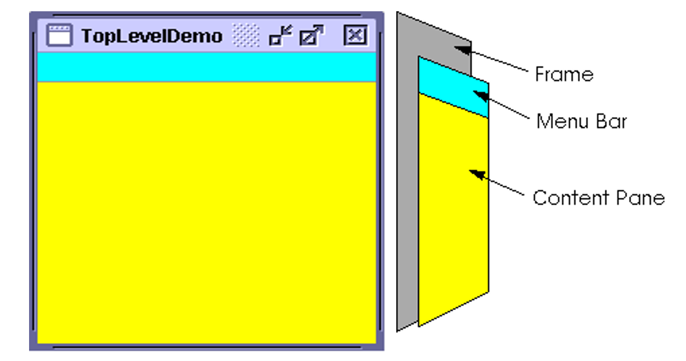
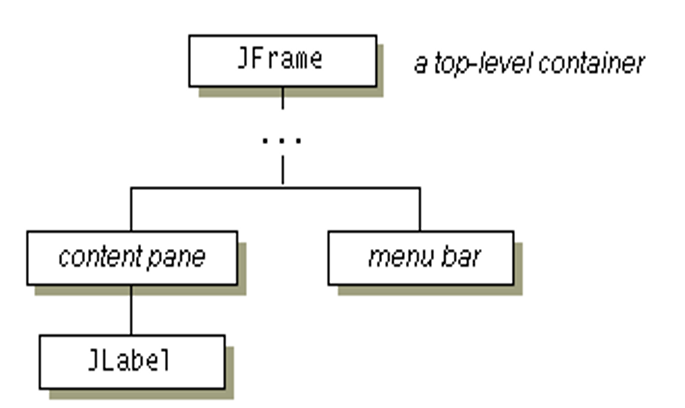
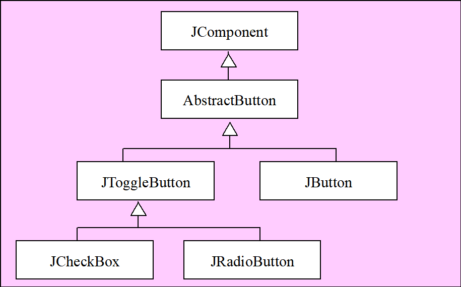
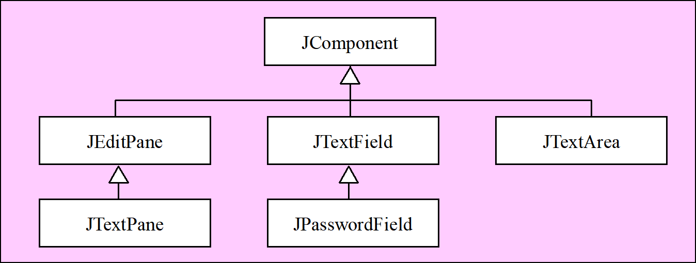

[TOC]
# 图形用户界面（GUI）
## Java图形用户界面概述

GUI(graphics user interface)基本元素:
  ==组件、容器、布局管理器、绘图工具==

1) 组件是与用户实现交互操作的部件，
2) 容器是包容组件的部件，
3) 布局管理器是管理组件在容器中布局的部件，
4) 工具是绘制图形的部件

步骤：
1. 创建和设置容器/组件
2. 将组件加入到容器中
3. 布局组件
4. 处理由组件产生的事件

### 使用 Java Swing 创建图形用户界面概述

Java两个包==(java.awt、javax.swing)==含有实现上述所有元素的类。

1) AWT(abstract windows toolkit):抽象窗口工具包.   java1.1。
2) Swing(JFC:Java Foundation Classes)  :替代AWT。改进组件的显示外观 、 增强组件的控制能力。
3) 事件处理的类在java.event包中。

### 1. Swing 的概述

1) AWT是基于同位体的体系结构，重量级组件。
2) AWT有部分代码是用c编写的，而Swing是纯    
  Java的。
3) Swing具有控制外观的功能，而AWT则完全依赖于本地平台。
4) Swing组件都存于javax.swing包中,另外Swing包
　中的所有类都冠以“J”打头。
5) Jcomponent是Container的子类，所有的Swing
　组件都是容器。

### 2. Swing GUI 应用的基本构建块

一个典型的 Swing GUI 应用通常由以下核心元素构成：

#### A. 顶层容器 (Top-Level Containers)

* **`JFrame`：** 用于创建应用程序主窗口。它是带标题栏、边框和控制按钮的顶层窗口。每个 Swing 应用程序通常至少有一个 `JFrame`。
* **`JDialog`：** 用于创建对话框窗口，通常依附于 `JFrame`，用于显示消息、获取用户输入或进行特定的短期交互。
* **`JApplet`：** 用于在 Web 浏览器中运行 Java 小程序（现代浏览器已基本不再支持）。

#### B. 通用容器 (General-PurposeContainers)

* **`JPanel`：** 最常用的通用容器，用于组织和分组其他组件。它没有边框或标题栏，通常嵌入在顶层容器或其他中间容器中。`JPanel` 是默认双缓冲的，有助于平滑绘图。
* **`JScrollPane`：** 为组件（如 `JTextArea`, `JTable`）提供滚动功能。
* **`JSplitPane`：** 将两个组件分割成可调整大小的区域。
* **`JTabbedPane`：** 提供带标签的面板，用于在同一个区域显示不同内容。

#### C. 基本组件 (Basic Components / Controls)

* **`JLabel`：** 显示文本或图像，不可编辑。
* **`JButton`：** 点击时触发操作的按钮。
* **`JTextField`：** 单行文本输入框。
* **`JTextArea`：** 多行文本输入/显示区域。
* **`JCheckBox`：** 复选框，可选中或取消选中。
* **`JRadioButton`：** 单选按钮，通常与 `ButtonGroup` 结合使用，实现互斥选择。
* **`JComboBox`：** 下拉列表框。
* **`JList`：** 显示可选择项的列表。
* **`JTable`：** 显示表格数据。
* **`JTree`：** 显示层级数据（树状结构）。
* **`JMenuBar`, `JMenu`, `JMenuItem`：** 用于创建菜单栏、菜单和菜单项。


### 3. 布局管理器 (Layout Managers)

布局管理器负责自动排列容器中的组件，确保 GUI 在不同屏幕尺寸和分辨率下都能正确显示。

* **`BorderLayout`：** 将容器分为上、下、左、右、中五个区域。`JFrame` 的默认布局。
* **`FlowLayout`：** 组件像文字一样从左到右、从上到下排列。`JPanel` 的默认布局。
* **`GridLayout`：** 将容器分割成网格，每个单元格大小相同，组件按网格顺序排列。
* **`BoxLayout`：** 沿水平或垂直方向排列组件。
* **`GridBagLayout`：** 最强大但也最复杂的布局管理器，允许组件在网格中跨越多个单元格，并提供精细的控制。
* **`null` 布局 (绝对布局)：** 不使用布局管理器，手动设置每个组件的位置和大小。**不推荐**，因为它缺乏灵活性和跨平台适应性。

#### 4. 事件处理 (Event Handling)

Swing 采用**委托事件模型 (Delegation Event Model)** 来处理用户交互。

* **事件源 (Event Source)：** 产生事件的组件（如按钮被点击）。
* **事件对象 (Event Object)：** 封装了事件信息的对象（如 `ActionEvent`）。
* **事件监听器 (Event Listener)：** 实现特定接口（如 `ActionListener`, `MouseListener`）的类，用于处理特定类型的事件。
* **注册监听器：** 事件源通过 `addXxxListener()` 方法注册事件监听器。

**基本步骤：**
1.  创建事件监听器类（通常是匿名内部类、Lambda 表达式或单独的类）。
2.  实现监听器接口中定义的事件处理方法。
3.  将监听器对象注册到事件源上。


**说明**
1) 基于Swing的GUI程序，==至少要有一个顶层容器==作为==根==的容器层级结构。
2) 每个GUI组件只能添加到一个容器。
3) 每个顶层容器都包含一个==内容器==( content pane),所有的==可视组件（其它容器）都必须放在内容器中显示.==
4) 可在顶层容器中添加菜单栏,它将位于顶层容器的约定置。
   (在顶层容器内，但在内容器的外部)

## 顶层容器

### JFrame构造方法：
1. JFrame(): 创建一个初始不可见且标题为空的窗口框架。
2. JFrame(String title)：创建一个初始不可见且标题为title的窗口
```java
import java.awt.*;
import javax.swing.*;
public class TestJFrame{
  public static void main(String[] args){
    JFrame jframe=new JFrame("JFrame 测试程序 ");
     jframe.setBounds(100,100,300,300);
     jframe.setVisible(true);
  }
}
```
其中：setBounds(int x,int y,int width,int height) 
 将窗口框架的左上角位置设置为坐标点x，y，宽为width,高为height.

### 顶层容器的主要方法：
1. frame.getContentPane() :获得顶层容器的内容器。
　内容器作为中间层，是Jcomponent的子类。它使用BorderLayout作为默认布局管理器。
2. 加一组件至内容器(content pane)中:
  frame.getContentPane().add(yellowLabel, BorderLayout.CENTER); 
3. 要设置顶层容器的内容窗格，使用顶层容器的成员方法:setContentPane（）。
4. 添加菜单至顶层容器中。　 setJMenuBar(cyanMenuBar);

## 通用容器:JPanel、JScrollPane、JToolBar
**中间层容器**：包含其它容器(通用容器、专用容器)和组件的容器 
    主要包括:
    ==面板容器（Panel）、==
    ==带滚动条的视窗容器（ScrollPane）、==
    ==工具栏（ToolBar）等。==
    Swing中，分别用==JPanel、JScrollPane和JToolBar类==实现，它们都是==JComponent=的子类，且通常被放置在其他容器中。
好的，我们来详细解释 `JPanel` 和 `JScrollPane` 这两个 Swing 容器组件的使用方法。它们是构建 Swing GUI 界面时非常常用且重要的组件。

### 1. 面板容器 `JPanel`

`JPanel` 是 Swing 中最基本的通用轻量级容器。它通常用于组织和分组其他组件，也可以作为自定义绘制的区域。`JPanel` 本身没有边框或标题，但它可以设置背景色，并且可以容纳其他组件。

**构造方法：**

* **`JPanel();`**
    * **含义：** 创建一个新的 `JPanel`，并使用默认的布局管理器。
    * **默认布局管理器：** Java Swing 中的 `JPanel` 默认使用 `FlowLayout`。`FlowLayout` 会按照组件添加的顺序，从左到右、从上到下排列组件，当一行排满时自动换行。
    * **使用场景：** 当您不需要复杂的布局，或者只是简单地堆放少量组件时。

    ```java
    import javax.swing.*;
    import java.awt.*;

    public class JPanelDemo1 {
        public static void main(String[] args) {
            JFrame frame = new JFrame("JPanel Default Layout Demo");
            frame.setDefaultCloseOperation(JFrame.EXIT_ON_CLOSE);
            frame.setSize(400, 300);
            frame.setLocationRelativeTo(null); // 居中显示

            // 创建一个默认布局的JPanel
            JPanel panel = new JPanel();
            panel.setBackground(Color.LIGHT_GRAY); // 设置背景色以便区分

            // 添加一些组件到JPanel
            panel.add(new JButton("Button 1"));
            panel.add(new JButton("Button 2"));
            panel.add(new JLabel("Label 1"));
            panel.add(new JTextField(10));

            // 将JPanel添加到JFrame
            frame.add(panel);
            frame.setVisible(true);
        }
    }
    ```

* **`JPanel(LayoutManager layout);`**
    * **含义：** 创建一个新的 `JPanel`，并使用指定的布局管理器。
    * **`LayoutManager`：** Java Swing 提供了多种布局管理器来控制组件在容器中的排列方式，例如：
        * `FlowLayout`：流式布局，从左到右，从上到下。
        * `BorderLayout`：边界布局，将容器划分为东、南、西、北、中五个区域。`JFrame` 的内容面板默认使用 `BorderLayout`。
        * `GridLayout`：网格布局，将容器划分为行和列的网格。
        * `BoxLayout`：盒式布局，按水平或垂直方向排列组件。
        * `GridBagLayout`：最灵活但最复杂的网格袋布局，可以实现非常复杂的布局。
        * `CardLayout`：卡片布局，一次只显示一个组件。
    * **使用场景：** 当您需要更精确地控制组件的布局时，这是最常用的方式。

    ```java
    import javax.swing.*;
    import java.awt.*;

    public class JPanelDemo2 {
        public static void main(String[] args) {
            JFrame frame = new JFrame("JPanel Custom Layout Demo");
            frame.setDefaultCloseOperation(JFrame.EXIT_ON_CLOSE);
            frame.setSize(400, 300);
            frame.setLocationRelativeTo(null);

            // 创建一个使用GridLayout的JPanel (2行2列)
            JPanel gridPanel = new JPanel(new GridLayout(2, 2, 5, 5)); // 2行2列，组件间距5像素
            gridPanel.setBackground(new Color(200, 220, 255)); // 浅蓝色背景

            gridPanel.add(new JButton("Top-Left"));
            gridPanel.add(new JButton("Top-Right"));
            gridPanel.add(new JButton("Bottom-Left"));
            gridPanel.add(new JButton("Bottom-Right"));

            // 创建一个使用BorderLayout的JPanel
            JPanel borderPanel = new JPanel(new BorderLayout());
            borderPanel.setBackground(new Color(255, 220, 200)); // 浅橙色背景

            borderPanel.add(new JLabel("North", SwingConstants.CENTER), BorderLayout.NORTH);
            borderPanel.add(new JButton("Center Button"), BorderLayout.CENTER);
            borderPanel.add(new JTextField("South Text"), BorderLayout.SOUTH);

            // 将这两个JPanel添加到JFrame的内容面板（JFrame默认使用BorderLayout）
            frame.add(gridPanel, BorderLayout.WEST); // 将网格面板放在左边
            frame.add(borderPanel, BorderLayout.CENTER); // 将边界面板放在中间

            frame.setVisible(true);
        }
    }
    ```

### 2. 带滚动视窗容器 `JScrollPane`

`JScrollPane` 是一个专门用于为其他组件（尤其是那些内容可能超出其可视区域的组件）提供滚动功能的容器。最典型的应用是为 `JTextArea` 或 `JTable` 等组件提供滚动条。

**基本用法：**

`JScrollPane` 的主要构造方法是：

* **`JScrollPane(Component view);`**
    * **含义：** 创建一个 `JScrollPane`，并为其指定一个**视图组件 (view component)**。这个视图组件就是您希望能够滚动的内容。
    * **`Component view`：** 这是您想要添加滚动条的组件。例如，一个很大的 `JTextArea`、一个 `JTable`、甚至是一个 `JPanel`（如果 `JPanel` 里面的内容可能超出可视范围）。

**使用场景：**

当您的组件内容可能过大，无法在有限的窗口空间内完全显示时，就需要 `JScrollPane`。它会自动判断何时显示垂直或水平滚动条。

```java
import javax.swing.*;
import java.awt.*;

public class JScrollPaneDemo {
    public static void main(String[] args) {
        JFrame frame = new JFrame("JScrollPane Demo");
        frame.setDefaultCloseOperation(JFrame.EXIT_ON_CLOSE);
        frame.setSize(400, 300);
        frame.setLocationRelativeTo(null);

        // 1. 创建一个需要滚动功能的组件
        // 这里我们使用JTextArea，并添加很长的文本，使其超出可视范围
        JTextArea textArea = new JTextArea(
            "This is a long text that needs to be scrolled.\n" +
            "You can keep typing here and the scroll pane will automatically\n" +
            "provide a vertical scrollbar when the text exceeds the visible area.\n" +
            "Line 1\nLine 2\nLine 3\nLine 4\nLine 5\nLine 6\nLine 7\n" +
            "Line 8\nLine 9\nLine 10\nLine 11\nLine 12\nLine 13\nLine 14\n" +
            "Line 15\nLine 16\nLine 17\nLine 18\nLine 19\nLine 20\n" // 很多行
        );
        textArea.setLineWrap(true); // 自动换行
        textArea.setWrapStyleWord(true); // 按单词换行
        textArea.setFont(new Font("Monospaced", Font.PLAIN, 14));


        // 2. 将需要滚动功能的组件包装到JScrollPane中
        JScrollPane scrollPane = new JScrollPane(textArea);

        // 3. (可选) 设置滚动条策略
        // scrollPane.setVerticalScrollBarPolicy(JScrollPane.VERTICAL_SCROLLBAR_ALWAYS); // 总是显示垂直滚动条
        // scrollPane.setHorizontalScrollBarPolicy(JScrollPane.HORIZONTAL_SCROLLBAR_NEVER); // 永不显示水平滚动条
        // 默认是JScrollPane.VERTICAL_SCROLLBAR_AS_NEEDED 和 JScrollPane.HORIZONTAL_SCROLLBAR_AS_NEEDED

        // 4. 将JScrollPane添加到JFrame中
        frame.add(scrollPane, BorderLayout.CENTER); // 通常放在中间

        frame.setVisible(true);
    }
}
```

**`JScrollPane` 包装 `JPanel` 的情况：**

您也可以将一个 `JPanel` 放到 `JScrollPane` 中，如果这个 `JPanel` 里面的内容（比如很多小图片、很多自定义绘制的图形）可能超出其预设大小，从而需要滚动。

```java
import javax.swing.*;
import java.awt.*;

public class JScrollPaneWithJPanelDemo {
    public static void main(String[] args) {
        JFrame frame = new JFrame("JScrollPane with JPanel Demo");
        frame.setDefaultCloseOperation(JFrame.EXIT_ON_CLOSE);
        frame.setSize(400, 300);
        frame.setLocationRelativeTo(null);

        // 创建一个JPanel，并将其首选大小设置为超出JFrame的尺寸
        JPanel contentPanel = new JPanel();
        contentPanel.setLayout(new GridLayout(20, 1)); // 20行，每行一个标签
        contentPanel.setPreferredSize(new Dimension(350, 600)); // 设置比JFrame高的首选大小
        contentPanel.setBackground(Color.YELLOW);

        // 添加很多组件到contentPanel
        for (int i = 1; i <= 20; i++) {
            contentPanel.add(new JLabel("Item " + i));
        }

        // 将contentPanel包装到JScrollPane中
        JScrollPane scrollPane = new JScrollPane(contentPanel);

        // 将JScrollPane添加到JFrame
        frame.add(scrollPane, BorderLayout.CENTER);

        frame.setVisible(true);
    }
}
```

通过以上解释和示例，您应该对 `JPanel` 和 `JScrollPane` 的基本使用有了清晰的理解。它们是 Swing GUI 编程中不可或缺的基石。


---
## 布局管理器
 Swing 中三种最常用的布局管理器：**`FlowLayout`**、**`BorderLayout`** 和 **`GridLayout`**。它们是构建用户界面的基石。


### 1. FlowLayout（流式布局）

**FlowLayout** 是最简单的布局管理器，它像文本一样，从左到右、从上到下地排列组件。当一行空间不足时，组件会自动换到下一行。`JPanel` 默认使用的就是 `FlowLayout`。

#### 构造方法：

* `FlowLayout()`: 创建一个居中对齐的流式布局，组件之间默认有 5 像素的水平和垂直间距。
* `FlowLayout(int align)`: 创建一个指定对齐方式的流式布局。`align` 可以是：
    * `FlowLayout.LEFT`: 左对齐
    * `FlowLayout.CENTER`: 居中对齐 (默认)
    * `FlowLayout.RIGHT`: 右对齐
    * `FlowLayout.LEADING`: 容器方向的起始位置对齐 (通常是左对齐)
    * `FlowLayout.TRAILING`: 容器方向的结束位置对齐 (通常是右对齐)
* `FlowLayout(int align, int hgap, int vgap)`: 创建一个指定对齐方式和水平/垂直间距的流式布局。
    * `hgap`: 组件之间的水平间距 (像素)。
    * `vgap`: 行之间的垂直间距 (像素)。

#### 简单样例：

```java
import javax.swing.*;
import java.awt.*;

public class FlowLayoutDemo {
    public static void main(String[] args) {
        JFrame frame = new JFrame("FlowLayout Demo");
        frame.setDefaultCloseOperation(JFrame.EXIT_ON_CLOSE);
        frame.setSize(400, 200);
        frame.setLocationRelativeTo(null); // 窗口居中显示

        // 创建一个JPanel并设置其布局为右对齐，水平垂直间距为10像素
        JPanel panel = new JPanel(new FlowLayout(FlowLayout.RIGHT, 10, 10));
        panel.setBackground(Color.LIGHT_GRAY); // 设置背景色方便观察

        // 添加一些按钮到面板
        panel.add(new JButton("Button 1"));
        panel.add(new JButton("Long Button 2"));
        panel.add(new JButton("Btn 3"));
        panel.add(new JButton("Another Button 4"));
        panel.add(new JButton("Last One 5"));

        frame.add(panel); // 将面板添加到帧
        frame.setVisible(true);
    }
}
```

---

### 2. BorderLayout（边界布局）

**BorderLayout** 将容器划分为五个区域：**北 (NORTH)**、**南 (SOUTH)**、**东 (EAST)**、**西 (WEST)** 和 **中 (CENTER)**。每个区域最多只能放置一个组件。**`JFrame` 的内容面板默认就使用 `BorderLayout`。**

#### 构造方法：

* `BorderLayout()`: 创建一个没有间距的边界布局。
* `BorderLayout(int hgap, int vgap)`: 创建一个指定水平和垂直间距的边界布局。
    * `hgap`: 组件之间的水平间距 (像素)。
    * `vgap`: 组件之间的垂直间距 (像素)。

#### 简单样例：

```java
import javax.swing.*;
import java.awt.*;

public class BorderLayoutDemo {
    public static void main(String[] args) {
        JFrame frame = new JFrame("BorderLayout Demo");
        frame.setDefaultCloseOperation(JFrame.EXIT_ON_CLOSE);
        frame.setSize(500, 300);
        frame.setLocationRelativeTo(null);

        // JFrame的内容面板默认就是BorderLayout，可以直接向其中添加组件
        // 如果想创建一个独立的JPanel使用BorderLayout，则像FlowLayout那样传入布局管理器
        // JPanel panel = new JPanel(new BorderLayout(5, 5)); // 5像素的水平垂直间距

        // 添加组件到不同的区域
        frame.add(new JButton("North Button"), BorderLayout.NORTH); // 顶部
        frame.add(new JButton("South Button"), BorderLayout.SOUTH); // 底部
        frame.add(new JButton("West Button"), BorderLayout.WEST);   // 左边
        frame.add(new JButton("East Button"), BorderLayout.EAST);   // 右边

        // CENTER区域会自动占据所有剩余空间，且是唯一一个能自动填充的区域
        JTextArea centerText = new JTextArea("This is the Center area. It will expand to fill available space.");
        centerText.setLineWrap(true); // 文本自动换行
        centerText.setWrapStyleWord(true); // 按单词换行
        // 通常大的文本区会放在JScrollPane里，JScrollPane再放到CENTER
        frame.add(new JScrollPane(centerText), BorderLayout.CENTER);

        frame.setVisible(true);
    }
}
```

---

### 3. GridLayout（网格布局）

**GridLayout** 将容器划分为一个规则的行和列的网格。容器中的所有组件大小相同，并依次填充网格的每个单元格，从左到右，从上到下。

#### 构造方法：

* `GridLayout()`: 创建一个单行单列的网格布局 (不常用，因为所有组件会堆叠在一个单元格里)。
* `GridLayout(int rows, int cols)`: 创建一个指定行数和列数的网格布局。
    * `rows`: 网格的行数。如果为 0，则行数不限（但仍受列数限制）。
    * `cols`: 网格的列数。如果为 0，则列数不限（但仍受行数限制）。
    * **注意：** 行数和列数不能同时为 0。如果其中一个为 0，则表示另一个参数是固定的，而这个为 0 的参数会根据添加的组件数量自动调整。通常我们会固定行数或列数中的一个。
* `GridLayout(int rows, int cols, int hgap, int vgap)`: 创建一个指定行数、列数以及水平/垂直间距的网格布局。
    * `hgap`: 组件之间的水平间距 (像素)。
    * `vgap`: 组件之间的垂直间距 (像素)。

#### 简单样例：

```java
import javax.swing.*;
import java.awt.*;

public class GridLayoutDemo {
    public static void main(String[] args) {
        JFrame frame = new JFrame("GridLayout Demo");
        frame.setDefaultCloseOperation(JFrame.EXIT_ON_CLOSE);
        frame.setSize(400, 300);
        frame.setLocationRelativeTo(null);

        // 创建一个JPanel并设置其布局为3行2列，组件间距为5像素
        JPanel panel = new JPanel(new GridLayout(3, 2, 5, 5));
        panel.setBackground(Color.ORANGE); // 设置背景色方便观察

        // 添加6个按钮到面板，它们会自动填充3行2列的网格
        panel.add(new JButton("Cell (0,0)"));
        panel.add(new JButton("Cell (0,1)"));
        panel.add(new JButton("Cell (1,0)"));
        panel.add(new JButton("Cell (1,1)"));
        panel.add(new JButton("Cell (2,0)"));
        panel.add(new JButton("Cell (2,1)"));

        frame.add(panel); // 将面板添加到帧
        frame.setVisible(true);
    }
}
```

---

**总结：**

* **FlowLayout** 适用于简单、线性的组件排列，或者需要组件自动换行的情况。
* **BorderLayout** 适用于将界面划分为几个固定区域，其中中央区域可以自适应大小的场景（如主内容区）。
* **GridLayout** 适用于需要将组件以等大小的网格形式排列的场景（如计算器键盘）。

在实际开发中，你经常会**嵌套使用这些布局管理器**。例如，在一个使用 `BorderLayout` 的 `JPanel` 的 `NORTH` 区域中，你可能会放置一个使用 `FlowLayout` 的 `JPanel` 来排列一些按钮。通过这种方式，你可以构建出非常复杂和灵活的用户界面。


## Swing常用组件
### 标签
在Swing中，用==JLabel类==实现标签组件，它的显示形式得到了扩展，它不仅可以显示文字，还可以显示图片。
您好！您提供的这些是 `JLabel` 类中常用的方法和构造方法。`JLabel` 是 Swing 中一个非常基础且重要的组件，主要用于显示文本或图像（图标），但它**不能被编辑**。

### `JLabel` 的常用方法

这些方法用于获取或设置 `JLabel` 的文本、图标以及对齐方式。

1.  **`String getText()`**
    * **作用：** 获取当前 `JLabel` 上显示的文本内容。
    * **返回值：** 一个 `String` 类型的值，表示标签的文本。

2.  **`void setText(String text)`**
    * **作用：** 设置或更改 `JLabel` 上要显示的文本内容。
    * **参数 `text`：** 您想要在标签上显示的新文本字符串。

3.  **`Icon getIcon()`**
    * **作用：** 获取当前 `JLabel` 上显示的图标（图像）。
    * **返回值：** 一个 `Icon` 对象，表示标签的图标。如果标签没有设置图标，则返回 `null`。

4.  **`void setIcon(Icon icon)`**
    * **作用：** 设置或更改 `JLabel` 上要显示的图标。
    * **参数 `icon`：** 您想要在标签上显示的新图标对象。`Icon` 通常是 `ImageIcon` 的实例，用于加载图片。

5.  **`int getHorizontalAlignment()`**
    * **作用：** 获取 `JLabel` 中文本和图标的水平对齐方式。
    * **返回值：** 一个整数值，表示当前的水平对齐常量，例如 `SwingConstants.LEFT`、`SwingConstants.CENTER`、`SwingConstants.RIGHT` 等。

6.  **`void setHorizontalAlignment(int alignment)`**
    * **作用：** 设置 `JLabel` 中文本和图标的水平对齐方式。
    * **参数 `alignment`：** 指定水平对齐方式的常量，通常来自 `SwingConstants` 接口：
        * `SwingConstants.LEFT`：左对齐
        * `SwingConstants.CENTER`：居中对齐
        * `SwingConstants.RIGHT`：右对齐
        * `SwingConstants.LEADING`：与组件方向相关的起始对齐（通常是左对齐）
        * `SwingConstants.TRAILING`：与组件方向相关的结束对齐（通常是右对齐）

7.  **`int getVerticalAlignment()`**
    * **作用：** 获取 `JLabel` 中文本和图标的垂直对齐方式。
    * **返回值：** 一个整数值，表示当前的垂直对齐常量，例如 `SwingConstants.TOP`、`SwingConstants.CENTER`、`SwingConstants.BOTTOM` 等。

8.  **`void setVerticalAlignment(int alignment)`**
    * **作用：** 设置 `JLabel` 中文本和图标的垂直对齐方式。
    * **参数 `alignment`：** 指定垂直对齐方式的常量，通常来自 `SwingConstants` 接口：
        * `SwingConstants.TOP`：顶部对齐
        * `SwingConstants.CENTER`：居中对齐 (默认)
        * `SwingConstants.BOTTOM`：底部对齐

---

### `JLabel` 的构造方法

这些构造方法允许您在创建 `JLabel` 对象时，根据需要初始化其文本、图标和对齐方式。

1.  **`JLabel()`**
    * **作用：** 创建一个不带文本和图标的空 `JLabel`。
    * **使用场景：** 当您想先创建标签，之后再通过 `setText()` 或 `setIcon()` 方法设置其内容时。

2.  **`JLabel(Icon icon)`**
    * **作用：** 创建一个只显示指定图标的 `JLabel`。图标默认水平居中对齐，垂直居中对齐。
    * **参数 `icon`：** 要在标签上显示的 `Icon` 对象。

3.  **`JLabel(Icon icon, int horizontalAlignment)`**
    * **作用：** 创建一个只显示指定图标的 `JLabel`，并设置图标的水平对齐方式。垂直对齐方式仍为默认的居中。
    * **参数 `icon`：** 要在标签上显示的 `Icon` 对象。
    * **参数 `horizontalAlignment`：** 图标的水平对齐方式（如 `SwingConstants.LEFT`, `SwingConstants.CENTER` 等）。

4.  **`JLabel(String text)`**
    * **作用：** 创建一个只显示指定文本的 `JLabel`。文本默认水平居中对齐，垂直居中对齐。
    * **参数 `text`：** 要在标签上显示的文本字符串。

5.  **`JLabel(String text, int horizontalAlignment)`**
    * **作用：** 创建一个只显示指定文本的 `JLabel`，并设置文本的水平对齐方式。垂直对齐方式仍为默认的居中。
    * **参数 `text`：** 要在标签上显示的文本字符串。
    * **参数 `horizontalAlignment`：** 文本的水平对齐方式。

6.  **`JLabel(String text, Icon icon, int horizontalAlignment)`**
    * **作用：** 创建一个同时显示文本和图标的 `JLabel`，并设置它们的水平对齐方式。图标会显示在文本的左侧。
    * **参数 `text`：** 要在标签上显示的文本字符串。
    * **参数 `icon`：** 要在标签上显示的 `Icon` 对象。
    * **参数 `horizontalAlignment`：** 文本和图标的水平对齐方式。

### 按钮

抽象类==AbstractButton类==的部分成员方法:
---

#### 1. `boolean isSelected()`

* **作用：** 查询组件的当前选中状态。
* **返回值：**
    * `true`：表示组件当前处于被选中（打勾、被点亮等）的状态。
    * `false`：表示组件当前处于未选中状态。
* **使用场景：** 比如在一个复选框（`JCheckBox`）中，您想知道用户是否已经勾选了它。

#### 2. `void setSelected(boolean b)`

* **作用：** 设置组件的选中状态。
* **参数 `b`：**
    * `true`：将组件设置为选中状态。
    * `false`：将组件设置为未选中状态。
* **使用场景：** 比如在程序启动时，您希望某个复选框默认就是被选中的。

---

#### 3. `String getText()`

* **作用：** 获取组件上显示的文本内容。
* **返回值：** 一个 `String` 类型的值，表示组件的文本标签。
* **使用场景：** 获取按钮上显示的文字，或者复选框旁边描述的文字。

#### 4. `void setText(String text)`

* **作用：** 设置或更改组件上显示的文本内容。
* **参数 `text`：** 您想要在组件上显示的新文本字符串。
* **使用场景：** 动态修改按钮的文本，或者复选框的描述。

---

#### 5. `Icon getIcon()`

* **作用：** 获取组件在默认状态（未被选中、未被按下）下显示的图标。
* **返回值：** 一个 `Icon` 对象，表示默认图标。如果未设置，则返回 `null`。
* **使用场景：** 获取按钮或复选框默认显示的图片。

#### 6. `void setIcon(Icon icon)`

* **作用：** 设置组件在默认状态下要显示的图标。
* **参数 `icon`：** 您想要设置的新 `Icon` 对象。
* **注意：** 您提供的原问题中是 `setIconb`，这很可能是笔误，正确的方法名应该是 `setIcon`。
* **使用场景：** 为按钮设置默认的图片样式。

---

#### 7. `Icon getDisabledIcon()`

* **作用：** 获取当组件处于禁用状态（即不能被用户点击或操作）时显示的图标。
* **返回值：** 一个 `Icon` 对象，表示禁用状态下的图标。
* **使用场景：** 当一个按钮因为某些条件不满足而不能点击时，您希望它显示一个灰色的或带有禁用标志的图标。

#### 8. `void setDisabledIcon(Icon icon)`

* **作用：** 设置当组件被禁用时要显示的图标。
* **参数 `icon`：** 您想要设置的禁用状态下的 `Icon` 对象。
* **使用场景：** 当您通过 `setEnabled(false)` 方法禁用一个按钮时，设置它应该显示什么图标。

---

#### 9. `Icon getPressedIcon()`

* **作用：** 获取当组件被按下（例如鼠标点击但尚未释放）时显示的图标。
* **返回值：** 一个 `Icon` 对象，表示按下状态下的图标。
* **使用场景：** 为按钮添加交互效果，当用户按下按钮时，图标会发生变化，提供视觉反馈。


使用按钮组件需要经过下列基本步骤：
==1）== 创建按钮对象；
==2）== 将按钮对象添加到容器中；
==3）== 设置响应点击按钮的操作。

### 文本框


---

#### `JTextField` 的构造方法

这些构造方法允许您在创建 `JTextField` 对象时，根据需要初始化其文本内容和建议的列数（宽度）。

1.  **`JTextField()`**
    * **作用：** 创建一个空的 `JTextField`（不带初始文本），其列数（宽度）将由布局管理器决定。
    * **使用场景：** 当您想创建一个空白的文本输入框，用户从头开始输入时。

2.  **`JTextField(String text)`**
    * **作用：** 创建一个带有指定初始文本的 `JTextField`，其列数（宽度）将由布局管理器决定。
    * **参数 `text`：** 文本框中预先显示的文本字符串。
    * **使用场景：** 当您想为文本框提供一个默认值或提示性文本时。

3.  **`JTextField(String text, int columns)`**
    * **作用：** 创建一个带有指定初始文本和指定建议列数的 `JTextField`。
    * **参数 `text`：** 文本框中预先显示的文本字符串。
    * **参数 `columns`：** 建议的列数。这通常表示文本框能够显示多少个字符的宽度。这个值是建议性的，实际宽度还会受布局管理器和字体大小的影响。
    * **使用场景：** 当您希望文本框不仅有初始文本，还能指定一个大概的显示宽度时。

4.  **`JTextField(int columns)`**
    * **作用：** 创建一个空的 `JTextField`，但指定了建议的列数（宽度）。
    * **参数 `columns`：** 建议的列数（宽度）。
    * **使用场景：** 当您想创建一个空白的文本框，但希望它有预设的宽度，以便在布局中占据适当空间时。

---

#### `JTextField` 的常用方法

这些方法用于获取或设置 `JTextField` 的文本内容、可编辑状态和建议的列数。

1.  **`String getText()`**
    * **作用：** 获取当前 `JTextField` 中包含的文本内容。
    * **返回值：** 一个 `String` 类型的值，表示用户在文本框中输入或程序设置的文本。

2.  **`void setText(String text)`**
    * **作用：** 设置或更改 `JTextField` 中要显示的文本内容。
    * **参数 `text`：** 您想要在文本框中显示的新文本字符串。这会覆盖文本框中原有的内容。

3.  **`boolean isEditable()`**
    * **作用：** 查询 `JTextField` 是否允许用户编辑其内容。
    * **返回值：**
        * `true`：表示用户可以修改文本框中的内容。
        * `false`：表示用户无法修改文本框中的内容（文本框会变成只读状态）。

4.  **`void setEditable(boolean editable)`**
    * **作用：** 设置 `JTextField` 的可编辑状态。
    * **参数 `editable`：**
        * `true`：将文本框设置为可编辑状态，用户可以输入和修改。
        * `false`：将文本框设置为只读状态，用户不能修改其内容，但仍然可以复制文本。
    * **使用场景：** 比如显示一些用户不能修改的信息，或者在某些操作完成前禁用输入。

5.  **`int getColumns()`**
    * **作用：** 获取 `JTextField` 的建议列数（宽度）。
    * **返回值：** 一个整数值，表示在创建时或通过 `setColumns()` 方法设置的建议列数。请注意，这只是一个建议值，实际显示宽度可能因字体、布局管理器等因素而有所不同。

6.  **`void setColumns(int columns)`**
    * **作用：** 设置 `JTextField` 的建议列数（宽度）。
    * **参数 `columns`：** 您想要为文本框设置的新的建议列数。
    * **使用场景：** 动态调整文本框的建议宽度，以适应布局需求。

---

### 组合框
组合框允许用户从若干个选项中选择一项。在Swing中用`JComboBox`类实现，它提供了两种不同形式的组合框。一种是==不可编辑的组合框==，它由一个按钮和下拉列表组成，这是默认形式；另一种是==可编辑的组合框==，它由一个可接收用户输入的文本框、按钮和下拉列表组成，用户既可以在文本框中输入文本串，也可以点击按钮，打开下拉列表。
好的，您提供的这些是 `JComboBox` 这个 Swing 组件的常用构造方法和成员方法。`JComboBox` 是一个下拉列表框组件，它允许用户从预定义的列表中选择一个项目。


#### `JComboBox` 的构造方法

这些构造方法允许您在创建 `JComboBox` 对象时，初始化其包含的选项列表。

1.  **`JComboBox()`**
    * **作用：** 创建一个空的 `JComboBox`。这意味着它最初没有包含任何可选项目。您需要稍后通过 `addItem()` 等方法向其添加项目。
    * **使用场景：** 当您想要动态地向下拉列表添加项目时，或者在程序启动时先创建一个空的列表，待数据加载后再填充。

2.  **`JComboBox(Object[] items)`**
    * **作用：** 使用一个 `Object` 数组来初始化 `JComboBox`，数组中的每个元素都将成为下拉列表中的一个可选项目。
    * **参数 `items`：** 一个 `Object` 类型的数组，数组中的每个元素将作为下拉列表中的一项。
    * **使用场景：** 当您在创建 `JComboBox` 时就已知所有可选项目，并且这些项目可以存储在一个数组中时。

    ```java
    // 示例：使用字符串数组创建JComboBox
    String[] colors = {"Red", "Green", "Blue", "Yellow"};
    JComboBox<String> colorComboBox = new JComboBox<>(colors);
    ```

3.  **`JComboBox(Vector<Object> items)`**
    * **作用：** 使用一个 `Vector`（一个动态数组集合）来初始化 `JComboBox`，`Vector` 中的每个元素都将成为下拉列表中的一个可选项目。
    * **参数 `items`：** 一个 `Vector<Object>` 对象，其中包含将作为列表项的对象。
    * **使用场景：** 类似于使用数组，但当您的数据是 `Vector` 类型时可以直接传入。在现代 Java 编程中，`ArrayList` 更常用，但 `JComboBox` 仍然支持 `Vector`。

    ```java
    // 示例：使用Vector创建JComboBox
    import java.util.Vector;
    Vector<Integer> numbers = new Vector<>();
    numbers.add(10);
    numbers.add(20);
    numbers.add(30);
    JComboBox<Integer> numberComboBox = new JComboBox<>(numbers);
    ```

---

#### `JComboBox` 的常用方法

这些方法用于管理 `JComboBox` 中的项目、获取用户选择的项目以及查询列表的状态。

1.  **`void addItem(Object item)`**
    * **作用：** 将一个新项目添加到下拉列表的末尾。
    * **参数 `item`：** 您想要添加到下拉列表中的新项目。这个项目可以是任何 `Object` 类型（通常是 `String`，但也可以是自定义对象）。
    * **使用场景：** 动态地向 `JComboBox` 中添加选项。

    ```java
    // 假设已有 colorComboBox
    colorComboBox.addItem("Purple"); // 添加一个新颜色
    ```

2.  **`void insertItemAt(Object item, int index)`**
    * **作用：** 在下拉列表的指定位置插入一个新项目。
    * **参数 `item`：** 您想要插入的新项目。
    * **参数 `index`：** 项目将被插入的位置（索引）。索引从 0 开始。如果 `index` 等于当前项目总数，则新项目会被添加到末尾。
    * **使用场景：** 当您需要在特定位置插入一个新选项时。

    ```java
    // 假设已有 colorComboBox
    colorComboBox.insertItemAt("Orange", 1); // 在索引1（第二个位置）插入Orange
    ```

3.  **`Object getItemAt(int index)`**
    * **作用：** 获取下拉列表中指定索引位置的项目。
    * **参数 `index`：** 您想要获取项目的索引。
    * **返回值：** 指定索引位置的 `Object` 对象。
    * **使用场景：** 获取下拉列表中某个特定位置的选项内容。

    ```java
    // 假设已有 colorComboBox
    Object firstColor = colorComboBox.getItemAt(0); // 获取第一个颜色
    System.out.println("First color: " + firstColor);
    ```

4.  **`Object getSelectedItem()`**
    * **作用：** 获取当前在下拉列表中被用户选中的项目。
    * **返回值：** 被选中的 `Object` 对象。如果没有选中任何项目（例如，列表为空），则返回 `null`。
    * **使用场景：** 获取用户在下拉列表中所做的选择。这是获取用户输入最常用的方法之一。

    ```java
    // 假设用户已经选择了列表中的某个颜色
    Object selectedColor = colorComboBox.getSelectedItem();
    if (selectedColor != null) {
        System.out.println("Selected color: " + selectedColor);
    }
    ```

5.  **`void removeItem(Object item)`**
    * **作用：** 从下拉列表中移除指定的项目。
    * **参数 `item`：** 您想要移除的项目。如果列表中有多个相同的项目，只有第一个匹配项会被移除。
    * **使用场景：** 动态地从 `JComboBox` 中移除不再需要的选项。

    ```java
    // 假设已有 colorComboBox
    colorComboBox.removeItem("Blue"); // 移除"Blue"选项
    ```

6.  **`int getItemCount()`**
    * **作用：** 获取下拉列表中当前的总项目数量。
    * **返回值：** 一个整数，表示列表中的项目数量。
    * **使用场景：** 遍历列表中的所有项目，或者检查列表是否为空。

    ```java
    // 假设已有 colorComboBox
    int count = colorComboBox.getItemCount();
    System.out.println("Total items: " + count);
    ```


### Java Swing/AWT 事件处理机制详解

在图形用户界面 (GUI) 编程中，**事件 (Event)** 是用户与 GUI 交互时（如点击按钮、敲击键盘、移动鼠标）或系统自身发生的一些特定状况（如窗口关闭、组件获得焦点）的通知。**事件处理机制**就是程序如何检测、响应和处理这些事件的系统。

Java 的 AWT 和 Swing 采用的是**委托事件模型 (Delegation Event Model)**，这是 Java GUI 事件处理的核心。

#### 1. 委托事件模型 (Delegation Event Model) 的核心角色

委托事件模型涉及四个核心角色：

1.  **事件源 (Event Source)：**
    * 产生或触发事件的 GUI 组件。
    * 例子：`JButton` (当被点击时)、`JTextField` (当文本改变时)、`JFrame` (当窗口关闭时)。
    * 事件源会提供方法来**注册**事件监听器（例如 `addActionListener()`、`addMouseListener()` 等）。

2.  **事件对象 (Event Object)：**
    * 封装了关于事件的详细信息（如事件类型、事件源、事件发生时的一些特定数据）。
    * 每个事件都有一个对应的事件类，它们都继承自 `java.util.EventObject`。
    * 例子：
        * `ActionEvent`：由按钮点击、菜单项选择、文本字段回车等操作触发。
        * `MouseEvent`：由鼠标点击、移动、拖拽等操作触发。
        * `KeyEvent`：由键盘按键按下、释放、输入字符等操作触发。
        * `WindowEvent`：由窗口打开、关闭、最小化等操作触发。
        * `ItemEvent`：由复选框、单选按钮、下拉列表选择状态改变触发。

3.  **事件监听器 (Event Listener)：**
    * 一个实现了特定接口（或继承了特定适配器类）的对象。
    * 它“监听”或“等待”特定类型的事件发生。
    * 当它监听的事件发生时，其内部的相应方法会被自动调用来处理事件。
    * 监听器接口通常命名为 `XxxListener`，例如 `ActionListener`、`MouseListener`、`KeyListener`。
    * 如果监听器接口有多个方法，但你只需要实现其中一个，可以使用对应的**适配器类 (Adapter Class)** 来简化代码（例如 `MouseAdapter` 实现了 `MouseListener`，你可以只重写你需要的方法）。

4.  **事件处理方法 (Event Handling Method)：**
    * 事件监听器接口中定义的方法，当事件发生时，由 JVM 自动回调执行。
    * 例子：`ActionListener` 接口中的 `actionPerformed(ActionEvent e)` 方法。

#### 2. 事件处理的流程

事件处理的整个过程可以概括为以下步骤：

1.  **事件源生成事件对象：** 当用户在 GUI 组件上执行某个操作时（例如点击一个按钮），该组件（事件源）会检测到这个操作。
2.  **创建事件对象：** 事件源会创建一个对应的事件对象（例如 `ActionEvent`），其中包含了关于这次操作的所有相关信息。
3.  **查找并通知监听器：** 事件源会检查它是否注册了对该类型事件感兴趣的监听器。如果注册了，它会遍历所有注册的监听器，并将事件对象作为参数调用监听器中相应的方法。
4.  **监听器执行事件处理代码：** 被调用的监听器方法（例如 `actionPerformed()`）会执行预先定义好的业务逻辑代码，从而响应用户操作。

#### 3. 实现事件处理的几种常见方式

##### A. 作为内部类实现 (最常用和推荐)

将监听器类定义在事件源所在类的内部。

1.  **匿名内部类 (Anonymous Inner Class)：** 最简洁的方式，尤其适用于只使用一次的简单监听器。

    ```java
    import javax.swing.*;
    import java.awt.event.ActionEvent;
    import java.awt.event.ActionListener;

    public class InnerClassEventDemo extends JFrame {
        public InnerClassEventDemo() {
            setTitle("匿名内部类事件处理");
            setSize(300, 200);
            setDefaultCloseOperation(JFrame.EXIT_ON_CLOSE);
            setLayout(new java.awt.FlowLayout());

            JButton button = new JButton("点击我");
            add(button);

            // 使用匿名内部类实现 ActionListener
            button.addActionListener(new ActionListener() {
                @Override
                public void actionPerformed(ActionEvent e) {
                    JOptionPane.showMessageDialog(InnerClassEventDemo.this, "按钮被点击了！(匿名内部类)");
                }
            });

            setVisible(true);
        }

        public static void main(String[] args) {
            SwingUtilities.invokeLater(() -> new InnerClassEventDemo());
        }
    }
    ```

2.  **命名内部类 (Named Inner Class)：** 当监听器逻辑比较复杂或需要被多个事件源共享时。

    ```java
    import javax.swing.*;
    import java.awt.event.ActionEvent;
    import java.awt.event.ActionListener;

    public class NamedInnerClassEventDemo extends JFrame {
        private JButton button1;
        private JButton button2;

        public NamedInnerClassEventDemo() {
            setTitle("命名内部类事件处理");
            setSize(300, 200);
            setDefaultCloseOperation(JFrame.EXIT_ON_CLOSE);
            setLayout(new java.awt.FlowLayout());

            button1 = new JButton("按钮 1");
            button2 = new JButton("按钮 2");
            add(button1);
            add(button2);

            MyButtonListener listener = new MyButtonListener(); // 创建监听器实例
            button1.addActionListener(listener); // 注册监听器
            button2.addActionListener(listener); // 注册同一个监听器到不同按钮

            setVisible(true);
        }

        // 命名内部类实现 ActionListener
        private class MyButtonListener implements ActionListener {
            @Override
            public void actionPerformed(ActionEvent e) {
                // 根据事件源判断是哪个按钮被点击
                if (e.getSource() == button1) {
                    JOptionPane.showMessageDialog(NamedInnerClassEventDemo.this, "按钮 1 被点击了！");
                } else if (e.getSource() == button2) {
                    JOptionPane.showMessageDialog(NamedInnerClassEventDemo.this, "按钮 2 被点击了！");
                }
            }
        }

        public static void main(String[] args) {
            SwingUtilities.invokeLater(() -> new NamedInnerClassEventDemo());
        }
    }
    ```

3.  **Lambda 表达式 (Java 8+):** 对于函数式接口（只有一个抽象方法的接口），可以使用 Lambda 表达式极大地简化事件处理代码。

    ```java
    import javax.swing.*;

    public class LambdaEventDemo extends JFrame {
        public LambdaEventDemo() {
            setTitle("Lambda 表达式事件处理");
            setSize(300, 200);
            setDefaultCloseOperation(JFrame.EXIT_ON_CLOSE);
            setLayout(new java.awt.FlowLayout());

            JButton button = new JButton("点击我！(Lambda)");
            add(button);

            // 使用 Lambda 表达式实现 ActionListener
            button.addActionListener(e -> {
                JOptionPane.showMessageDialog(this, "按钮被点击了！(Lambda)");
            });

            setVisible(true);
        }

        public static void main(String[] args) {
            SwingUtilities.invokeLater(() -> new LambdaEventDemo());
        }
    }
    ```

##### B. 作为外部类实现 (不常用，除非监听器非常通用)

将监听器定义为一个独立的公共类。

```java
// MyExternalListener.java
import javax.swing.*;
import java.awt.event.ActionEvent;
import java.awt.event.ActionListener;

public class MyExternalListener implements ActionListener {
    private JFrame parentFrame; // 引用父窗口，以便弹出消息框

    public MyExternalListener(JFrame frame) {
        this.parentFrame = frame;
    }

    @Override
    public void actionPerformed(ActionEvent e) {
        JOptionPane.showMessageDialog(parentFrame, "按钮被点击了！(外部类)");
    }
}

// ExternalClassEventDemo.java
import javax.swing.*;

public class ExternalClassEventDemo extends JFrame {
    public ExternalClassEventDemo() {
        setTitle("外部类事件处理");
        setSize(300, 200);
        setDefaultCloseOperation(JFrame.EXIT_ON_CLOSE);
        setLayout(new java.awt.FlowLayout());

        JButton button = new JButton("点击我");
        add(button);

        button.addActionListener(new MyExternalListener(this)); // 实例化并注册外部监听器

        setVisible(true);
    }

    public static void main(String[] args) {
        SwingUtilities.invokeLater(() -> new ExternalClassEventDemo());
    }
}
```

##### C. 所在类实现监听器接口 (适用于只有一个事件源或事件处理逻辑集中的情况)

让 GUI 窗口类本身实现监听器接口。

```java
import javax.swing.*;
import java.awt.event.ActionEvent;
import java.awt.event.ActionListener;

public class ThisClassEventDemo extends JFrame implements ActionListener { // 实现了 ActionListener

    private JButton myButton;

    public ThisClassEventDemo() {
        setTitle("本类实现监听器");
        setSize(300, 200);
        setDefaultCloseOperation(JFrame.EXIT_ON_CLOSE);
        setLayout(new java.awt.FlowLayout());

        myButton = new JButton("点击我");
        add(myButton);

        myButton.addActionListener(this); // 将自身注册为监听器

        setVisible(true);
    }

    @Override
    public void actionPerformed(ActionEvent e) {
        // 根据事件源判断
        if (e.getSource() == myButton) {
            JOptionPane.showMessageDialog(this, "按钮被点击了！(本类实现)");
        }
    }

    public static void main(String[] args) {
        SwingUtilities.invokeLater(() -> new ThisClassEventDemo());
    }
}
```

#### 4. 适配器类 (Adapter Classes)

有些监听器接口包含多个方法（例如 `MouseListener` 有 `mouseClicked`, `mousePressed`, `mouseReleased`, `mouseEntered`, `mouseExited`）。如果你只需要实现其中一个方法，实现整个接口会显得很麻烦，因为你必须为空的其他方法提供空实现。

为了解决这个问题，Java 提供了**适配器类**，它们是抽象类，实现了监听器接口中的所有方法（空实现）。你可以继承适配器类，然后只重写你需要的方法。

**示例：`MouseAdapter`**

```java
import javax.swing.*;
import java.awt.event.MouseAdapter; // 导入 MouseAdapter
import java.awt.event.MouseEvent;

public class AdapterClassEventDemo extends JFrame {
    public AdapterClassEventDemo() {
        setTitle("适配器类事件处理");
        setSize(300, 200);
        setDefaultCloseOperation(JFrame.EXIT_ON_CLOSE);
        setLayout(new java.awt.FlowLayout());

        JLabel label = new JLabel("点击或进入/离开我");
        add(label);

        // 使用 MouseAdapter，只重写 mouseClicked 方法
        label.addMouseListener(new MouseAdapter() {
            @Override
            public void mouseClicked(MouseEvent e) {
                JOptionPane.showMessageDialog(AdapterClassEventDemo.this, "标签被点击了！");
            }

            @Override
            public void mouseEntered(MouseEvent e) {
                label.setText("鼠标进入！"); // 鼠标进入时改变文本
            }

            @Override
            public void mouseExited(MouseEvent e) {
                label.setText("鼠标离开！"); // 鼠标离开时改变文本
            }
        });

        setVisible(true);
    }

    public static void main(String[] args) {
        SwingUtilities.invokeLater(() -> new AdapterClassEventDemo());
    }
}
```


#### 5. 线程安全：事件调度线程 (Event Dispatch Thread, EDT)

Swing 是**单线程**的。所有与 GUI 组件相关的操作（如创建、修改、更新组件，处理事件）都**必须**在 **事件调度线程 (Event Dispatch Thread, EDT)** 上执行。如果长时间运行的任务在 EDT 上执行，会导致 UI 冻结（无响应）。

* **启动 GUI：** 通常在 `main` 方法中，使用 `SwingUtilities.invokeLater()` 来在 EDT 上创建和显示 GUI。
* **长时间任务：** 如果有耗时的任务（如网络请求、文件 I/O），应该在单独的**工作线程**中执行。当任务完成后，如果需要更新 GUI，再使用 `SwingUtilities.invokeLater()` 或 `SwingWorker` 将更新操作调度回 EDT。

#### 6. Swing GUI 开发流程概述

1.  **创建顶层容器：** `JFrame` 或 `JDialog`。
2.  **设置容器属性：** 大小 (`setSize`), 关闭操作 (`setDefaultCloseOperation`), 标题 (`setTitle`), 布局管理器 (`setLayout`) 等。
3.  **创建组件：** 实例化 `JButton`, `JTextField`, `JLabel` 等。
4.  **添加组件到容器：** 使用容器的 `add()` 方法。
5.  **注册事件监听器：** 为组件添加事件处理逻辑。
6.  **显示容器：** 调用 `setVisible(true)` 使窗口可见。
7.  **处理线程安全：** 确保所有 GUI 操作都在 EDT 上执行，将耗时操作放到后台线程。


### Java Swing 使用方法详解与示例

Java Swing 是一个用于创建富客户端桌面应用程序的 GUI 工具包。它构建在 AWT 之上，提供了一套纯 Java 实现的“轻量级”组件，从而实现跨平台的一致性外观。

**核心思想：**
1.  **组件：** GUI 的基本构建块（按钮、文本框等）。
2.  **容器：** 容纳其他组件的组件（窗口、面板）。
3.  **布局管理器：** 控制组件在容器中的排列方式。
4.  **事件处理：** 响应用户交互（点击、输入等）。
5.  **EDT (Event Dispatch Thread)：** 确保 GUI 操作的线程安全。

#### 1. Swing 应用的基本步骤

1.  **创建顶层容器：`JFrame` (窗口)**
    * 一个 Swing 应用通常从一个 `JFrame` 开始，它是应用程序的主窗口。
    * 设置窗口的标题、大小、关闭行为等。
2.  **创建中间容器：`JPanel` (面板)**
    * `JPanel` 是最常用的通用容器，用于组织和分组其他组件。
    * 可以为 `JPanel` 设置不同的布局管理器。
3.  **创建 GUI 组件：`JButton`, `JLabel`, `JTextField` 等**
    * 实例化各种 UI 控件。
4.  **设置布局管理器：`setLayout()`**
    * 容器需要一个布局管理器来决定其内部组件的位置和大小。
    * `JFrame` 默认使用 `BorderLayout`，`JPanel` 默认使用 `FlowLayout`。
5.  **添加组件：`add()`**
    * 将创建的组件添加到容器中。
6.  **注册事件监听器：`addActionListener()` 等**
    * 为需要响应用户交互的组件添加监听器，定义当事件发生时要执行的代码。
7.  **显示窗口：`setVisible(true)`**
    * 使 `JFrame` 可见。
8.  **线程安全处理：`SwingUtilities.invokeLater()`**
    * 所有 Swing GUI 组件的创建和更新都必须在 **事件调度线程 (Event Dispatch Thread, EDT)** 上进行，以避免线程问题和 UI 冻结。

#### 2. 综合示例：一个简单的用户注册表单

这个例子将创建一个包含标签、文本框、密码框、复选框、下拉列表和按钮的简单注册表单，并演示事件处理。

```java
import javax.swing.*; // 导入 Swing 包中的所有类
import java.awt.*;    // 导入 AWT 包中的布局、颜色等基础类
import java.awt.event.ActionEvent; // 导入事件处理相关的类
import java.awt.event.ActionListener; // 导入事件监听器接口

/**
 * 这是一个演示 Swing GUI 基本使用方法的程序。
 * 它创建了一个简单的用户注册表单界面。
 */
public class SimpleRegistrationForm extends JFrame implements ActionListener {

    // 声明 GUI 组件作为类的成员变量，以便在不同方法中访问它们
    private JLabel titleLabel;
    private JLabel usernameLabel;
    private JTextField usernameField;
    private JLabel passwordLabel;
    private JPasswordField passwordField; // 密码框，输入时显示星号
    private JCheckBox rememberMeCheckBox;
    private JLabel roleLabel;
    private JComboBox<String> roleComboBox; // 下拉列表
    private JButton registerButton;
    private JTextArea outputArea; // 用于显示注册信息的文本区域
    private JScrollPane scrollPane; // 为 JTextArea 提供滚动条

    /**
     * 构造函数：初始化 GUI 界面
     */
    public SimpleRegistrationForm() {
        // --- 1. 设置顶层容器 JFrame 的基本属性 ---
        setTitle("用户注册表单 - Swing Demo"); // 设置窗口标题
        setSize(400, 500); // 设置窗口大小 (宽度, 高度)
        // 设置窗口关闭操作：当用户点击关闭按钮时，程序退出
        setDefaultCloseOperation(JFrame.EXIT_ON_CLOSE);
        // 设置窗口在屏幕中央显示
        setLocationRelativeTo(null);

        // --- 2. 创建一个主面板 JPanel，并设置其布局管理器 ---
        // JPanel 默认是 FlowLayout，这里我们使用 BorderLayout 来组织主要区域
        // BorderLayout 将容器分为 North, South, East, West, Center
        JPanel mainPanel = new JPanel(new BorderLayout(10, 10)); // 10像素的水平和垂直间距
        mainPanel.setBorder(BorderFactory.createEmptyBorder(15, 15, 15, 15)); // 设置边距

        // --- 3. 创建表单输入区域 (放置在 mainPanel 的 CENTER) ---
        // 使用 GridLayout 来组织标签和输入框，形成两列多行的网格
        JPanel formPanel = new JPanel(new GridLayout(0, 2, 10, 10)); // 0行表示行数自动调整，2列，10像素的水平和垂直间距
        formPanel.setBorder(BorderFactory.createTitledBorder("请填写注册信息")); // 设置一个带标题的边框

        usernameLabel = new JLabel("用户名:");
        usernameField = new JTextField(20); // 20是建议的列宽，实际宽度由布局管理器决定
        passwordLabel = new JLabel("密码:");
        passwordField = new JPasswordField(20);

        rememberMeCheckBox = new JCheckBox("记住我");

        roleLabel = new JLabel("选择角色:");
        String[] roles = {"普通用户", "管理员", "访客"};
        roleComboBox = new JComboBox<>(roles); // 初始化下拉列表选项

        // 将组件添加到表单面板
        formPanel.add(usernameLabel);
        formPanel.add(usernameField);
        formPanel.add(passwordLabel);
        formPanel.add(passwordField);
        // 复选框通常只占一列，但GridLayout会强制它占满一格。
        // 为了美观，可以将其放在另一个小JPanel中，或调整GridLayout列数
        formPanel.add(new JLabel("")); // 占位符，让复选框对齐右边
        formPanel.add(rememberMeCheckBox);
        formPanel.add(roleLabel);
        formPanel.add(roleComboBox);

        // --- 4. 创建按钮区域 (放置在 mainPanel 的 SOUTH) ---
        JPanel buttonPanel = new JPanel(new FlowLayout(FlowLayout.CENTER)); // 按钮居中
        registerButton = new JButton("注册");
        buttonPanel.add(registerButton);

        // --- 5. 创建输出区域 (放置在 mainPanel 的 NORTH，或单独的滚动面板) ---
        outputArea = new JTextArea(10, 30); // 10行，30列
        outputArea.setEditable(false); // 设置为不可编辑
        outputArea.setLineWrap(true); // 自动换行
        outputArea.setWrapStyleWord(true); // 按单词换行
        scrollPane = new JScrollPane(outputArea); // 为 JTextArea 添加滚动条
        scrollPane.setBorder(BorderFactory.createTitledBorder("注册结果/日志")); // 设置边框

        // --- 6. 将子面板添加到主面板 ---
        mainPanel.add(scrollPane, BorderLayout.NORTH); // 输出区域在上部
        mainPanel.add(formPanel, BorderLayout.CENTER); // 表单区域在中间
        mainPanel.add(buttonPanel, BorderLayout.SOUTH); // 按钮区域在底部

        // 将主面板添加到 JFrame
        add(mainPanel);

        // --- 7. 注册事件监听器 ---
        // 让当前类（SimpleRegistrationForm）作为按钮的监听器，因为 SimpleRegistrationForm 实现了 ActionListener 接口
        registerButton.addActionListener(this); // this 指向当前 SimpleRegistrationForm 实例

        // --- 8. 显示窗口 ---
        // 设置窗口可见，并确保所有组件都已布局好
        setVisible(true);
    }

    /**
     * 事件处理方法：当按钮被点击时，此方法会被调用
     * 实现 ActionListener 接口后，必须实现 actionPerformed 方法
     * @param e 包含事件信息的 ActionEvent 对象
     */
    @Override
    public void actionPerformed(ActionEvent e) {
        // 判断事件源是否是注册按钮
        if (e.getSource() == registerButton) {
            // 获取用户输入的值
            String username = usernameField.getText();
            String password = new String(passwordField.getPassword()); // JPasswordField 获取密码的正确方式
            boolean rememberMe = rememberMeCheckBox.isSelected();
            String selectedRole = (String) roleComboBox.getSelectedItem(); // 获取下拉列表的选中项

            // 简单的输入验证
            if (username.isEmpty() || password.isEmpty()) {
                // 使用 JOptionPane 弹出消息框
                JOptionPane.showMessageDialog(this, "用户名和密码不能为空！", "输入错误", JOptionPane.WARNING_MESSAGE);
                return; // 阻止后续操作
            }

            // 构建注册信息字符串
            StringBuilder registrationInfo = new StringBuilder();
            registrationInfo.append("--- 注册信息 ---\n");
            registrationInfo.append("用户名: ").append(username).append("\n");
            registrationInfo.append("密码: ").append(password).append(" (注意：密码不应明文显示在日志中！)\n");
            registrationInfo.append("记住我: ").append(rememberMe ? "是" : "否").append("\n");
            registrationInfo.append("选择角色: ").append(selectedRole).append("\n");
            registrationInfo.append("----------------\n");
            registrationInfo.append("注册成功！\n");

            // 将注册信息显示在输出区域
            outputArea.setText(registrationInfo.toString()); // setText会覆盖原有内容
            // outputArea.append(registrationInfo.toString()); // append则会追加内容
        }
    }

    /**
     * main 方法：程序的入口点。
     * 必须在事件调度线程 (EDT) 上创建和显示 Swing GUI。
     */
    public static void main(String[] args) {
        // SwingUtilities.invokeLater 确保 GUI 更新在 EDT 上安全执行
        SwingUtilities.invokeLater(new Runnable() {
            @Override
            public void run() {
                new SimpleRegistrationForm(); // 创建并显示界面
            }
        });
        // 也可以使用 Lambda 表达式简化：
        // SwingUtilities.invokeLater(() -> new SimpleRegistrationForm());
    }
}
```

---

#### 代码运行说明：

1.  **保存：** 将上述代码保存为 `SimpleRegistrationForm.java`。
2.  **编译：** 打开命令行或终端，进入文件所在目录，执行 `javac SimpleRegistrationForm.java`。
3.  **运行：** 执行 `java SimpleRegistrationForm`。

#### 运行结果：

你将看到一个名为“用户注册表单 - Swing Demo”的窗口弹出，其中包含：

* 一个顶部的滚动文本区域（用于显示注册结果）。
* 一个带有“请填写注册信息”边框的表单区域，里面有：
    * “用户名”标签和一个文本输入框。
    * “密码”标签和一个密码输入框（输入时显示星号）。
    * 一个“记住我”复选框。
    * “选择角色”标签和一个包含“普通用户”、“管理员”、“访客”选项的下拉列表。
* 一个底部的“注册”按钮。

当你填写信息并点击“注册”按钮时：

* 如果用户名或密码为空，会弹出一个警告对话框。
* 如果填写完整，注册信息会显示在顶部的文本区域中。

#### 核心知识点回顾：

* **`JFrame`:** 应用程序主窗口。
* **`JPanel`:** 通用容器，用于组织组件。
* **`JLabel`:** 显示文本。
* **`JTextField`:** 单行文本输入。
* **`JPasswordField`:** 密码输入。
* **`JCheckBox`:** 复选框。
* **`JComboBox`:** 下拉列表。
* **`JButton`:** 按钮。
* **`JTextArea`:** 多行文本显示/输入。
* **`JScrollPane`:** 为组件提供滚动条。
* **`BorderLayout`:** 常用布局管理器之一，将区域分为 NORTH, SOUTH, EAST, WEST, CENTER。
* **`GridLayout`:** 将区域分为网格，组件按网格顺序排列。
* **`FlowLayout`:** 组件按流式布局排列。
* **`BorderFactory.createEmptyBorder()`:** 创建边距。
* **`BorderFactory.createTitledBorder()`:** 创建带标题的边框。
* **`ActionListener` 接口和 `actionPerformed()` 方法：** 按钮点击事件的处理。
* **`JOptionPane.showMessageDialog()`:** 弹出标准消息对话框。
* **`SwingUtilities.invokeLater()`:** **至关重要！** 确保所有 Swing GUI 操作都在事件调度线程 (EDT) 上运行，避免 UI 阻塞和线程安全问题。

这个示例涵盖了 Swing GUI 开发的许多基本元素和常用模式，是学习 Swing 的一个良好起点。
