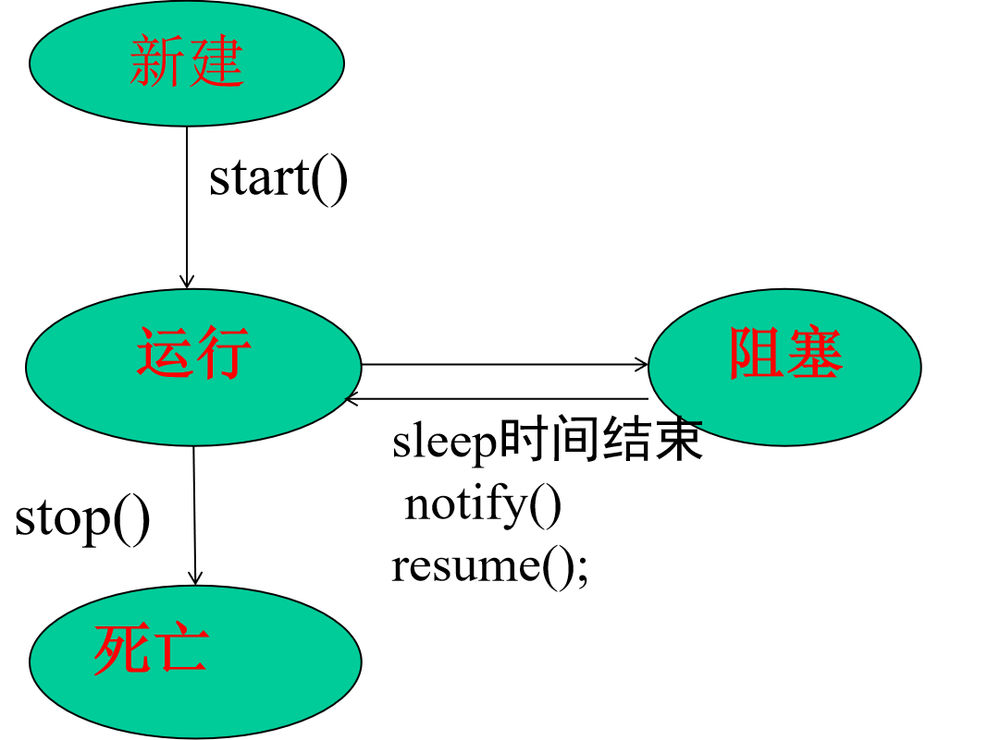

[TOC]
# 线程
## 线程
我们来详细讲解 Java 中的**线程 (Threads)**。

---

### Java 中的线程 (Threads) 详解

在计算机科学中，**线程 (Thread)** 是操作系统能够进行运算调度的最小单位。它比进程更轻量级，一个进程可以包含多个线程，这些线程共享进程的资源（如内存空间、文件句柄等），但每个线程有独立的程序计数器、栈和局部变量。

**多线程 (Multithreading)** 编程允许程序同时执行多个任务（并发），从而提高程序的响应性、吞吐量和资源利用率。Java 对多线程提供了强大的内置支持。

#### 进程与线程的关系

* **进程 (Process)：** 是操作系统进行资源分配的基本单位。一个进程拥有独立的内存空间，一个程序运行起来就是一个进程。
* **线程 (Thread)：** 是操作系统进行 CPU 调度和执行的最小单位。一个进程可以包含多个线程，这些线程共享进程的资源，但拥有独立的执行路径。

好的，我来用中文再给你详细解释一下 `Thread(new Print());` 这段代码。

---

### 1. `Thread` 类

在 Java 里，**线程**是程序中独立执行的一条路径。默认情况下，你的 Java 程序只有一个主线程。如果你想让你的程序同时做多件事情（也就是实现**并发**），你就需要创建和管理额外的线程。

`java.lang.Thread` 类就是 Java 中用来创建和控制线程的基本工具。

---

### 2. `Runnable` 接口

`Thread` 类本身可以直接运行一些代码，但更常用、也更灵活的方式是使用 `java.lang.Runnable` 接口。

* `Runnable` 接口只有一个方法：`public void run()`。
* 任何实现了 `Runnable` 接口的类，都**必须**提供 `run()` 方法的实现。这个 `run()` 方法就是新线程要执行的代码所在的地方。

---

#### Java 中创建线程的两种方式

Java 提供了两种主要的方式来创建和执行线程：

##### A. 继承 `java.lang.Thread` 类

* **步骤：**
    1.  创建一个类，继承 `Thread` 类。
    2.  重写 `run()` 方法，将线程要执行的任务代码放入其中。
    3.  创建该子类的实例。
    4.  调用线程实例的 `start()` 方法来启动线程。

* **示例：**
    ```java
    public class myThread extends Thread{
	    public void run(){		
		//线程体			
	    }
	    public static void main(String args[]){
		    Thread t = new myThread();
             t.start();
		    // 执行若干操作
	    }
    }
    ```
    ```java
    class  Thread1 extends Thread{
	int i=0;
    public void run(){
	   for(int k=0;k<=i;k++){
          System.out.println("Thread1 is running"+k);
	      try{
	       sleep(1000);
		  }catch(Exception e){
            System.out.println("errror in thread1");
		  }
	   }
	}
	public Thread1(int time){		i=time;	}
    }
    public class SingleThreadUsingThread{
        public static void main(String[] args){
        Thread thread1=new Thread1(10);	    
        thread1.start();	   
        }
    };
    ```

1.  `java.lang.Thread` 是表示进程的类，其中所定义的许多方法为完成线程的处理工作提供了比较完整的功能。

2.  将一个类定义为 `Thread` 的子类，那么这个类就可以用来表示线程。

3.  `public void run()`，这个方法称为**线程体**，它是整个线程的核心，线程所要完成任务的代码都定义在线程体中。`run()` 像其它方法一样，能引用其它类、声明变量。它是线程的执行入口。当它返回后，线程结束。

4.  `start()` 方法执行的是对 `run()` 方法的调用。
* **优点：** 结构清晰，直接就是线程类。
* **缺点：** Java 是单继承的，如果你的类已经继承了其他类，就无法再继承 `Thread`。任务和线程本身紧密耦合。

##### B. 实现 `java.lang.Runnable` 接口

* **步骤：**
    1.  创建一个类，实现 `Runnable` 接口。
    2.  实现 `run()` 方法，将线程要执行的任务代码放入其中。
    3.  创建 `Runnable` 接口实现类的实例。
    4.  将 `Runnable` 实例作为参数传递给 `Thread` 类的构造器，创建 `Thread` 对象。
    5.  调用 `Thread` 对象的 `start()` 方法来启动线程。

* **示例：**

    ```java
    public class xyz implements Runnable{
	    int i;
	    public void run(){
		//线程体		
	    }
    }
    //可以构造一个线程如下：
    Runnable r = new xyz();
    Thread t = new Thread(r);
    ```

    ```java
    class Print implements Runnable {
    @Override
    public void run() {
        int i = 0;
        do {
            i++;
            System.out.print(" print " + i);
        } while (true);
    }
    }

    class Input implements Runnable {
        @Override
        public void run() {
            int sum = 0;
            int i = 0;
            do {
                sum += i;
                i++;
                System.out.print(" sum:" + sum);
            } while (true);
        }
    }

    public class TestConcurrent {
        public static void main(String[] args) {
            Thread printThread = new Thread(new Print());
            Thread inputThread = new Thread(new Input());

            printThread.start(); // 启动 Print 线程
            inputThread.start(); // 启动 Input 线程
        }
    }
    ```
当你看到 `Thread(new Print());` 这段代码时：

1.  **`new Print()`**: 这部分和之前一样，是创建了一个 `Print` 类的**对象（实例）**。
    * 关键点在于，因为 `Print` 现在**实现了 `Runnable` 接口**，所以这个 `Print` 对象同时也是一个 `Runnable` 对象。它“知道”如何运行（具体来说，就是它的 `run()` 方法）。

2.  **`Thread(...)`**: `Thread` 类有一个构造函数，它接受一个 `Runnable` 对象作为参数：`public Thread(Runnable target)`。
    * 所以，当你把 `new Print()`（它是一个 `Runnable` 对象）传递给 `Thread` 的构造函数时，你实际上是在告诉新创建的 `Thread` 对象：“嘿，当你开始运行的时候，请执行这个 `Print` 对象的 `run()` 方法。”


* **优点：**
    * 推荐的方式。
    * **实现了任务（`Runnable`）和线程（`Thread`）的分离**，一个 `Runnable` 对象可以被多个 `Thread` 对象共享执行，更符合“单一职责原则”。
    * 你的类可以继承其他类，没有单继承的限制。
* **缺点：** 创建线程稍微复杂一些，需要多一步。

#### 关于两种创建线程方法的讨论

1.  **采用实现 `Runnable` 接口方法的情况:**
    多继承: applet 线程

2.  **采用继承 `Thread` 方法的情况**
    当一个 `run()` 方法置于 `Thread` 类的子类中时，`this` 实际引用的是控制当前运行系统的 `Thread` 实例，所以，代码不必写得繁琐：

    `Thread.currentThread().suspend();`

    可简单地写为:

    `suspend();`

#### 线程的状态

1. 新建状态:   创建一个线程对象后.有内存空间和其他资源，但还处于不可运行状态。    
例如：`Thread thread=new Thread()`
2. 运行状态：当就绪状态的线程被调用并获得处理器资源(CPU)时，线程进入运行状态。
    此时，自动调用该线程对象的`run()`方法。
    `run()`方法定义了该线程的操作和功能。
3. 堵塞状态:  线程让出CPU并暂时中止自己的执行，进入堵塞状态。
    在可执行状态下，如果调用`sleep()、suspend()、wait()`等方法，线程都将进入堵塞状态。
  堵塞时，线程不能进入排队队列，只有当引起堵塞的原因被消除后，线程才可以转入就绪状态。
4. 死亡状态：不具有继续运行的能力。 
     两种情况: 
     (1) 线程完成了全部工作： `run()`方法执 行结束。
     (2) 线程被强行终止运行：线程调用`stop()`方法。

## 主线程
我们来详细讲解 Java 中的**主线程 (Main Thread)**。

---

### Java 中的主线程 (Main Thread) 详解

在 Java 应用程序中，**主线程 (Main Thread)** 是程序执行的起点，也是所有其他线程的“祖先”线程。当你通过 `java YourProgram` 命令运行一个 Java 程序时，JVM（Java 虚拟机）会启动，并自动创建一个特殊的线程来执行你的 `public static void main(String[] args)` 方法。这个特殊的线程就是主线程。

#### 主线程的重要性
1. 产生其它子线程的线程
2. 它是最后完成执行。
```java
class MainThreadTest
{
	public static void main(String[] args) 
	{
		Thread t=Thread.currentThread();	//通过currentThread()方法获得主线程
		System.out.println("current Thread: "+t.getName());
		t.setName("zhang");    //改变线程的名字       
        System.out.println("after name changed: "+t.getName());
		try{
			for(int i=0;i<=5;i++){
              System.out.println(i);     
			  Thread.sleep(1000);//一秒钟
			}
		  }catch(InterruptedException e){
             System.out.println("main thread interrupted");     
		   }
	}
}
```


## Java 中的多线程 (Multithreading) 

**多线程 (Multithreading)** 是 Java 语言的一个核心特性，它允许程序同时执行多个任务（并发），从而显著提高程序的性能、响应性和资源利用率。在现代计算机系统（特别是多核处理器）中，多线程是充分利用硬件资源、构建高性能和高并发应用的关键。

### 1. 为什么需要多线程？

1.  **提高响应性：** 对于图形用户界面（GUI）应用程序或Web服务器，如果所有任务都在一个线程中执行，耗时操作（如文件读写、网络请求）会阻塞主线程，导致界面卡顿或服务器无响应。多线程可以将这些耗时操作放到后台线程中，主线程继续响应用户或客户端请求。
2.  **提高资源利用率：** 当一个线程因等待外部资源（如 I/O 操作）而暂时停止执行时，CPU 可以切换到另一个线程，继续执行其他任务，避免 CPU 空闲，提高效率。
3.  **发挥多核处理器优势：** 在多核 CPU 环境下，不同的线程可以真正地在不同的 CPU 核心上并行执行，从而加速程序的整体运行速度。
4.  **简化编程模型：** 复杂任务可以分解为多个相对独立的子任务，每个子任务由一个线程处理，使得代码结构更清晰、更易于管理。
 
### 多线程代码样例

```java
class  Thread1 extends Thread
{
	int i=0;
    public void run(){
	  while(true){
       System.out.println("Thread1 is running"+i);
	   i++;
	   try{
	       sleep(1000);
		  }catch(Exception e){
            System.out.println("errror in thread1");
		  }
	  }
	}	 
}

class  Thread2 extends Thread
{
	int i=0;
    public void run(){
	  while(true){
       System.out.println("Thread2 is running"+i);
	   i++;
	   try{
	       sleep(1000);
		  }catch(Exception e){
            System.out.println("errror in thread1");
		  }
	  }
	}	 
}

public class MulThreads
{
	public static void main(String[] args){
       Thread thread1=new Thread1();
	   Thread thread2=new Thread2();
	   thread1.start();
	   thread2.start();
	}
};
```
```java
class  Thread3 extends Thread
{
	public static int i=0;
	String kk="";
    public void run(){
	  while(true){
       System.out.println( kk+" "+i);
	   i++;
	   try{
	       sleep(1000);
		  }catch(Exception e){
            System.out.println("errror in thread1");
		  }
	  }
	}
	public Thread3(String k){
		kk=k;
	}
}

class  Thread4 extends Thread
{
	int i=0;
    public void run(){
	  while(true){
       System.out.println("Thread2 is running"+i);
	   i++;
	   try{
	       sleep(1000);
		  }catch(Exception e){
            System.out.println("errror in thread1");
		  }
	  }
	}	 
}

public class MulThreads2
{
	public static void main(String[] args){
       Thread thread3=new Thread3("thread3");
	   Thread thread4=new Thread4();
	   thread3.start();
	   //thread2.start();
	   Thread thread5=new Thread3("thread5");
	   thread5.start();
	}
};
```
### 多线程与多进程间的比较
1. 进程是重量级的任务，需要分配它们自己独立的地址空间。进程间通信是昂貴和受限的。进程间的转换也是很需要花费
2. 线程是轻量级的任务，它们共享相同的地址空间并且共同分享同一个进程。线程间通信是便宜的。线程间的转换也是低成本的。


## 线程的启动：start（）

**对比 `start()` 和直接调用 `run()`：**

| 特性           | `start()` 方法                                   | 直接调用 `run()` 方法                      |
| :------------- | :----------------------------------------------- | :----------------------------------------- |
| **是否创建新线程** | **是**，JVM 会创建一个新的操作系统线程。         | **否**，在当前线程中执行。                 |
| **是否并发执行** | **是**，`start()` 立即返回，`run()` 在新线程中并发执行。 | **否**，同步执行，`run()` 执行完后才返回。 |
| **执行位置** | 在新创建的线程中执行 `run()` 方法。              | 在调用 `run()` 方法的当前线程中执行。      |
| **多线程效果** | **实现多线程并发。** | **无多线程效果，只是普通方法调用。** |
| **线程状态** | 将线程从新建置为可运行。                         | 不改变线程状态，只是普通方法调用。         |


---

## Java 线程的 `isAlive()` 和 `join()` 方法详解

这两个方法都属于 `java.lang.Thread` 类，用于帮助我们管理和协调线程的执行。

#### 1. `isAlive()` 方法

* **作用：** 判断线程是否处于“存活”状态。
* **返回类型：** `boolean`
* **定义：**
    * `public final boolean isAlive()`
* **行为：** 如果线程已经启动但尚未终止（即线程处于**可运行 (Runnable)**、**运行 (Running)**、**阻塞 (Blocked)**、**等待 (Waiting)** 或**限时等待 (Timed Waiting)** 状态），`isAlive()` 方法就返回 `true`。
    * 如果线程处于**新建 (New)** 状态（即只创建了 `Thread` 对象但尚未调用 `start()`）或**终止 (Terminated)** 状态（即 `run()` 方法已执行完毕或因异常退出），`isAlive()` 方法就返回 `false`。

* **使用场景：**
    * 在启动线程后，检查线程是否已经开始运行。
    * 在等待线程结束之前，偶尔检查线程是否还在活动。
    * 但通常不建议使用 `isAlive()` 来作为线程同步或等待线程结束的精确控制手段，因为它只是一个瞬时状态的快照，无法保证后续的状态。更可靠的等待线程结束的方法是 `join()`。

* **示例：**

    ```java
    class MyAliveThread extends Thread {
        @Override
        public void run() {
            System.out.println(Thread.currentThread().getName() + " 开始运行.");
            try {
                // 模拟耗时操作
                Thread.sleep(200);
            } catch (InterruptedException e) {
                System.out.println(Thread.currentThread().getName() + " 被中断.");
            }
            System.out.println(Thread.currentThread().getName() + " 运行结束.");
        }
    }

    public class IsAliveDemo {
        public static void main(String[] args) {
            MyAliveThread thread = new MyAliveThread();

            // 1. 线程刚创建，尚未启动
            System.out.println("线程启动前 isAlive(): " + thread.isAlive()); // 输出: false

            thread.start(); // 启动线程

            // 2. 线程启动后，但在 run() 方法完成前
            System.out.println("线程启动后 immediately isAlive(): " + thread.isAlive()); // 输出: true (几乎总是)

            // 3. 稍微等待，让子线程有机会运行
            try {
                Thread.sleep(100);
            } catch (InterruptedException e) {
                e.printStackTrace();
            }
            System.out.println("线程运行中 isAlive(): " + thread.isAlive()); // 输出: true

            // 4. 等待线程完全结束
            try {
                thread.join(); // 等待 thread 线程终止
            } catch (InterruptedException e) {
                e.printStackTrace();
            }

            // 5. 线程运行结束后
            System.out.println("线程运行结束后 isAlive(): " + thread.isAlive()); // 输出: false
        }
    }
    ```

#### 2. `join()` 方法

* **作用：** `join()` 方法用于让当前线程（调用 `join()` 方法的线程）**等待**另一个线程（被 `join()` 的线程）终止。
* **返回类型：** `void`
* **定义：**
    * `public final void join() throws InterruptedException`：无限期等待被 `join()` 的线程终止。
    * `public final synchronized void join(long millis) throws InterruptedException`：最多等待指定的毫秒数。如果超时，被 `join()` 的线程可能仍在运行，但当前线程会继续执行。
    * `public final synchronized void join(long millis, int nanos) throws InterruptedException`：更精确的等待，指定毫秒和纳秒。

* **行为：**
    * 当一个线程 A 调用另一个线程 B 的 `B.join()` 方法时，线程 A 会进入**等待 (Waiting)** 或**限时等待 (Timed Waiting)** 状态。
    * 线程 A 会一直阻塞，直到以下任一条件发生：
        1.  线程 B 终止（其 `run()` 方法执行完毕或抛出未捕获的异常）。
        2.  `join(long millis)` 方法等待时间超时。
        3.  线程 A 自身被中断（此时 `join()` 方法会抛出 `InterruptedException`）。

* **使用场景：**
    * **任务依赖：** 当主线程需要等待子线程完成某些计算或数据处理，才能继续执行后续操作时。
    * **资源汇总：** 例如，多个线程并行计算不同部分，主线程等待所有计算完成，然后汇总结果。
    * **确保顺序：** 尽管多线程强调并发，但在某些特定业务逻辑中，可能需要确保某个线程在另一个线程之后完成。

* **示例：**

    ```java
    class DataProcessorThread extends Thread {
        private String data;
        private int result;

        public DataProcessorThread(String name, String data) {
            super(name);
            this.data = data;
        }

        @Override
        public void run() {
            System.out.println(getName() + " 开始处理数据: " + data);
            try {
                // 模拟数据处理，例如计算数据长度的平方
                int processedValue = data.length() * data.length();
                Thread.sleep(1000); // 模拟耗时 1 秒
                result = processedValue;
                System.out.println(getName() + " 数据处理完成，结果: " + result);
            } catch (InterruptedException e) {
                System.out.println(getName() + " 数据处理被中断.");
                Thread.currentThread().interrupt(); // 重新设置中断状态
            }
        }

        public int getResult() {
            return result;
        }
    }

    public class JoinDemo {
        public static void main(String[] args) {
            System.out.println("主线程开始.");

            DataProcessorThread processor1 = new DataProcessorThread("Processor-1", "Hello World");
            DataProcessorThread processor2 = new DataProcessorThread("Processor-2", "Java Programming");

            processor1.start(); // 启动数据处理器 1
            processor2.start(); // 启动数据处理器 2

            // 主线程需要等待两个处理器线程完成它们的计算，才能获取结果
            try {
                System.out.println("主线程等待 Processor-1 完成...");
                processor1.join(); // 主线程在这里阻塞，直到 processor1 终止
                System.out.println("主线程等待 Processor-2 完成...");
                processor2.join(); // 主线程在这里阻塞，直到 processor2 终止
            } catch (InterruptedException e) {
                System.out.println("主线程在等待子线程时被中断.");
                Thread.currentThread().interrupt();
            }

            // 所有处理器线程都已完成，主线程可以安全地获取结果
            System.out.println("主线程获取 Processor-1 的结果: " + processor1.getResult());
            System.out.println("主线程获取 Processor-2 的结果: " + processor2.getResult());

            System.out.println("主线程结束.");
        }
    }
    ```

#### 3. `isAlive()` 和 `join()` 的关系与区别

* `isAlive()` 只是一个状态查询，它告诉你线程当前是否正在运行（或准备运行）。它**不能保证**线程在调用 `isAlive()` 之后的一瞬间仍然存活或终止。
* `join()` 是一个**同步机制**。它会使当前线程阻塞，直到被 `join()` 的线程真正终止。它提供了比 `isAlive()` 更强大的线程协作和等待能力。


--

## Java 线程间的同步 
当多个线程需要共享资源，它们需要某种方法来确定资源在某一刻仅被一个线程占用。
达到此目的的过程叫做==同步(synchronization)==

#### 临界资源、 临界区
**临界资源**：在一个时刻只能被一个线程访问的资源。
**临界区**：访问临界资源的那段代码。

####  Java 中实现线程同步的几种主要方式

Java 提供了多种线程同步机制，从语言内置的关键字到 `java.util.concurrent` 包中的高级工具。

##### A. `synchronized` 关键字 (最常用和基础)

`synchronized` 关键字是 Java 提供的一种内置的同步机制，它用于确保在任何给定时刻，只有一个线程可以执行被 `synchronized` 保护的代码块或方法。

**用法：**

1.  **同步方法 (Synchronized Methods)：**
    * **实例方法：** `public synchronized void increment() { count++; }`
        * 锁对象：该方法所属的**当前实例对象 (`this`)**。
        * 作用范围：整个方法体。
    * **静态方法：** `public static synchronized void staticIncrement() { staticCount++; }`
        * 锁对象：该方法所属类的 `Class` 对象 (`类名.class`)。
        * 作用范围：整个静态方法体。

使用同步方法：
```java
class  Callme{
	  synchronized void call(String str){//阻止三个线程同时调用同一个对象的同一个方法
		 System.out.print("["+str);
		 try{
			 Thread.sleep(1000);
		 }catch(InterruptedException e){
			 System.out.println("errror");
		 }
		 System.out.println("]");
	 }
}
class Caller implements Runnable{
	String str="";
	Callme target;
	 
	public Caller(Callme c,String s){
         target=c;
		 str=s;		  
	}
	public void run(){        
		   	target.call(str);	   
	}
}
public class  Syn{
  public static void main(String[] args){
	System.out.println("begin of main()");
    Callme cm1=new Callme();     
	Caller c1=new Caller(cm1,"c1");
    Caller c2=new Caller(cm1,"c2");
    Caller c3=new Caller(cm1,"c3");
	
	Thread t1=new Thread(c1);
	Thread t2=new Thread(c2);
	Thread t3=new Thread(c3);
	t1.start();
	t2.start();
	t3.start();
	
    try{
		  t1.join();
		 t2.join();
		  t3.join();
	}catch(InterruptedException e){
		System.out.println("dddddddd");
	}
	  
	System.out.println("end of main()");
  }
}

/*
begin of main()
[c1]
[c2]
[c3]
end of main()
*/
```
调用不同对象的同步方法
```java
class  Callme
{
	synchronized   void call(String str){
		 System.out.print("["+str);
		 try{
			 Thread.sleep(1000);
		 }catch(InterruptedException e){
			 System.out.println("errror");
		 }
		 System.out.println("]");
	 }
}

class Caller implements Runnable{
	String str="";
	Callme target;
	 
	public Caller(Callme c,String s){
         target=c;
		 str=s;		  
	}
	public void run(){       
		   	target.call(str);	    
	}
}

public class  Syn6{
  public static void main(String[] args){
	System.out.println("begin of main()");
    Callme cm1=new Callme();
    Callme cm2=new Callme();
    Callme cm3=new Callme(); 
	Caller c1=new Caller(cm1,"c1");
    Caller c2=new Caller(cm2,"c2");
    Caller c3=new Caller(cm3,"c3");
	
	Thread t1=new Thread(c1);
	Thread t2=new Thread(c2);
	Thread t3=new Thread(c3);
	t1.start();
	t2.start();
	t3.start(); 
	 
    try{
		  t1.join();
		 t2.join();
		  t3.join();
	}catch(InterruptedException e){
		System.out.println("dddddddd");
	}
	 
	System.out.println("end of main()");
  }
}

/*
begin of main()
[c1[c2[c3]
]
]
end of main()
*/
```
调同一对象的同步方法和非同步方法:
```java
class  Code
{
	 public synchronized void prn1(int str){
		 System.out.println(Thread.currentThread().getName()+" "+str);
		 try{
			 Thread.sleep(1000);
			 System.out.println(Thread.currentThread().getName() +" "+str+"sleep end");
		 }catch(InterruptedException e){
		 }
	 }
	 public synchronized void prn2(int str){
		 System.out.println(Thread.currentThread().getName()+" "+str);
		 try{
			 //Thread.sleep(1000);
			 Thread.sleep(200);
			 System.out.println(Thread.currentThread().getName() +" "+str+"sleep end");
		 }catch(InterruptedException e){
		 }
	 }
	 public  void prn3(int str){

		  System.out.println(Thread.currentThread().getName()+" "+str);
        try{
			 Thread.sleep(200);
			 System.out.println(Thread.currentThread().getName() +" "+str+"sleep end");
		 }catch(InterruptedException e){
		 }
	 }
}

class R1 implements Runnable{
	Code code;
	public R1(Code code){
		this.code=code;
	}
	public void run(){
		for(int i=0;i<=3;i++){
			code.prn1(i);
		}	
	}
}
class R2 implements Runnable{
	Code code;
	public R2(Code code){
		this.code=code;
	}
	public void run(){
		for(int i=0;i<=3;i++){
			code.prn2(i);
		}	
	}
}
class R3 implements Runnable{
	Code code;
	public R3(Code code){
		this.code=code;
	}
	public void run(){
		for(int i=0;i<=3;i++){
			code.prn3(i);
		}	
	}
}
public class Test{

  public static void main(String[] args){
	 Code code=new Code();
     R1 r1=new R1(code);
	 R2 r2=new R2(code);	  
     Thread t1=new Thread(r1);
	 t1.setName("t1");
	 Thread t2=new Thread(r2);
     t2.setName("t2");	  
	 t1.start();
	 t2.start();  

    
    try{
		 t1.join();
		 t2.join();
          
	 }catch(Exception e){
	 }

 System.out.println(".............");
	 R1 r11=new R1(code);	 
	 R3 r3=new R3(code);
     Thread t11=new Thread(r11);
	 t11.setName("t11");	 
	 Thread t3=new Thread(r3);
     t3.setName("t3");
     t11.start();
	 t3.start();

	 
  }
}
```


2.  **同步块 (Synchronized Blocks)：**
    * `synchronized (lockObject) { /* 临界区代码 */ }`
    * `lockObject`：任何 Java 对象都可以作为锁对象。
    * **选择锁对象：**
        * 对于**实例**共享数据，通常使用 `this` 或专门的 `final Object lock = new Object();` 作为锁。
        * 对于**静态**共享数据，必须使用 `类名.class` 作为锁。
    * **优点：** 可以精确控制锁的范围，只同步必要的代码，提高并发性。

```java
class Tickets{
   private int total;

   public Tickets(int total){ this.total=total;   }
   public void setTotal(int total){     this.total=total;   }
   public int getTotal( ){     return total;   }

   public    void   sale(int num){      
	   if(total>=num){    //这个条件放在前面,可以看出同步的作用
		     try{  
		         Thread.sleep(300);
		        }catch(Exception e){
		         }
		     System.out.println(Thread.currentThread().getName()+"  剩余票数:"+total+ "    已经购买:"+num+"张" ); 
			 total=total-num; 
		  }else{
			 System.out.println(Thread.currentThread().getName()+"  剩余票数不够  "+"  剩余票数:"+total+"   需购买:"+num ); 
		  }
	 
	}
}

class Booking implements Runnable{
	private Tickets tickets=null;// 共享数据
	private int num;

	public Booking( ){ 		}
	public void setTickets(Tickets tickets){          this.tickets=tickets;	}
	public Tickets getTickets(){		return tickets;	}
	public void setNum(int num){          this.num=num;	}
	public int getNum(){		return num;	}
	 
	public void run(){ 
		synchronized(tickets){    //对象同步 
		 tickets.sale(num);      
		}
	}
}
public class  TestBooking3{
	public static void main(String[] args)	{	
	   Tickets shanghai=new Tickets(100);   //共享资源tickets
	   Booking booking1=new Booking( ); 
	   booking1.setTickets(shanghai); // 线程共享资源tickets
	   booking1.setNum(70);

	   Booking booking2=new Booking( ); 
	   booking2.setTickets(shanghai); // 线程共享资源tickets
	   booking2.setNum(50);

       
       Thread thread1=new Thread(booking1,"thread1");
	   thread1.start();
	   Thread thread2=new Thread(booking2,"thread2");
	   thread2.start();

	   try{
		   thread1.join();
		   thread2.join();
	   }catch(Exception e){
	   }
	   Tickets surplusTickets=booking1.getTickets();
	   System.out.println("剩余票数:"+surplusTickets.getTotal());

	     surplusTickets=booking2.getTickets();
	   System.out.println("剩余票数:"+surplusTickets.getTotal());
	}
}
```
```java
class  Callme{
	   void call(String str){
		 System.out.print("["+str);
		 try{
			 Thread.sleep(1000);
		 }catch(InterruptedException e){
			 System.out.println("errror");
		 }
		 System.out.println("]");
	 }
}

class Caller implements Runnable{
	String str="";
	Callme target;
	
	public Caller(Callme c,String s){
         target=c;
		 str=s;		  
	}
	public void run(){
       synchronized(target){
		   	target.call(str);
	   }
	}
}

public class  SynBlock{
  public static void main(String[] args){
	System.out.println("begin of main()");
    Callme cm1=new Callme(); //cm1为共享资源
    
	Caller c1=new Caller(cm1,"c1");  
    Caller c2=new Caller(cm1,"c2");
    Caller c3=new Caller(cm1,"c3");
	
	Thread t1=new Thread(c1);
	Thread t2=new Thread(c2);
	Thread t3=new Thread(c3);
	t1.start();
	t2.start();
	t3.start();	 
    try{
		  t1.join();
		  t2.join();
		  t3.join();
	}catch(InterruptedException e){
		System.out.println("dddddddd");
	}
	 
	System.out.println("end of main()");
  }
}
/*
begin of main()
[c1]
[c2]
[c3]
end of main()
*/
```

#### 3. 线程间通信

除了同步对共享资源的访问，线程之间通常还需要进行协作和通信。

* **`wait()`, `notify()`, `notifyAll()` (基于 `Object` 和 `synchronized` 锁)：** 实现生产者-消费者模式等经典问题。
    * `wait()`：释放锁，并使当前线程进入等待状态。
    * `notify()`：唤醒一个正在等待该对象锁的线程。
    * `notifyAll()`：唤醒所有正在等待该对象锁的线程。
* **`Condition` (与 `Lock` 配合)：** 提供了更细粒度的等待/通知机制，可以有多个等待队列。
* **`BlockingQueue`：** 阻塞队列，在生产者-消费者模型中非常有用。当队列满时生产者阻塞，队列空时消费者阻塞。
* **`CountDownLatch`, `CyclicBarrier`, `Semaphore`：** `java.util.concurrent` 包中提供的更高级的同步工具，用于协调复杂的线程协作。

#### 4. 总结与选择

选择合适的线程同步机制取决于具体的需求和场景：

* **简单同步：** 对于简单的方法或代码块同步，且对性能要求不是极致，**`synchronized` 关键字**通常是首选，它使用方便且 JVM 有很多优化。
* **高级同步或需要更多控制：** 当需要尝试获取锁、可中断锁、公平性、多个条件变量等高级功能时，使用 **`Lock` 接口及其实现（如 `ReentrantLock`）**。
* **单一变量的原子操作：** 使用 **`java.util.concurrent.atomic` 包中的原子类**，性能通常最优。
* **可见性保证：** `volatile` 用于保证变量的可见性，但不保证原子性，适用于状态标志等。
* **高并发集合：** 在多线程环境下使用 **`java.util.concurrent` 包中的并发集合**。
* **线程协作：** 使用 `wait()/notify()` 或 `Condition` 进行线程间的通信，使用 `BlockingQueue` 实现生产者-消费者模式，使用其他并发工具进行更复杂的协调。

理解和正确应用这些线程同步机制是编写健壮、高效且无死锁的多线程 Java 应用程序的关键。
## 死锁

### Java 中的死锁 (Deadlock) 详解

**死锁 (Deadlock)** 是多线程编程中一个非常严重且难以调试的问题。当两个或多个线程在互相等待对方释放资源时，它们会陷入一种无限期的等待状态，导致程序停滞不前，无法继续执行。

简单来说，就是“你等我，我等你，结果谁也走不了”。

####  死锁的发生场景

死锁通常发生在多个线程尝试获取多个共享资源（通常是锁）时。

**经典死锁场景：**
假设有两个线程 `Thread-A` 和 `Thread-B`，以及两个资源 `Resource-X` 和 `Resource-Y`。
1.  `Thread-A` 尝试获取 `Resource-X` 的锁。
2.  `Thread-A` 成功获取 `Resource-X` 的锁。
3.  `Thread-B` 尝试获取 `Resource-Y` 的锁。
4.  `Thread-B` 成功获取 `Resource-Y` 的锁。
5.  `Thread-A` 尝试获取 `Resource-Y` 的锁（但 `Resource-Y` 被 `Thread-B` 占用，所以 `Thread-A` 阻塞）。
6.  `Thread-B` 尝试获取 `Resource-X` 的锁（但 `Resource-X` 被 `Thread-A` 占用，所以 `Thread-B` 阻塞）。

结果：`Thread-A` 等待 `Thread-B` 释放 `Resource-Y`，而 `Thread-B` 等待 `Thread-A` 释放 `Resource-X`。它们陷入了相互等待，谁也无法继续执行，这就是死锁。
```java
class A{	 
	synchronized void prn( B b){
		System.out.println("A: prn(B b) begin ");
		try{
		 Thread.sleep(1000);
		}catch(Exception e){}
        b.prn2();//当前线程因为等待其他线程释放共享资源b的锁，而处于等待状态。
	    System.out.println("A: prn() end ");
	}
	synchronized void prn2(){
		System.out.println("A: prn2() begin ");
		try{
		 Thread.sleep(1000);
		}catch(Exception e){}
        System.out.println("A: prn2() end ");
	}
};
class B{	
	synchronized void prn(A a ){
		System.out.println("B: prn(A a) begin ");
		try{
		 Thread.sleep(1000);
		}catch(Exception e){}
        a.prn2();//当前线程因为等待其他线程释放共享资源a的锁，而处于等待状态。
		System.out.println("B: prn() end ");
	}
	synchronized void prn2(){
		System.out.println("B: prn2() begin ");
		try{
		 Thread.sleep(1000);
		}catch(Exception e){}
		System.out.println("B: prn2() end ");
	}
};
class R1 implements Runnable{
	A a;
	B b;
	public R1(A a,B b){		 
		this.a=a;
		this.b=b;		 
	}
	public void run(){
        a.prn(b);
	}
};
class R2 implements Runnable{
	A a;
	B b;
	public R2(A a,B b){
		this.a=a;
		this.b=b;
	}
	public void run(){
        b.prn(a);
	}
};
public class  DeathLock{
	public static void main(String[] args) {   
		A a=new A();
		B b=new B();			 
		 Runnable r1=new R1(a,b);		  
		 Runnable r2=new R2(a,b);		  
		 Thread t1=new Thread(r1);		  
		 Thread t2=new Thread(r2);		 
		 t1.start();
		 t2.start();
	}
}
```

## 线程间通信

### Java 线程间通信 (Inter-Thread Communication) 详解

在多线程编程中，线程之间不仅需要同步访问共享资源，还常常需要**协同工作**，即一个线程的执行依赖于另一个线程的状态或结果。这种线程之间的协作过程就是**线程间通信 (Inter-Thread Communication)**。

线程间通信是解决多线程复杂业务逻辑的关键，它允许线程在满足特定条件时暂停执行，并在条件满足时被唤醒，从而实现任务的有序推进。

#### 1. 为什么需要线程间通信？

考虑一个经典的**生产者-消费者 (Producer-Consumer)** 模型：
* **生产者线程：** 负责生成数据，并将数据放入一个共享的缓冲区。
* **消费者线程：** 负责从共享缓冲区中取出数据并进行处理。

如果没有通信机制：
* 如果缓冲区满了，生产者还在继续生产，就会导致数据溢出或覆盖。
* 如果缓冲区空了，消费者还在继续消费，就会尝试读取不存在的数据，导致错误。

线程间通信机制能够让生产者在缓冲区满时“等待”消费者消费，让消费者在缓冲区空时“等待”生产者生产，从而实现协调和同步。

#### 2. 线程间通信的几种主要方式

Java 提供了多种线程间通信的机制，从基于 `Object` 类的方法到 `java.util.concurrent` 包中的高级工具。

##### A. `wait()`, `notify()`, `notifyAll()` (基于 `Object` 类)

这是 Java 最基础也是最重要的线程间通信机制。它们都是 `Object` 类的方法，而不是 `Thread` 类的方法，这意味着任何对象都可以作为锁和通信的媒介。

**核心概念：**
* **锁对象 (Monitor / Intrinsic Lock)：** `wait()`, `notify()`, `notifyAll()` 方法必须在**同步代码块或同步方法内部**调用，并且是针对**同一个锁对象**调用的。
* **等待队列 (Wait Set)：** 每个锁对象都有一个与之关联的等待队列。当线程调用 `wait()` 时，它会释放该锁并进入该对象的等待队列，直到被唤醒。

**方法详解：**

1.  **`public final void wait() throws InterruptedException`：**
    * **作用：** 使当前线程（调用 `wait()` 的线程）进入等待状态，并**释放它所持有的锁对象**。线程进入该对象的等待队列。
    * **何时调用：** 当线程发现某个条件不满足，无法继续执行时（例如，消费者发现缓冲区为空），它就调用 `wait()` 来暂停自己，等待条件满足。
    * **唤醒：** 线程会一直等待，直到被其他线程调用相同锁对象的 `notify()` 或 `notifyAll()` 方法唤醒，或者被中断。被唤醒后，它需要重新竞争该锁才能继续执行。

2.  **`public final void wait(long timeout) throws InterruptedException`：**
    * **作用：** 与 `wait()` 类似，但会等待指定的毫秒数。如果超时，线程会自动唤醒（但不保证立即获得锁）。

3.  **`public final void notify()`：**
    * **作用：** 唤醒在该对象锁的等待队列中**一个**任意等待的线程。
    * **何时调用：** 当线程改变了某个条件，使得其他等待的线程可能可以继续执行时（例如，生产者向缓冲区放入了数据）。
    * **不释放锁：** 调用 `notify()` 的线程不会立即释放锁，它会继续执行完同步代码块，然后才释放锁。

4.  **`public final void notifyAll()`：**
    * **作用：** 唤醒在该对象锁的等待队列中**所有**等待的线程。
    * **何时调用：** 当不确定哪个线程需要被唤醒，或者多个线程可能都需要被唤醒时。
    * **不释放锁：** 同样不立即释放锁。

**生产者-消费者模型示例：**

```java
class Food{
	private String name;
	public Food(String name){this.name=name;}
	public String getName(){return name;}
}
class Box{
	private int num;
	private Food[] foods;
	private int current;
	public Box(){}
	public Box( int num){ 
        this.num=num;
		foods=new Food[num];
		current=-1;
	}

	public  synchronized void put(Food food){ 
		System.out.println(Thread.currentThread().getName() +"  put... " );
		if(current< (num-1)){
		  current++;
		  System.out.println(Thread.currentThread().getName()+" put "+current +" apple"); 
          foods[current]=food; 
		  notify();  //通知消费者可以消费了：前提是消费者由于之前仓库中没有商品而wait。
		  //该方法一定要放在同步方法或者同步块中，否则运行报错。
		  //notify()：恢复同一个对象（调put的对象：box）中第一个调用wait()的线程
					  
		   
		} else{
			try{
				System.out.println(Thread.currentThread().getName()+"  wait..."   );
			    wait();
             
			}catch(Exception e){
			}
			  
		 }	
	}
	public  synchronized Food get( ){
		System.out.println(Thread.currentThread().getName() +"  get... " );
		Food food=null;
		if(current>=0){ 
		   System.out.println(Thread.currentThread().getName()+" get "+current +" apple");  
           food=foods[current];
		   current--;
		   notify(); //通知生产者可以生产了：前提是生产者由于之前仓库商品已满而wait。
		   //该方法一定要放在同步方法或者同步块中，否则运行报错。
		   //notify()：恢复同一个对象（调get的对象：box）中第一个调用wait()的线程 
		}else{
             try{
		      System.out.println(Thread.currentThread().getName() +"  wait..." );
			  wait();              
			 }catch(Exception e){
			 }
			 
		 }		
		return food;
	}
}
class  Producter implements Runnable{
   private  Box box=null;
   public Producter(Box box){this.box=box;}

   public void run(){
       int i=0;
	   java.util.Random random = new java.util.Random(); 
	   int second=0;
       while(true){
		 
		 Food food=new Food(""+i +" apple");
         box.put(food); 
		 i++;
		 
		 try{
		    second=Math.abs(random.nextInt())%1000;
			System.out.println(Thread.currentThread().getName() +"  sleep... " +second);
			Thread.sleep(second);                            
		   //Thread.sleep(1000);
		 }catch(Exception e){
		 }		
	   }
   }	 
}

class Consumer implements Runnable{
   private  Box box=null;
   public Consumer(Box box){this.box=box;}
   
   public void run(){ 
	 java.util.Random random = new java.util.Random(); 
	 int second=0;
     while(true){

         Food food=null;
         food=box.get();  

		 try{
			  second=Math.abs(random.nextInt())%1000;
			  System.out.println(Thread.currentThread().getName() +"  sleep... " +second);
			  Thread.sleep(second);                            
		      //Thread.sleep(1000);
		 }catch(Exception e){
		 }
	   } 
   }	
}

public class TestProducterConsumer{
	public static void main(String[] args)	{
		Box myBox=new Box(4);  //notify(),notifyAll()恢复相同对象(myBox)中第一个调用wait()的线程。

		Producter p=new Producter(myBox);
		Consumer c=new Consumer(myBox);

		Thread  pt=new Thread(p,"Producter");
        Thread  ct=new Thread(c,"Consumer");

        pt.start();
		ct.start();
	}
}
```