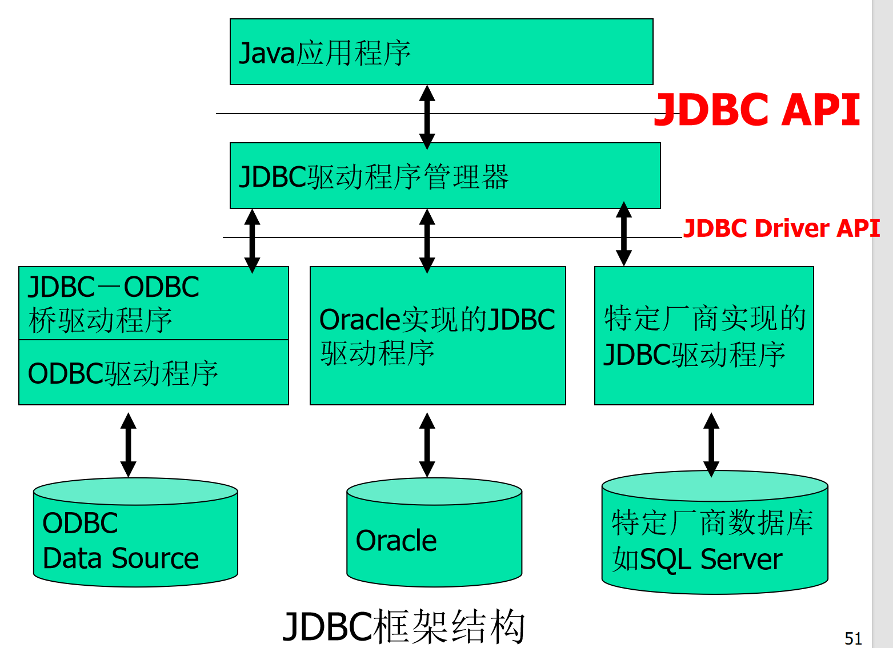
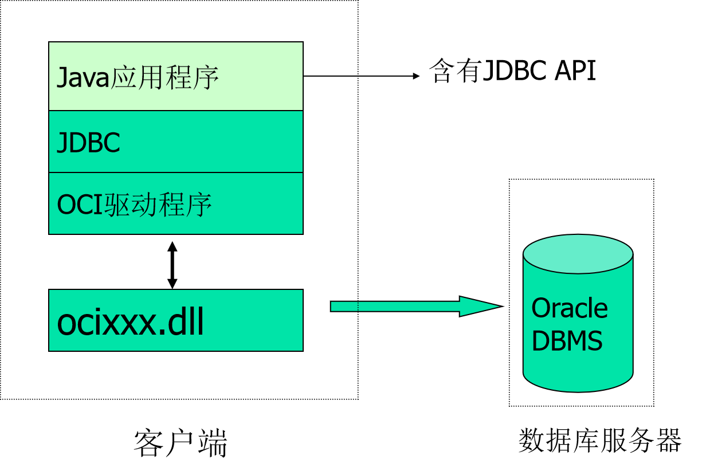
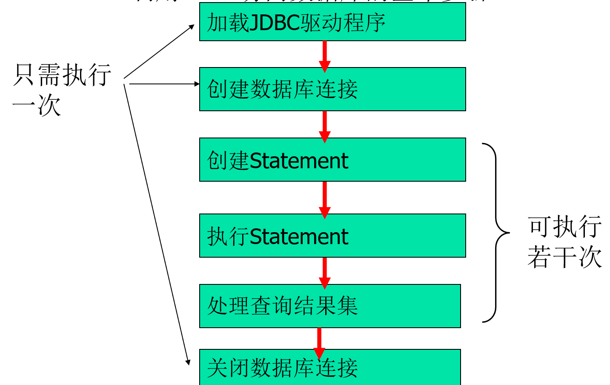

# 数据库访问】
## 数据库基本知识

**信息世界中的基本概念**
==实体(Entity)==：客观存在并可相互区别的事物称为实体，如：一个学生、一个部门、一门课、学生的一次选课、部门的一次订货等。
==实体集(Entity Set)==：同型实体的集合称为实体集。如：全体学生就是一个实体集。
==属性(Attribute)==：实体所具有的某一特性称为属性。一个实体可以由若干个属性来刻画。例如学生实体可以用学号、姓名、性别、出生年月等属性组成。
==码(Key)==：唯一标识实体的属性集称为码。如：学号是学生实体的码。


## SQL语言基本语法

### 数据库定义命令
```sql
CREATE TABLE <表名> -- 用于指定要创建的表的名称
(
    <列名1> <数据类型1> [列级完整性约束条件1], -- 定义表的第一个列，包括列名、数据类型和可选的列级约束
    <列名2> <数据类型2> [列级完整性约束条件2], -- 定义表的第二个列，可以有多个列
    -- ... 可以定义任意数量的列，每个列的定义都包含列名、数据类型和可选的列级约束
    [<表级完整性约束条件>] -- 可选的表级完整性约束条件，例如复合主键、外键等
);
```

**详细解释和示例：**

* **`CREATE TABLE <表名>`**: 这是SQL语句的起始部分，用于声明要创建一个新的数据库表。`<表名>` 是你为新表指定的名称，它应该遵循数据库的命名规则（通常不允许有空格，对大小写敏感性取决于具体的数据库系统）。

* **`(` 和 `)`**: 表的定义内容（所有列和表级约束）都包含在这一对括号内。

* **`<列名> <数据类型>`**:
    * `<列名>`: 表中每一列的名称，例如 `StudentID`, `Name`, `Age`, `EnrollmentDate` 等。
    * `<数据类型>`: 定义了该列可以存储的数据种类和范围。常见的数据类型包括：
        * `INT` 或 `INTEGER`: 整数
        * `VARCHAR(n)` 或 `NVARCHAR(n)`: 可变长度字符串，`n` 是最大长度
        * `CHAR(n)` 或 `NCHAR(n)`: 固定长度字符串
        * `DATE`: 日期
        * `TIME`: 时间
        * `DATETIME` 或 `TIMESTAMP`: 日期和时间
        * `DECIMAL(p,s)` 或 `NUMERIC(p,s)`: 精确数值，`p` 是总位数，`s` 是小数点后的位数
        * `BOOLEAN`: 布尔值 (真/假)
        * 等等...

* **`[列级完整性约束条件]`**: 这些约束直接应用于单个列，确保该列数据的有效性和一致性。常见的列级约束有：
    * `PRIMARY KEY`: 唯一标识表中每一行的列（或列的组合）。一个表只能有一个主键。
    * `NOT NULL`: 强制列不能存储 `NULL` 值。
    * `UNIQUE`: 强制列中的所有值都是唯一的（允许 `NULL` 值，但通常只有一个 `NULL`）。
    * `DEFAULT <默认值>`: 为列提供一个默认值，当插入新行时没有为该列指定值时使用。
    * `CHECK (<条件>)`: 强制列中的所有值必须满足特定条件。
    * `AUTO_INCREMENT` (MySQL) / `IDENTITY` (SQL Server) / `GENERATED ALWAYS AS IDENTITY` (PostgreSQL): 自动为该列生成唯一的递增数值，常用于主键。

* **`[， <列名><数据类型>[列级完整性约束条件] ]`**: 逗号 `,` 用于分隔不同的列定义。这意味着你可以按需添加任意数量的列。

* **`[， <表级完整性约束条件>]`**: 这些约束作用于整个表，或者涉及多个列的组合。它们通常放在所有列定义之后。常见的表级约束有：
    * `PRIMARY KEY (<列名1>, <列名2>, ...)`: 定义由多个列组成的主键（复合主键）。
    * `FOREIGN KEY (<列名>) REFERENCES <引用表名>(<引用列名>)`: 建立表之间的关系，确保引用数据的完整性。
    * `UNIQUE (<列名1>, <列名2>, ...)`: 定义由多个列组成的唯一性约束。
    * `CHECK (<条件>)`: 定义涉及多个列的复杂检查条件。

**示例：**

```sql
CREATE TABLE Students (
    StudentID INT PRIMARY KEY AUTO_INCREMENT, -- 学生ID，主键，自动递增
    FirstName VARCHAR(50) NOT NULL,           -- 名，非空字符串
    LastName VARCHAR(50) NOT NULL,            -- 姓，非空字符串
    DateOfBirth DATE,                         -- 出生日期
    Email VARCHAR(100) UNIQUE,                -- 电子邮件，必须唯一
    EnrollmentDate DATE DEFAULT CURRENT_DATE, -- 入学日期，默认当前日期
    MajorID INT,                              -- 专业ID
    CONSTRAINT CHK_Age CHECK (DATEDIFF(CURRENT_DATE, DateOfBirth) / 365 >= 18), -- 表级约束：学生年龄必须大于等于18岁 (示例，具体函数可能因数据库而异)
    FOREIGN KEY (MajorID) REFERENCES Majors(MajorID) -- 表级约束：外键，引用Majors表的MajorID
);
```
### 修改基本表语句格式：
```sql
ALTER TABLE <表名> -- 用于指定要修改的表的名称
[
    ADD [COLUMN] <新列名> <数据类型> [列级完整性约束条件], -- 添加新列，可选的COLUMN关键字在某些数据库中是必需的
    -- 示例：ADD COLUMN Email VARCHAR(100) UNIQUE;
    -- 示例：ADD PhoneNumber VARCHAR(20) NOT NULL DEFAULT 'N/A';

    DROP [COLUMN] <列名>, -- 删除现有列，可选的COLUMN关键字在某些数据库中是必需的
    -- 注意：删除列会丢失该列中的所有数据，并且如果该列被其他对象（如视图、存储过程、约束）引用，可能会导致错误。
    -- 示例：DROP COLUMN OldAddress;

    DROP CONSTRAINT <完整性约束名>, -- 删除指定的完整性约束
    -- 约束通常有一个系统生成或用户指定的名字。
    -- 如果是主键或唯一约束，有时可以直接使用DROP PRIMARY KEY 或 DROP UNIQUE (<列名>)。
    -- 示例：DROP CONSTRAINT PK_Students;
    -- 示例（MySQL）：DROP PRIMARY KEY;
    -- 示例（SQL Server）：DROP CONSTRAINT UQ_Email;

    MODIFY [COLUMN] <列名> <新数据类型> [新列级完整性约束条件], -- 修改现有列的数据类型或完整性约束
    -- 注意：修改数据类型可能导致数据丢失（例如，将VARCHAR(50)改为VARCHAR(10)）。
    -- 在某些数据库（如SQL Server）中使用 ALTER COLUMN 替代 MODIFY。
    -- 示例（标准SQL/MySQL）：MODIFY COLUMN Age TINYINT;
    -- 示例（SQL Server）：ALTER COLUMN Age TINYINT NOT NULL;

    -- 其他常见操作（非你原始格式中包含，但很常用）：
    RENAME COLUMN <旧列名> TO <新列名>, -- 重命名列（标准SQL语法，但不同数据库实现不同）
    -- 示例（PostgreSQL）：RENAME COLUMN OldName TO NewName;
    -- 示例（MySQL）：CHANGE COLUMN OldName NewName VARCHAR(50);
    -- 示例（SQL Server）：EXEC sp_rename 'TableName.OldName', 'NewName', 'COLUMN';

    ADD CONSTRAINT <完整性约束名> <约束类型> (<列名>), -- 添加表级完整性约束（如外键、唯一、检查约束）
    -- 示例：ADD CONSTRAINT FK_Major FOREIGN KEY (MajorID) REFERENCES Majors(MajorID);
    -- 示例：ADD CONSTRAINT UQ_Passport UNIQUE (PassportNumber);
    -- 示例：ADD CONSTRAINT CHK_Salary CHECK (Salary >= 0);

    RENAME TO <新表名> -- 重命名表（不同数据库实现不同）
    -- 示例（标准SQL/PostgreSQL）：RENAME TO NewTableName;
    -- 示例（MySQL）：RENAME TO NewTableName;
    -- 示例（SQL Server）：EXEC sp_rename 'OldTableName', 'NewTableName';
];
```

**关键点总结：**

1.  **数据库差异：** `ALTER TABLE` 的具体子句和语法在不同的关系型数据库管理系统（RDBMS）中可能有所不同。例如：
    * `MODIFY` (MySQL, Oracle) vs. `ALTER COLUMN` (SQL Server, PostgreSQL)。
    * 删除约束时，有些数据库允许直接 `DROP PRIMARY KEY` 或 `DROP UNIQUE (<列名>)`，而有些则需要先获取约束的名称，然后使用 `DROP CONSTRAINT <约束名>`。
    * 重命名列或表通常也有各自的特定语法或存储过程。
2.  **操作风险：**
    * **删除列 (`DROP COLUMN`)** 会永久删除列及其数据。在执行此操作前务必备份数据。
    * **修改数据类型 (`MODIFY`/`ALTER COLUMN`)** 可能会导致数据截断或转换错误，如果新类型无法容纳现有数据。例如，将 `VARCHAR(50)` 更改为 `INT` 如果字符串包含非数字字符，就会失败。
    * **添加 `NOT NULL` 约束到已有数据列**：如果该列中已存在 `NULL` 值，此操作会失败，除非你同时提供一个 `DEFAULT` 值来填充现有的 `NULL`。

因此，你提供的格式是一个很好的通用概览，但在实际应用中，你需要根据你正在使用的数据库类型查阅其具体的 `ALTER TABLE` 文档。

### 删除基本表的语句格式：
DROP TABLE <表名>

### 数据库查询语言

```sql
SELECT [ALL|DISTINCT] <目标列表达式> [,<目标列表达式>]…  -- SELECT 子句：指定要检索的列或表达式
    -- ALL：(默认) 返回所有匹配的行，包括重复行。
    -- DISTINCT：只返回唯一值，消除重复行。
    -- <目标列表达式>：可以是列名、常量、函数调用（如 COUNT(*), SUM(列名)）、算术表达式等。
    -- 示例：SELECT Name, Age, Salary * 12 AS AnnualSalary

FROM <表名或视图名> [,表名或视图名] … -- FROM 子句：指定数据源，即要查询的表或视图
    -- 可以是单个表，也可以是多个表（通过 JOIN 操作连接）。
    -- 示例：FROM Employees
    -- 示例：FROM Orders JOIN Customers ON Orders.CustomerID = Customers.CustomerID

[WHERE <条件表达式>] -- WHERE 子句：可选，用于筛选行，只返回满足指定条件的行
    -- <条件表达式>：一个或多个布尔表达式，使用比较运算符（=, <, >, <=, >=, <>, !=）、逻辑运算符（AND, OR, NOT）等。
    -- 示例：WHERE Age > 30 AND City = 'New York'

[GROUP BY <列名1> [HAVING <条件表达式>]] -- GROUP BY 子句：可选，用于将结果集按照一个或多个列进行分组
    -- <列名1>：用于分组的列名。在 SELECT 子句中，如果使用了聚合函数（如 COUNT, SUM, AVG, MAX, MIN），并且同时有非聚合列，则非聚合列必须出现在 GROUP BY 子句中。
    -- HAVING <条件表达式>：可选，与 GROUP BY 结合使用，用于筛选分组后的结果。它作用于聚合函数的结果。
    -- 示例：GROUP BY DepartmentID HAVING COUNT(EmployeeID) > 5

[ORDER BY <列名2> [ASC|DESC]]; -- ORDER BY 子句：可选，用于对结果集进行排序
    -- <列名2>：用于排序的列名。可以指定多个列，按顺序进行多级排序。
    -- ASC：升序排列（默认）。
    -- DESC：降序排列。
    -- 示例：ORDER BY LastName ASC, FirstName DESC
```
(4) 选择表中的若干元组

| 查询条件 | 运算符                               | 说明                                     |
|----------|--------------------------------------|------------------------------------------|
| 比较     | `=`, `>=`, `<`, `<=`, `<>`, `!=`, `!>`, `!`, `!<=`, `!<`;<br>NOT+上述比较运算符 | 字符串比较从左向右进行                   |
| 确定范围 | BETWEEN AND, NOT BETWEEN AND         | BETWEEN 后是下限，AND 后面是上限，并且包括边界值 |
| 确定集合 | IN, NOT IN                           | 检查一个属性值是否属于集合中的值         |
| 字符匹配 | LIKE, NOT LIKE                       | 用于构造条件表达式中的字符匹配           |
| 空值     | IS NULL, IS NOT NULL                 | 当属性值为空时，要用此运算符             |
| 逻辑运算 | NOT, AND, OR                         | 用于构造复合条件表达式                   |

**例12-7** 查询计算机系全体学生的名单。
```sql
select  XMing from  XSheng where  YXi='中文系';
```
**例12-8**查询年龄在20～23岁（包括20岁和23岁）的学生的姓名、性别和所属院系。
```sql
select  XMing, Xbie, YXi from  XSheng where NLing between 20 and 23;
```
**例12-9**查询既不是中文系、数学系，也不是计算机学院的学生的姓名和性别。
```sql
select  XMing, XBie from  XSheng where  YXi  not  in ('中文系', '数学系', '计算机学院');
```

### 匹配查询格式
[NOT]  LIKE  `<匹配串>` [ ESCEAPE `<换码字符>`]
其含义是查找指定的属性列值与<匹配串>相匹配的元组。匹配串可以是一个完整的字符串，也可以含有通配符`%`和`_`。 
`% `代表任意长度的（可以为0）字符串。
`_`：代表任意单个字符。
**例12-10** 查询学号为04020001的学生的详细情况。
```sql
select   * from  XSheng where  XHao   like  '04020001';
等价于：
select   * from  XSheng where  XHao = '04020001';
```
**例12-11** 查询所有姓学号以04开头的学生的姓名和性别。
```sql
select  XMing, XBie from  XSheng where  XMing  like  '04%'；
```

#### 对查询结果排序
用`ORDER  BY` 子句对查询结果按照一个或多个属性列的升序（`ASC`）或将序（`DESC`）排列，缺省值为升序。
**例12-15** 查询全体学生的情况，查询结果按所属院系升序排列，同一院系中的学生按年龄降序排列。
```sql
select  *  from  XSheng order  by  YXi, NLing desc;
```

#### 使用集函数
COUNT ([DISTINCT|ALL]  *) 统计元组个数。
COUNT([DISTINCT|ALL] <列名>) 统计一列中值的个数。
SUM([[DISTINCT|ALL]<列名> ]   计算一列值的总和（此列必须是数值
AVG ([[DISTINCT|ALL]<列名> ]  求一列值的平均值（此列必须是数值型）
MAX ([[DISTINCT|ALL]<列名> ]  求一列值中的最大值。
MIN ([[DISTINCT|ALL]<列名> ]  求一列值中的最小值。
DISTINCT：表示在计算时要取消指定列中的重复值。
ALL：缺省值，表示不取消重复值。

#### 对查询结果分组
用`GROUP  BY`子句将查询结果按某一列或多列值分组，值相等的为一组。
**例12-17** 查询选修了3门以上课程的学生学号。
```sql
select  XHao  from  XKe
group  by  XHao  having  count(*)>3;
```
### 连接查询
#### 等值与非等值连接查询：
连接查询中用来连接两个表的条件称为连接条件或连接谓词。
格式：
[<表名1>.]<列名1>  <比较运算符>[<表名2>.]<列名2>
**例12-18** 查询每个学生及其选修课程的情况。
 ```sql
 select  XSheng.*,  XKe.*  from XSheng, XKe
 where  XSheng.XHao= XKe.XHao;       
```

#### 自身连接
一个表与其自己进行连接，称为表的自身连接。
**例12-19** 查询每一门课的间接先行课（即先行课的先行课）。
首先为KCheng表取两个别名first,  second。
```sql
select   first.KChHao,  second.XXKe
from  KCheng  first,   KCheng  second
where  first.XXKe=second.KChHao;
```
#### 外连接
1. 在外连接运算时以主表中的每一行去匹配从表中的数据行。符合连接条件的数据将直接作为结果返回，不符合条件的数据，将被填上NULL值后和主表中对应数据行组合作为结果数据返回。
2. 外连接分为左外连接和右外连接两种，主表在左边称为左外连接，主表在右边称为右外连接。
3. 表示的方法为，在连接谓词的某一边加上“*”号，如果“*”号出现在连接条件的左边为左外连接，否则为右外连接。

例：有04020005和04020008两位同学没有选课，在Xke表中没有相应的行，但是我们想以学生为主体显示选课信息，这两位没有选课的同学只输出他们的基本信息，所选课程的课程号和成绩显示为空。查询语句这样写：
```sql
select XSheng.Xhao,XMing,XBie,NLing,YXi,KChHao,ChJi
from XSheng,XKe
where XSheng.XHao = XKe.XHao(*);
```
### 数据更新语言
#### 插入数据
==（1）插入单个元组格式==：
      INSERT  INTO  <表名>[（<属性列1>[，<属性列2>…]）
      VALUES(<常量1>[，<常量2>] …)；
功能：属性列与常量一一对应，没出现的属性列将取空值。
**例12-21** 将新学生记录（学号：05020020；姓名：陈述；性别：男；年龄：21；所在院系：中文系）插入XSheng表
```sql
insert  into  XSheng values('05020020', '陈述', '男', 21, '中文系');
```
==（2）插入子查询结果格式==：
INSERT  INTO <表名>[（<属性列1>[，<属性列2>…]）子查询；

**例12-22 **对每一个系，求学生的平均年龄，并把结果存入数据库建立一个新表：
```sql
create  table  deptage (YXi  char(15)  avgage  smallint);
对XSheng表按系分组求平均年龄，再把系名和平均年龄存入新表。
insert  into  deptage (YXi, avgage)
select   YXi,  avg(NLing)  from XSheng  groupe  by  YXi;
```
### 修改数据格式：
     UPDATE <表名>
      SET  <列名>=<表达式>[，<列名>=<表达式>] …
      [WHERE<条件>];

**例12-21** 将学生05020025的年龄改为23岁。
```sql
update  XSheng  set  NLing=23  where  XHao='05020025';
```

### 删除数据格式： 

DELETE  FROM   <表名>     [WHERE<条件>]；

提示： DELETE语句删除表中的数据，不删除表的定义。

**例12-22** 删除学号为05020025的学生记录。
```sql
delete  from  XSheng where  XHao='05020025';
```

## JAVA语言的数据库访问接口----JDBC
`JDBC:java database connectivity`
  包含一组与访问数据库有关的java类和接口

## JDBC访问数据库
### JDBC框架结构


**Notice**:对于编程人员而言，只需要掌握JDBC  API。
### JDBC中的主要类和接口
| 类或接口名                 | 功能说明                               |
| :------------------------- | :------------------------------------- |
| `java.sql.DriverManager`   | 用于加载驱动程序，建立与数据库的连接。 |
| `java.sql.Driver`          | 驱动程序接口。                         |
| `java.sql.Connection`      | 用于建立与数据库的连接。               |
| `java.sql.Statement`       | 用于执行静态的SQL语句并返回结果。      |
| `java.sql.ResultSet`       | 执行SQL查询返回的结果集。              |
| `java.sql.SQLException`    | SQL异常处理类。                        |

### 利用JDBC访问数据库的基本步骤


### 加载JDBC驱动程序：加载到JVM中
两种方法

1.  **利用 `DriverManager` 类的静态方法 `registerDriver()`。**
    * **示例：** `DriverManager.registerDriver(new oracle.jdbc.driver.OracleDriver());`
    * **注意：** 如果加载的驱动程序不存在，`registerDriver()` 方法就会抛出 `SQLException` 异常。

2.  **使用 `java.lang.Class` 类的 `forName()` 方法。**
    * **示例：** `Class c=Class.forName("Oracle.jdbc.driver.OracleDriver");`
    * **注意：**
        * `Oracle.jdbc.driver.OracleDriver` 是 ORACLE JDBC 驱动程序的类名。
        * 如果加载的驱动程序不存在，`Class.forName()` 方法就会抛出 `ClassNotFoundException` 异常。

 **加载ORACLE JDBC驱动程序** 的两种方法示例：

1.  **利用 `DriverManager` 类的静态方法 `registerDriver`。**
    * 示例代码：`DriverManager.registerDriver(new oracle.jdbc.driver.OracleDriver());`
    * 注意：如果加载的驱动程序不存在，`registerDriver()` 方法会抛出 `SQLException` 异常。

2.  **使用 `java.lang.Class` 类的 `forName` 方法。**
    * 示例代码：`Class c=Class.forName("Oracle.jdbc.driver.OracleDriver");`
    * 注意：
        * (1) `Oracle.jdbc.driver.OracleDriver` 是 ORACLE JDBC 驱动程序的类名。
        * (2) 如果加载的驱动程序不存在，`Class.forName()` 方法会抛出 `ClassNotFoundException` 异常。

 **加载Microsoft SQLServer JDBC驱动程序** 的两种方法示例：

1.  **利用 `DriverManager` 类的静态方法 `registerDriver`。**
    * 示例代码：`DriverManager.registerDriver(new com.microsoft.jdbc.sqlserver.SQLServerDriver());`
    * 注意：如果加载的驱动程序不存在，`registerDriver()` 方法会抛出 `SQLException` 异常。

2.  **使用 `java.lang.Class` 类的 `forName` 方法。**
    * 示例代码：`Class c=Class.forName("com.microsoft.jdbc.sqlserver.SQLServerDriver");`
    * 注意：
        * (1) `com.microsoft.jdbc.sqlserver.SQLServerDriver` 是 Microsoft SQLServer JDBC驱动程序的类名。
        * (2) 如果加载的驱动程序不存在，`Class.forName()` 方法会抛出 `ClassNotFoundException` 异常。

**加载JDBC-ODBC桥驱动程序** 的两种方法示例：

1.  **利用 `DriverManager` 类的静态方法 `registerDriver`。**
    * 示例代码：`DriverManager.registerDriver(new sun.jdbc.odbc.JdbcOdbcDriver());`

2.  **使用 `java.lang.Class` 类的 `forName` 方法。**
    * 示例代码：`Class c=Class.forName("sun.jdbc.odbc.JdbcOdbcDriver");`
    * 注意：`sun.jdbc.odbc.JdbcOdbcDriver` 是数据库驱动程序的类名。

### 创建数据库连接
`Connection conn=DriverManager.getConnection(URL,User,Password);`
这是一个关于数据库连接参数的说明表格：

**连接参数** | **说明及示例**
---|---
**URL** | 用于定位数据库，格式为：`jdbc:<subprotocol>:<subname>`
 .  | `jdbc`：一种协议
  . | `subprotocol`：子协议，表示数据库驱动程序名或连接机制。
   .| `subname`：子名称，用于标识要连接的数据库。
**User** | 访问数据库的用户账号。
**Password** | 密码。

例：用oracle thin驱动程序连接oracle数据库的URL:
`jdbc:oracle:thin:@host:1521:Student`

例：用oracle Oci驱动程序连接oracle数据库的URL:
`jdbc:oracle:oci8:@host`

例：用Microsoft SQL Server驱动程序连接SQL Server的URL:
`jdbc:microsoft:sqlserver://host:DatabaseName=Studer`

例：用jdbc-odbc桥连接ODBC数据源的URL:
`jdbc:odbc:Student`

好的，我用中文来详细解释图片中的内容：

这张图片主要讲解的是在Java的JDBC (Java数据库连接) API中，如何**创建SQL语句对象（Statement）**。`Statement`对象是用来向数据库发送SQL指令的。

以下是各个部分的具体解释：

**11.4.4 创建SQL语句对象**
这是标题，说明了本节的主题。

---

**1 Statement createStatement() throws SQLException;**

* 这是最基本、最常用的创建`Statement`对象的方法。
* `createStatement()` 方法通常是作为`Connection`（数据库连接）对象的一个方法来调用的（例如：`conn.createStatement()`，其中`conn`是你已经建立的数据库连接）。
* `throws SQLException;` 表示这个方法可能会抛出 `SQLException` 异常。这意味着在调用这个方法时，如果数据库访问出现问题或SQL执行错误，你需要捕获并处理这个异常（例如使用 `try-catch` 语句块）。

**例：Statement stmt=conn.createStatement();**
这是一个实际的例子，展示了如何使用这个方法来创建一个`Statement`对象，并将其赋值给变量`stmt`。

**Notice:该对象执行指定的SQL语句之后，将返回以**只读**的(CONCUR_READ_ONLY)、**只向前**(TYPE_FORWARD_ONLY)类型的结果集。**

* 这是一条非常重要的注意事项，它说明了通过 `createStatement()` 方法创建的 `Statement` 对象在执行SQL查询后，默认返回的 **结果集（ResultSet）** 的行为特性。
* **只读的 (CONCUR_READ_ONLY):** 这表示通过这个 `Statement` 对象获得的 `ResultSet`（查询返回的数据表）是不能被修改的。你只能读取其中的数据，而不能对数据进行更新、删除或插入操作。
* **只向前 (TYPE_FORWARD_ONLY):** 这表示你只能从 `ResultSet` 的第一行数据开始，一行一行地向后（向下）移动。你不能向后移动（向上），也不能直接跳到某一行，或者进行任意的滚动操作。

---

**2 Statement createStatement(int resultSetType , int resultSetConcurrency) throws SQLException;**

* 这是 `createStatement()` 方法的一个重载版本，它允许你在创建 `Statement` 对象时，明确指定你想要获得的 `ResultSet` 的**类型**和**并发性**。
* **`resultSetType` (int):** 这个参数决定了 `ResultSet` 的滚动行为（光标如何移动）。常用的值包括：
    * `ResultSet.TYPE_FORWARD_ONLY` (默认值，如上面所解释的)
    * `ResultSet.TYPE_SCROLL_INSENSITIVE` (可以向前和向后滚动，但其他用户对数据库底层数据所做的更改不会反映在此 `ResultSet` 中)
    * `ResultSet.TYPE_SCROLL_SENSITIVE` (可以向前和向后滚动，并且其他用户对数据库底层数据所做的更改会反映在此 `ResultSet` 中)
* **`resultSetConcurrency` (int):** 这个参数决定了 `ResultSet` 是否可以被更新。常用的值包括：
    * `ResultSet.CONCUR_READ_ONLY` (默认值，如上面所解释的)
    * `ResultSet.CONCUR_UPDATABLE` (允许你修改 `ResultSet` 中的数据，然后可以将这些更改写回数据库)

---

**3 Statement createStatement(int resultSetType , int resultSetConcurrency,int resultSetHoldability) throws SQLException;**

* 这是 `createStatement()` 方法的另一个重载版本，它在前面两个参数的基础上，增加了一个 `resultSetHoldability` 参数。
* **`resultSetHoldability` (int):** 这个参数指定了在事务提交时，`ResultSet` 对象是否应该保持打开状态。
    * `ResultSet.HOLD_CURSORS_OVER_COMMIT`: 在事务提交后，结果集的光标（指向当前行的指针）仍然保持打开。
    * `ResultSet.CLOSE_CURSORS_AT_COMMIT`: 在事务提交时，结果集的光标会自动关闭。

总而言之，这些 `createStatement` 方法提供了不同级别的控制，让你能够根据需求，更灵活地定义当通过 `Statement` 对象执行SQL查询时所生成的结果集（`ResultSet`）的行为。第一个方法提供的是最基本的、只读、只向前的访问；而后续的方法则提供了更高级的选项，用于控制滚动、更新和事务处理。

这一页内容主要讲解了在Java JDBC中，如何**执行SQL Statement（语句）**，以及针对不同类型的SQL操作应该使用`Statement`对象的哪种方法。

**11.4.5 执行SQL Statement**
这是标题，说明本节主题是执行SQL语句。

**SQL语句：**
这里将SQL语句分为三大类，并指明了对应的JDBC `Statement`执行方法：

1.  **数据定义：`create`**
    * 这类SQL语句用于定义数据库结构，例如创建表、视图、索引等。
    * 在JDBC中，通常通过`Statement`对象中的 `executeUpdate()` 方法来完成。

2.  **数据更新：`insert`、`delete`、`update`**
    * 这类SQL语句用于修改数据库中的数据。
    * 在JDBC中，通过`Statement`对象中的 **`executeUpdate()`** 方法来完成。这个方法会返回一个整数，表示受影响的行数。

3.  **查询：`select`**
    * 这类SQL语句用于从数据库中检索数据。
    * 在JDBC中，通过`Statement`对象中的 **`executeQuery()`** 方法来完成。这个方法会返回一个 `ResultSet` 对象，其中包含了查询结果。

---

**例：查询。**
这是一个执行SQL查询的例子。

```java
Statement stmt=conn.createStatement(); // 创建一个Statement对象
ResultSet rset=stmt.executeQuery("Select Sno,Sname from Student"); // 执行SELECT语句，并获取结果集
```
* `Statement stmt=conn.createStatement();`：首先，像前面学到的，从数据库连接`conn`中创建一个`Statement`对象。
* `ResultSet rset=stmt.executeQuery("Select Sno,Sname from Student");`：然后，使用`stmt`对象的 `executeQuery()` 方法来执行一个`SELECT`语句。这个`SELECT`语句会从`Student`表中查询`Sno`（学号）和`Sname`（姓名）两列。`executeQuery()`方法会返回一个`ResultSet`对象`rset`，你可以通过遍历`rset`来获取查询到的数据。

---

**例：数据更新 (delete)**
这是一个执行数据更新（删除操作）的例子。

```java
Statement stmt=conn.createStatement(); // 创建一个Statement对象
int rowcount=stmt.executeUpdate("delete from student where Sno='01' "); // 执行DELETE语句，并获取受影响的行数
```
* `Statement stmt=conn.createStatement();`：同样，先创建一个`Statement`对象。
* `int rowcount=stmt.executeUpdate("delete from student where Sno='01' ");`：接着，使用`stmt`对象的 `executeUpdate()` 方法来执行一个`DELETE`语句。这个`DELETE`语句会从`student`表中删除`Sno`（学号）为`'01'`的记录。`executeUpdate()` 方法会返回一个整数值`rowcount`，表示这次删除操作实际影响了多少行数据。

**总结：**
核心在于区分不同类型的SQL操作在JDBC中应该使用 `Statement` 对象的哪种执行方法：
* **`executeQuery()`** 用于执行 **`SELECT` 查询**，返回 `ResultSet`。
* **`executeUpdate()`** 用于执行 **数据定义语言（DDL）**（如`CREATE`）和 **数据操作语言（DML）** 中的 **更新操作**（如`INSERT`、`DELETE`、`UPDATE`），返回受影响的行数。

==如果不能确定SQL语句的类型，则可使用Statement中的`execute()`方法==

`Boolean execute(Statement);`
* `true`: 表示Statement为查询语句
* `false`: 表示Statement为更新或数据定义语句

例:
```java
Statement stmt=conn.createStatement();
boolean  result= stmt.execute(statement); // 这里的 `statement` 应该是 SQL 字符串
if (result){ //statement是一个查询
    //获取结果集
    ResultSet rset=stmt.getResultSet();
    //处理结果
    //...
}else{   //statement不是一个查询
    int updateCount=stmt.getUpdateCount();
    //处理结果
    //...
}
```
### 处理查询结果集
`Statement`执行SQL语句之后，将返回一个结果集对象`ResultSet`。且每一个`ResultSet`对象都有一个游标(cusor),游标的初始位置是在结果集的==第一行记录之前==


可以通过游标的==成员方法==对结果集进行遍历，进而==获取==(用一组getXXX()方法) 或==更新==（用一组updateXXX()方法）结果集中每一个记录(Record)中的字段值(field)

### ResultSet中定位游标的方法
<table border="1">
  <tr>
    <th>定位游标的方法</th>
    <th>描述</th>
  </tr>
  <tr>
    <td>Boolean absolute(int row)</td>
    <td>将游标移动到ResultSet中第row行</td>
  </tr>
  <tr>
    <td>Void afterLast()</td>
    <td>将游标移动到ResultSet中最后一行之后的位置</td>
  </tr>
  <tr>
    <td>Void beforeFirst()</td>
    <td>将游标移动到ResultSet中第一行之前的位置</td>
  </tr>
  <tr>
    <td>Boolean first()</td>
    <td>将游标移动到ResultSet中第一行</td>
  </tr>
  <tr>
    <td>Boolean isAfterLast()</td>
    <td>判断游标是否指向ResultSet中最后一行之后的位置</td>
  </tr>
  <tr>
    <td>Boolean isBeforeFirst()</td>
    <td>判断游标是否指向ResultSet中第一行之前的位置</td>
  </tr>
  <tr>
    <td>Boolean isFirst()</td>
    <td>判断游标是否指向ResultSet中的第一行</td>
  </tr>
  <tr>
    <td>Boolean isLast()</td>
    <td>判断游标是否指向ResultSet中最后一行</td>
  </tr>
  <tr>
    <td>Boolean next()</td>
    <td>将ResultSet对象的游标从当前位置下移一行</td>
  </tr>
  <tr>
    <td>Boolean previous()</td>
    <td>将ResultSet对象的游标从当前位置上移一行</td>
  </tr>
</table>

如何遍历 `ResultSet` 并获取其中数据的方法，以及 `ResultSet` 中数据获取方法的一些特性。

**Notice**: 利用`next()`成员方法和循环语句，可以定位结果集中**每个记录**。此后，就需要使用`getString()`和`getInt()`等成员方法获取每个字段(field)的值，并赋值给java变量。

例：`while(rset.next()){`
`    String Sno=rset.getString("Sno");`
`    String Sname=rset.getString("Sname");`
`    ... //处理或显示数据`
`}`

**Notice**: 在结果集ResultSet中，对`getString()`、`getInt()`、`getLong()`、`getDouble()`等get方法重载了两套方法。
1) 一组以整型的**字段序号**为参数，该参数从1开始。
2) 另一组以String类型的**字段名**为参数。
它们返回的结果都是一样的。

例：表student

Got it. Here's the table from the image, formatted using HTML:

例：表student
<table>
  <tr>
    <td>Sno</td>
    <td>Sname</td>
    <td>Sage</td>
  </tr>
  <tr>
    <td>001</td>
    <td>Tom</td>
    <td>21</td>
  </tr>
  <tr>
    <td>002</td>
    <td>Rose</td>
    <td>20</td>
  </tr>
</table>


```java
String Sno=rset.getString("Sno");
String Sname=rset.getString("Sname");
int Sage=rset.getInt("Sage");
```
等同于
```java
String Sno=rset.getString(1);
String Sname=rset.getString(2);
int Sage=rset.getInt(3);
```

```
//游标指向第一个
Sno="001"
Sname="Tom"
Sage=21
```
**Notice** : java语言的8种基本类型（boolean、byte、char、short、int、long、float和double）**不能包含空值(null)**。

但数据库表中的某些字段值可能为空，此时应做特殊处理：

用ResultSet的成员方法**wasNull()**判断最近读取的某个字段是否为空

例：
```java
while(rset.next()){
    int Sage=rset.getInt("Sage");
    if(rset.wasNull()){
        .... //处理空值
    }
}
```
### 关闭数据库连接
1. 关闭结果集对象ResultSet
    rset.close();
2. 关闭Statement对象
   stmt.close();
3. 关闭连接对象Connect
   conn.close();


## 案例：图书管理系统登录