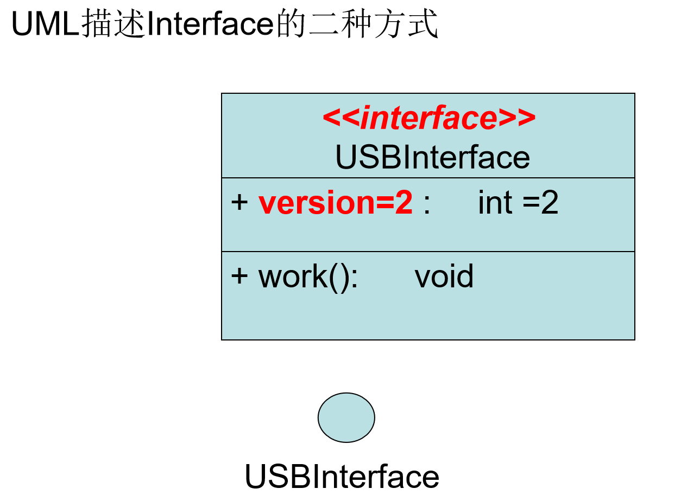
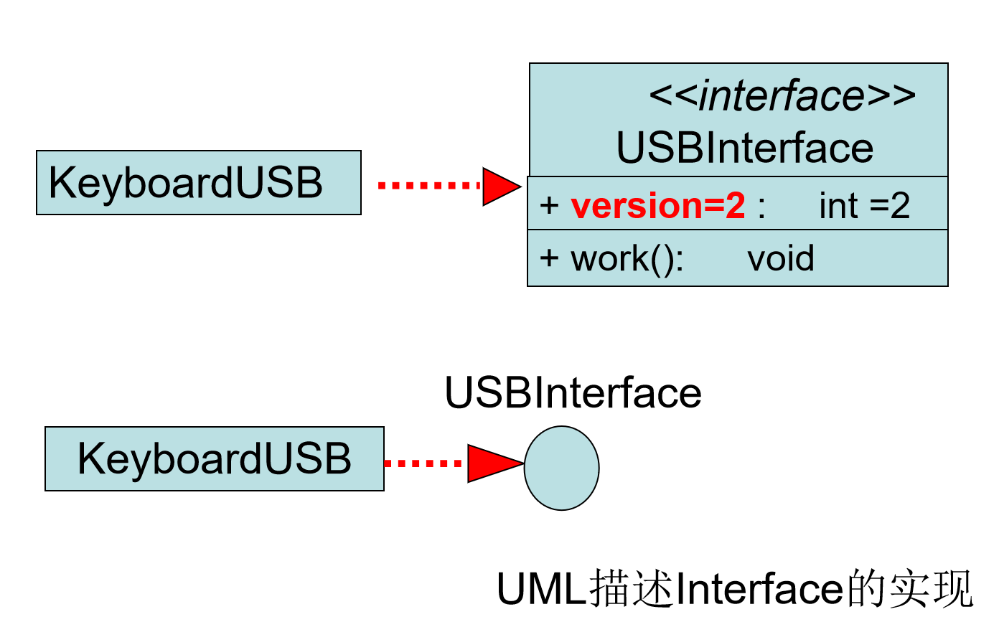
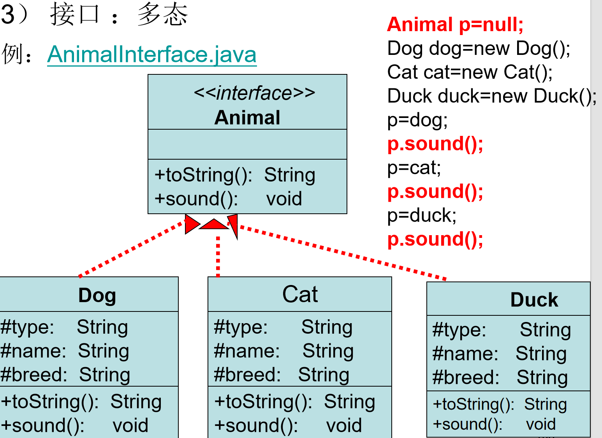

UML语言：抽象类和方法是斜体

java实现对象拷贝:实现Cloneable接口，并对该接口
    中的clone()方法重写。
**notice:**
　1 clone()返回的是Object类对象，需强制类型转换。
　2 clone()方法实现的是浅拷贝。

```java
import java.io.*;
class  Point {
   int x,y;
   Point(int x,int y){
     this.x=x;this.y=y;
   }
}
class Rect implements Cloneable{
   Point p1,p2;
   Rect(Point p1,Point p2){
     this.p1=p1;this.p2=p2;
    }
   public Object clone() throws CloneNotSupportedException{
     return super.clone();
   }
}

public class   TestClone{
   public static void main(String[] args) throws CloneNotSupportedException {
    Rect  r1=new Rect(new  Point(1,1),new Point(4,4));
    Rect  r2;
     
     r2=(Rect)r1.clone();
     System.out.println(r1.p1.x+" "+r1.p1.y+" "+r1.p2.x+" "+r1.p2.y);
     System.out.println(r2.p1.x+" "+r2.p1.y+" "+r2.p2.x+" "+r2.p2.y);
     System.out.println(r2.p1==r1.p1 );  //true
     System.out.println(r2.p2==r1.p2 );  //true

	  r2.p1.x=111;
	 System.out.println(""+r2.p1.x+" "+r1.p1.x );  //111
	

   }
}
```
传值，传引用
```java
class  Student {
	private String name; 	private int age;
	public  Student(){	}
	public   Student(String name2,int age2){     name=name2;	 age=age2;	} 
	public int getAge(){return age;}
	public void setAge(int age2){age=age2;}
}
public class  TestStudent{ 
	public static void  ChangeStudent(Student stu){ 
	   int age=stu.getAge();	   age++;	   stu.setAge(age); 	   return;
    } 
	public  static void ChangeAge(int age){		age++;		return;	}
	public static void main(String[] args) 	{
		int age1=10;
		ChangeAge(age1);
		System.out.println("age1:"+age1);
		Student tom=new Student("tom",10);
        ChangeStudent(tom);
        System.out.println("tom age:"+tom.getAge());
	}
}
```
```java
public class ArrayTest
{
	public void SetArray(int[] array){
		  for (int  i=0;i<=array.length-1 ;i++ )
		  {
			    array[i]=1;
		  }
	}
	public void ChangeArray(int[] array){
		  for (int  i=0;i<=array.length-1 ;i++ )
		  {
			    array[i]++;
		  }
	}
	public void PrintArray(int[] array){
		  for (int  i=0;i<=array.length-1 ;i++ )
		  {
			    System.out.print(" "+array[i]);
		  }
		  System.out.println( );
	}

	public static void main(String[] args){
		int age[]=new int[10];
		  ArrayTest  arraytest1=new ArrayTest();
          arraytest1.SetArray(age);
		  arraytest1.PrintArray(age);
		 
		  arraytest1.ChangeArray(age);
		  arraytest1.PrintArray(age);

	}

};
```

```java
class KeyboardUSB implements USBInterface{
	public void work(){
            System.out.println("KeyboardUSB: 输入数据  !");
	}
}
```
Notice:1类在实现抽象方法时，必须用public修饰符。　　
       　 2如果类没有实现所有接口的方法，则该类就必须
             被声明成抽象类。
例 
```java
abstract class KeyboardUSB implements USBInterface{
	   public void toString(){*                  
                System.out.println(“KeyboardUSB 类");
             } 

           /*
            * public void work(){
            *   System.out.println("KeyboardUSB: 输入数据  !");
            * }
            */
      }

class KeyboardUSB extends Keyboard implements USBInterface{
	   public void toString(){*                  
                System.out.println(“KeyboardUSB 类");
             }  
              public void work(){
                  System.out.println("KeyboardUSB: 输入数据  !");
             } 
      }
```



```java
  interface Animal {    
    String toString();       
    void sound();    //抽象方法
   }

class Dog implements Animal{
   protected String type, name,breed;  
   public Dog(String name ){
	   this.type="Dog";
	   this.name=name;	   
   }
   public Dog(String name,String breed){
	   this.type="Dog";
	   this.name=name;
	   this.breed=breed;      
   }
   public String toString(){return "Dog";}
   public void sound(){ System.out.println("Woof Woof");  }
}


class Cat implements Animal{
  protected String type, name,breed;  
   public Cat(String name){
     this.type="Cat";
	   this.name=name;
    }
   public Cat(String name,String breed){
     this.type="Cat";
	   this.name=name;
	   this.breed=breed;    
   }
   public String toString(){return "Cat";}
   public void sound(){System.out.println("Miiaooww");}
}


class Duck implements Animal{   
  protected String type, name,breed;  
  public Duck(String name){
	  this.type="Duck";
	   this.name=name;	  
  }
  public Duck(String name,String breed){
	  this.type="Duck";
	   this.name=name;
	   this.breed=breed;       
  }
  public String toString(){return "Duck";}
  public void sound(){
    System.out.println(" Quack quackquack ");
  }
}
 
public class  AnimalInterface{
  public static void main(String[] args){
   // Animal animal=new  Animal("Unknow","Unknow","Unknow");
    Animal animal=null;
    Dog dog=new Dog("Rover");
    Cat cat=new Cat("Max");
    Duck duck=new Duck("Daffy");
    animal=dog;
    animal.sound();
    animal=cat;
    animal.sound();
    animal=duck;
    animal.sound();
  }
}
```
```java
interface USBInterface {
	int version=2 ;     //USB驱动程序版本
	public void work(); //功能
}

class U implements USBInterface{
	public void work(){      System.out.println("U: 存储数据!");	}
}
class KeyboardUSB implements USBInterface{
	public void work(){      System.out.println("KeyboardUSB: 输入数据  !");	}
}

class MouseUSB implements USBInterface{
	public void work(){      System.out.println("MouseUSB: 方便输入数据   !");	}
} 
class DisplayUSB implements USBInterface{
	public void work(){      System.out.println(" DisplayUSB:显示数据  !");	}
}
public class TestUSBInterface{  
	public static void main(String[] args){
      USBInterface usb=null;
      U myU=new U();
      KeyboardUSB mykeyboard=new KeyboardUSB();
      MouseUSB mymouse=new MouseUSB();
      DisplayUSB mydisplay=new DisplayUSB();

	  usb=myU;
	  usb.work();

	  usb=mykeyboard;
	  usb.work();

	  usb=mymouse;
	  usb.work();

	  usb=mydisplay;
	  usb.work(); 

	}
}
```
```java
interface Shape{
	  double area(); //求面积
	  double permeter();  //周长 
}
class Circle implements Shape {
	private double radius;
	public Circle(double radius){this.radius=radius;}
    public double area()  { return 3.1415926*radius*radius;}  
	public double permeter()  { return 2*3.1415926*radius ;} 
}

class Rectangle implements Shape {
	private double length ,width ;
	public Rectangle(double length, double width){
		this.length=length; this.width=width;
	}
    public double area()  { return length*width;} 
	public double permeter()  { return 2*(length+width) ;} 
}

public class TestShapeInterface{ 
   public static void main(String[] args) 
	{
		 Shape shape=null;
		 Circle circle=new Circle(2.0);
		 Rectangle rectangle=new Rectangle(2.0,3.0);
		 shape=circle;
		 System.out.println( shape.area());
		 shape=rectangle;
		 System.out.println( shape.area());
	}

}
```
接口的继承
```java
 interface Parent1{
   int a=1;
   void A();
 }

 interface Parent2{
   int b=2;
   void B();
 }
 
 interface Parent3{
   int c=3;
   void C();
 }

 public interface  TestMultiExtends extends Parent1,Parent2,Parent3{

  }
  ```

