 
```java
class  A{

    public  A(String str){

		System.out.println(str);

	}     

     public static void main(String[] args){ 

	   //A a1= new A(); //编译通不过

      }

}
```

请问注释的语句为什么编译通不过？

A、没有默认的构造方法

B、修饰类的访问属性不对

这个问题的正确答案是 **A、没有默认的构造方法**。

**解释：**

1.  **构造方法 (Constructor)：** 在 Java 中，构造方法是一种特殊的方法，用于创建和初始化对象。它的名称必须与类名完全相同，并且没有返回类型。

2.  **默认构造方法 (Default Constructor)：**
    * 如果一个类**没有定义任何构造方法**，Java 编译器会自动为它生成一个**无参的、公共的默认构造方法**。
    * 例如：
        ```java
        class MyClass {
            // 编译器会自动添加一个 public MyClass() {}
        }
        ```
        所以你可以这样创建对象：`MyClass obj = new MyClass();`

3.  **自定义构造方法的影响：**
    * 一旦你在类中**手动定义了任何构造方法**（无论是有参还是无参），Java 编译器**就不会再为你生成默认的无参构造方法了**。

4.  **回到你的代码：**
    ```java
    class A{
        public A(String str){ // 你手动定义了一个带 String 参数的构造方法
            System.out.println(str);
        }
        public static void main(String[] args){
            //A a1= new A(); // 编译通不过
        }
    }
    ```
    * 你定义了一个 `public A(String str)` 构造方法。
    * 因为你已经手动定义了一个构造方法，编译器就不会再自动生成 `public A()` 这个无参构造方法了。
    * 所以，当你尝试使用 `new A()` 来创建一个对象时，编译器找不到一个无参的构造方法来匹配这个调用，因此会报错。

**解决方案：**
如果你既想使用带参数的构造方法，又想使用无参构造方法，你需要**显式地定义一个无参构造方法**：

```java
class A {
    public A(String str){ // 带参构造方法
        System.out.println(str);
    }

    public A(){ // 显式定义的无参构造方法
        System.out.println("这是一个无参构造方法");
    }

    public static void main(String[] args){
        A a1 = new A(); // 现在可以编译通过了，会调用无参构造方法
        A a2 = new A("Hello"); // 也可以调用带参构造方法
    }
}
```
```java
 public class TestStatic{ 

     public static int id=0;  

     public String str=""; 

     public static String getStr(){

	  	  return str;

    }    

}
```

请问public static String getStr(){...}方法为什么有编译错误？


A、访问属性定义错误

B、返回类型定义错误

C、类方法不能访问实例变量。

正确答案是 **C、类方法不能访问实例变量。**

**解释：**

在 Java 中，`static` 方法（也称为类方法）是属于类本身的，而不属于类的任何特定实例（对象）。这意味着你可以直接通过类名来调用它们，而无需先创建对象。

* **`static` 变量（例如 `id`）：** 它们也是类级别的。整个类只有一个 `id` 的副本，所有潜在的对象都共享它。`static` 方法可以访问 `static` 变量。
* **实例变量（例如 `str`）：** 这些变量属于特定的对象（实例）。每次你创建一个 `TestStatic` 对象时，它都会拥有自己独立的 `str` 变量。

问题出在 `getStr()` 方法中：

```java
public static String getStr(){
    return str; // 这里是错误！
}
```

* `getStr()` 是 `static` 方法。这意味着你可以像 `TestStatic.getStr()` 这样调用它。
* 当你调用 `TestStatic.getStr()` 时，并没有特定的 `TestStatic` 对象与这个调用相关联。
* 然而，`str` 是一个实例变量。它只存在于**一个具体的对象**内部。

由于 `getStr()` 是一个 `static` 方法，它不操作特定的对象，所以它不知道应该返回**哪个** `str`（来自哪个潜在的 `TestStatic` 对象）。这就是编译器报错的原因。一个 `static` 方法不能直接访问非 `static`（实例）成员。

**要解决这个错误，你可以选择：**

1.  **将 `str` 也声明为 `static`：**
    ```java
    public class TestStatic {
        public static int id = 0;
        public static String str = ""; // 现在 'str' 是 static 的了
        public static String getStr() {
            return str; // 现在这个访问是合法的
        }
    }
    ```
2.  **将 `getStr()` 声明为非 `static`（实例方法）：**
    ```java
    public class TestStatic {
        public static int id = 0;
        public String str = "";
        public String getStr() { // 'getStr' 不再是 static 的了
            return str; // 这个是合法的，它会操作当前对象的 'str'
        }
        // 如果要调用这个方法，你需要先创建一个对象：
        // TestStatic obj = new TestStatic();
        // String myString = obj.getStr();
    }
    ```

    下面的程序编写的构造方法有没有达到给实例变量赋值的目的？
```java
public class Employee{

  String name;  int employeeNo ; 

  Employee( String name;  int employeeNo){ 

	  name=name;

	  employeeNo=employeeNo;

  }   

}
```


A、没有

B、有
The correct answer is **A、没有**。

**解释：**

在这个构造方法中，你犯了一个常见的错误，叫做**“变量遮蔽” (Variable Shadowing)**。

让我们来看你的构造方法：

```java
Employee( String name; int employeeNo){ // 参数列表的语法也有问题，应该是逗号分隔
    name=name;       // 错误点：左边的 name 和右边的 name 指的是同一个东西
    employeeNo=employeeNo; // 错误点：左边的 employeeNo 和右边的 employeeNo 指的是同一个东西
}
```

1.  **参数列表的语法问题：** 你的参数列表 `String name; int employeeNo)` 语法是错误的。在 Java 中，方法或构造方法的参数之间应该用逗号 `,` 分隔，而不是分号 `;`。正确的写法应该是 `Employee(String name, int employeeNo)`。

2.  **变量遮蔽问题（即使修正了语法）：**
    * 当你在构造方法内部写 `name=name;` 时，左边的 `name` 指的是构造方法的**参数 `name`**，右边的 `name` 也指的是构造方法的**参数 `name`**。
    * 同样，`employeeNo=employeeNo;` 也是如此。左边的 `employeeNo` 指的是构造方法的**参数 `employeeNo`**，右边的 `employeeNo` 也指的是构造方法的**参数 `employeeNo`**。

    因此，这两行代码实际上只是将参数 `name` 的值赋给了参数 `name` 自己，以及将参数 `employeeNo` 的值赋给了参数 `employeeNo` 自己。**它并没有把参数的值赋给类的实例变量 `this.name` 和 `this.employeeNo`。** 实例变量仍然保持它们的默认值（`String` 的默认值是 `null`，`int` 的默认值是 `0`）。

**如何正确赋值：**

为了将参数的值赋给实例变量，你需要使用 `this` 关键字来明确引用实例变量：

```java
public class Employee {
    String name;
    int employeeNo;

    // 修正了参数列表的语法，并使用 this 关键字
    Employee(String name, int employeeNo) {
        this.name = name;           // 将参数 name 的值赋给实例变量 this.name
        this.employeeNo = employeeNo; // 将参数 employeeNo 的值赋给实例变量 this.employeeNo
    }
}
```

使用 `this.name` 和 `this.employeeNo` 可以明确告诉编译器，你正在引用的是当前对象的 `name` 和 `employeeNo` 实例变量，而不是构造方法中的同名参数。


下面父类Parent和子类Child
```java
class  Parent

{

	 public void pr1(){   System.out.println("pr1" );	 }

	 public void pr2(){   System.out.println("Parent pr1" );	 }

}

class  Child extends Parent

{

	 public void pr1(String name){   System.out.println("pr1" +name);	 }

	 public void pr2(){   System.out.println("Child pr1" );	 }

}
```

请问Parent类中的pr1方法和Child类中的pr1方法构成了（）；

       Parent类中的pr2方法和Child类中的pr2方法构成了（）；


A、
重载(overloading)；重构（overriding)

B、
重载 ；重载

C、
重构 ;重载

D、
重构 ; 重构 

我的答案：A

下面是关于Java的静态绑定和动态绑定的叙述，请问对的是？

A、
 变量都是动态绑定的；所有方法都是静态绑定的。

B、
变量都是动态绑定的；除了static和final修饰的方法是静态绑定的，其余方法是动态绑定的。

C、
变量都是静态绑定的；所有方法都是静态绑定的。

D、
变量都是静态绑定的；除了static和final修饰的方法是静态绑定的，其余方法是动态绑定的。

我的答案：D

请问下面的程序能否编译通过？
```java
class User{  

   User(String str){

System.out.println("User");

    }

} 


public class  Student extends User{

    public Student(String str){

System.out.println("Student");

      }

     public static void main(String[] args){

          new Student(“Tom”);

      }

}
```


A、能

B、不能

好的，我来用中文重新解释一下为什么这段程序无法编译通过。

**代码如下：**

```java
class User{
    User(String str){ // User 类有一个带 String 参数的构造方法
        System.out.println("User");
    }
}

public class Student extends User{
    public Student(String str){ // Student 类有一个带 String 参数的构造方法
        System.out.println("Student");
    }
    public static void main(String[] args){
        new Student("Tom");
    }
}
```

**分析过程：**

1.  **`User` 类（父类）：**
    * `User` 类明确定义了一个带参数的构造方法 `User(String str)`。
    * 根据 Java 的规则：如果一个类**手动定义了任何构造方法**（无论带不带参数），那么 Java 编译器**就不会再为它自动生成一个无参数的默认构造方法**（即 `User()`）。所以，`User` 类此刻**没有** `User()` 这个无参构造方法。

2.  **`Student` 类（子类）：**
    * `Student` 类继承自 `User` 类。
    * 在 Java 中，当一个子类的构造方法被调用时，它的第一件“任务”（无论是你显式写的还是编译器帮你隐式做的）就是去调用它的**父类的构造方法**。这是为了确保父类的部分也能被正确地初始化。
    * 如果你在子类构造方法的第一行**没有显式地调用父类的构造方法**（比如使用 `super(...)`），那么 Java 编译器会**自动地在子类构造方法的第一行插入一个对父类无参构造方法的调用**，即 `super();`。

3.  **问题所在：**
    * 在 `Student` 类的构造方法 `public Student(String str)` 中，你**没有显式地**调用父类 `User` 的任何构造方法。
    * 因此，编译器会尝试在 `Student` 构造方法的第一行隐式地插入 `super();`。
    * 然而，前面分析过，`User` 类**并没有无参数的构造方法** (`User()`)，它只有一个 `User(String str)`。
    * 这样，编译器就无法找到一个匹配的父类构造方法来执行 `super();` 这个隐式调用，从而导致了**编译错误**。

**结论：**

这个程序**不能**编译通过。

**要修正这个错误，你需要显式地在 `Student` 类的构造方法中调用 `User` 类的带参数构造方法：**

```java
class User{
    User(String str){
        System.out.println("User: " + str); // 稍微修改输出，更清晰
    }
}

public class Student extends User{
    public Student(String str){
        super(str); // 显式调用父类 User 的带参数构造方法
        System.out.println("Student: " + str); // 稍微修改输出，更清晰
    }
    public static void main(String[] args){
        new Student("Tom"); // 现在可以编译并运行了
    }
}
```
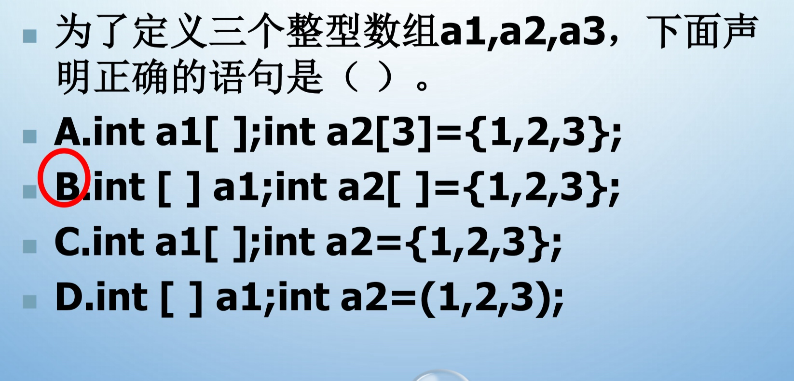
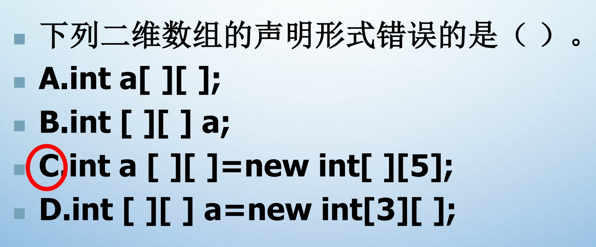
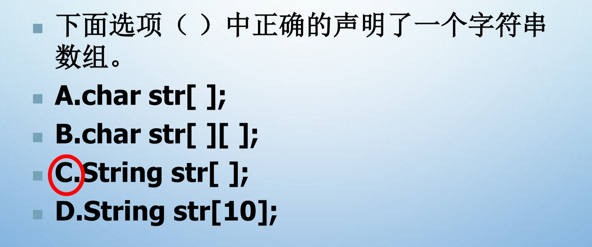
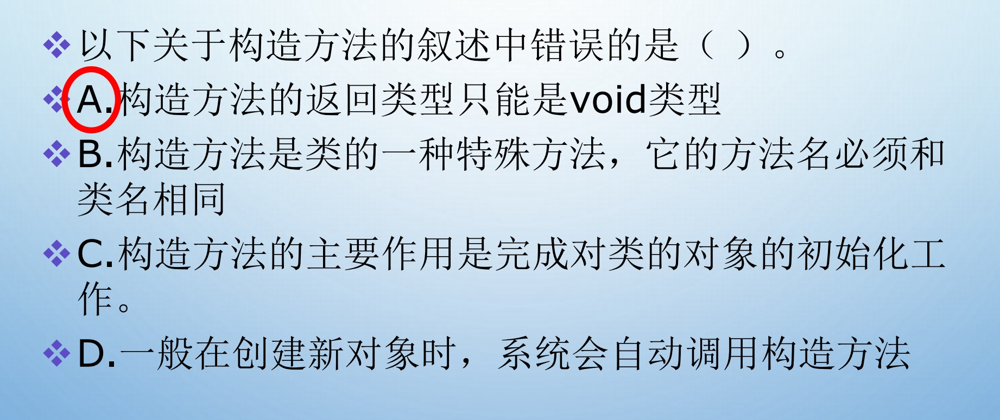
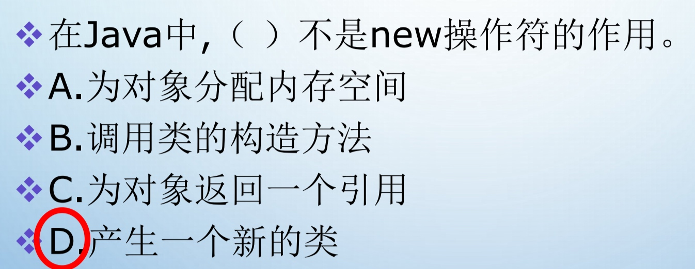
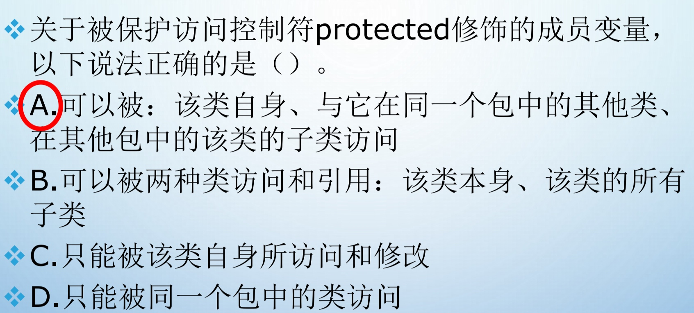
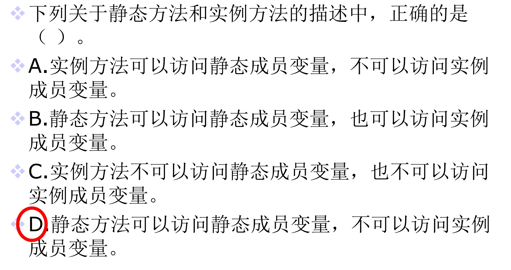
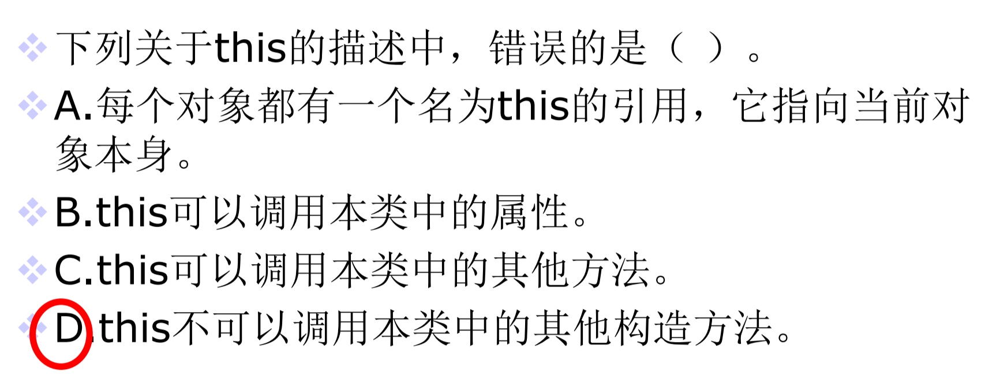
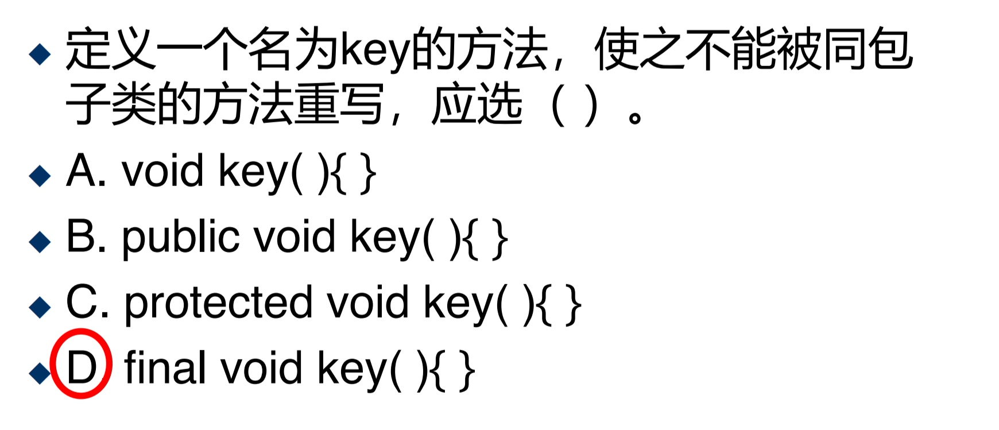
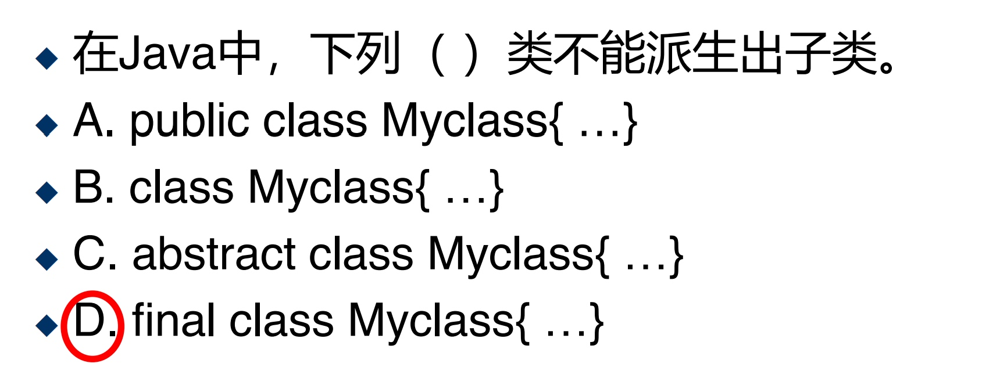
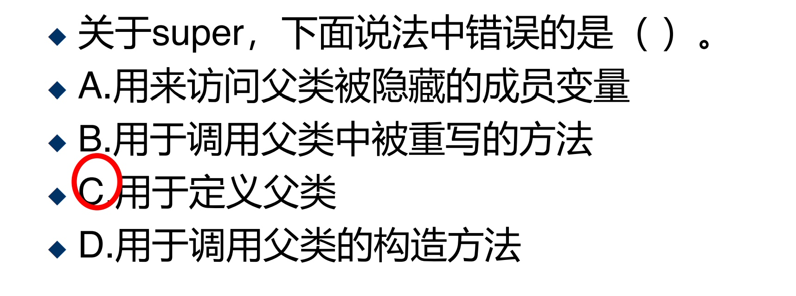
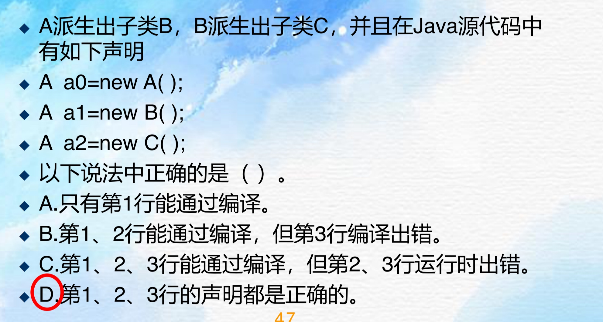
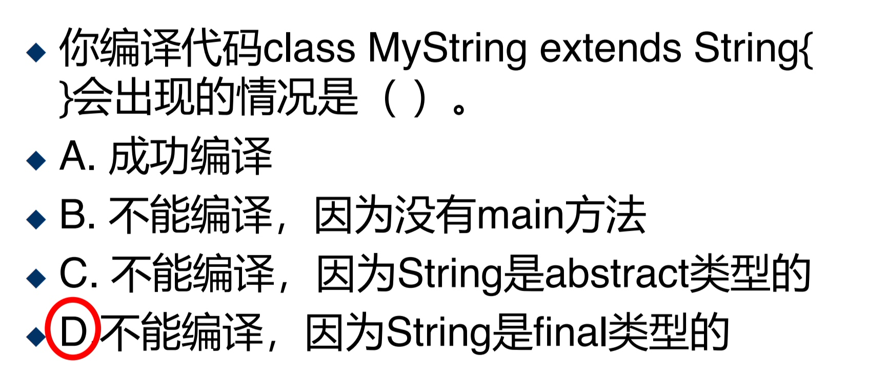

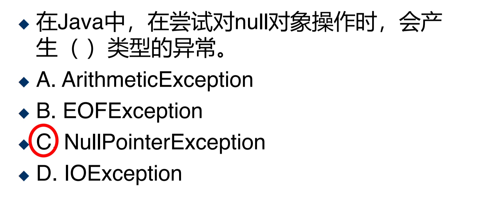
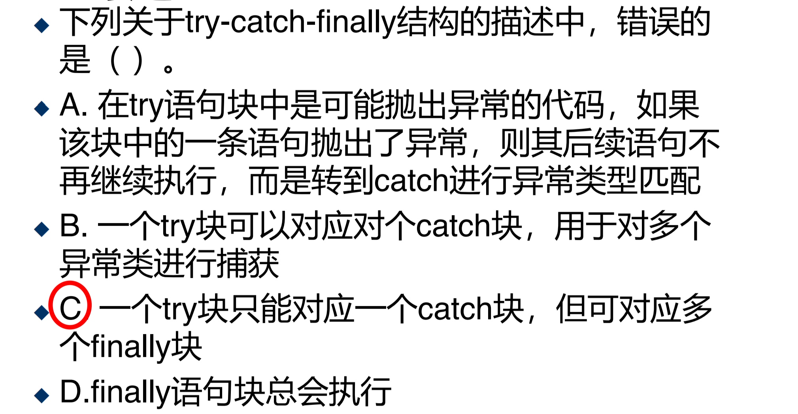
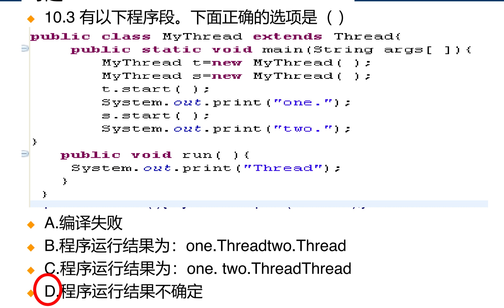
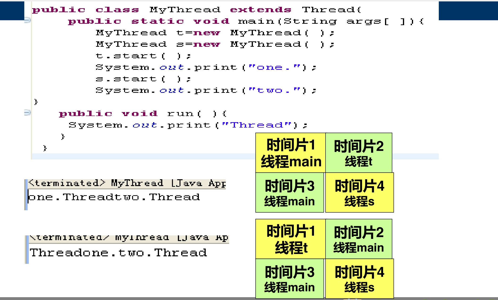

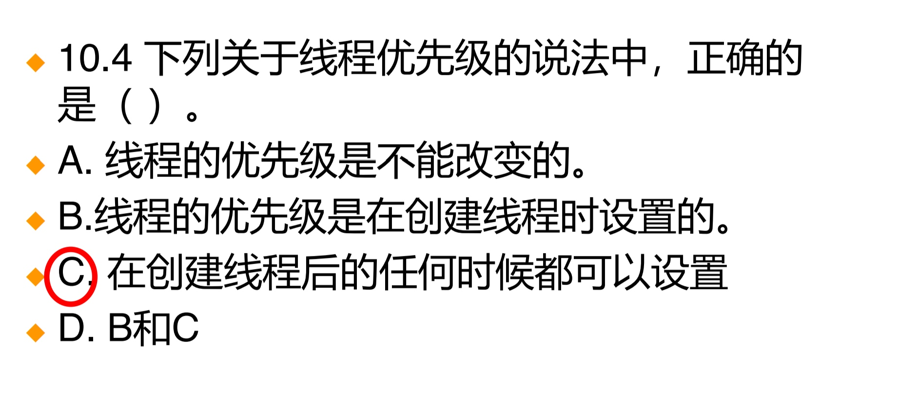
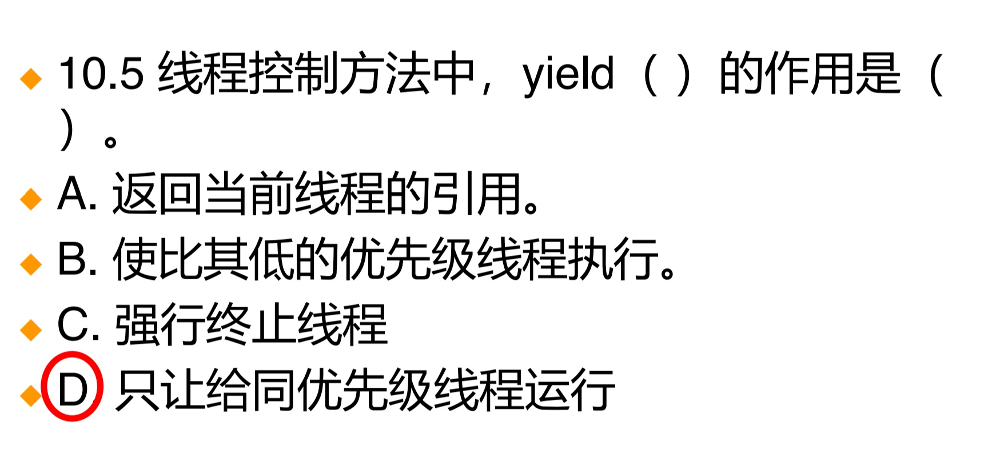


